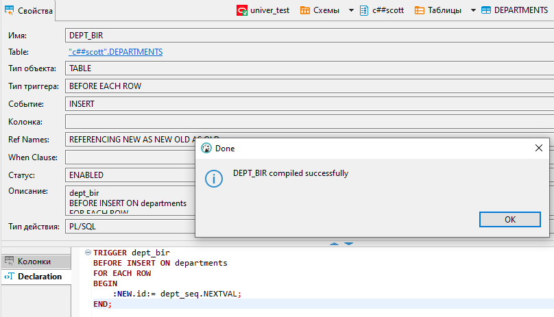

### Создание триггеров в оракле

#### Тригер на авто-инкрементацию поля id

Создадим тестовую таблицу

```sql

CREATE TABLE departments
(
    "ID"          NUMBER(10)    NOT NULL,
    "DESCRIPTION" VARCHAR2(50)  NOT NULL
);

ALTER TABLE departments ADD (
CONSTRAINT dept_pk PRIMARY KEY ("ID"));
```

Создание последовательности для генерации

```sql
CREATE SEQUENCE dept_seq START WITH 1;
```

Создание тригера

```sql
CREATE
OR REPLACE TRIGGER dept_bir
BEFORE INSERT ON departments 
FOR EACH ROW
BEGIN
 	:NEW
.id:= dept_seq.NEXTVAL;
END;
```

Если работаете через Dbeaver - найти и скомилировать тригер


Запустить тестовую вставку

```sql
INSERT INTO departments(DESCRIPTION)
VALUES ('dsdsd');
```

