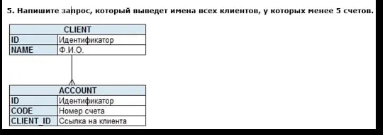

```sql
SELECT Name 
FROM Client c
LEFT JOINT Account a ON c.id = a.id
GROUP BY  (c.name, a.client.id)
HAVING COUNT(name) < 5 OR COUNT(name)=0

```
LEFT JOINT - применяем чтобы показать клиентов, у которых может не быть счетов
требование агрегатной функции count  мы вызываем, у name
так как для Name нет агригат функции, необходимо перечислит в GROUP BY 