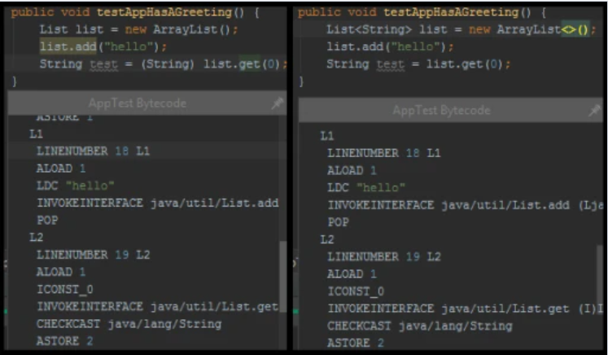
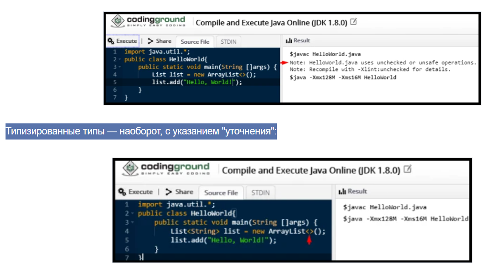
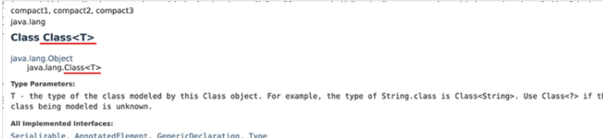

### Generics

— это параметризованные типы. Особые средства языка Java для реализации обобщённого программирования: особого
подхода к описанию данных и алгоритмов, позволяющего работать с различными типами данных без изменения их описания.

```java
import java.util.*;

public class HelloWorld {
    public static void main(String[] args) {
        List list = new ArrayList();
        list.add("Hello");
        String text = list.get(0) + ", world!";
        System.out.print(text);
    }
}
```

Этот код выполнится хорошо. Но что если к нам пришли и сказали, что фраза "Hello, world!" избита и можно вернуть только
Hello? Удалим из кода конкатенацию со строкой ", world!". Казалось бы, что может быть безобиднее? Но на деле мы получим
ошибку ПРИ КОМПИЛЯЦИИ:

```error: incompatible types: Object cannot be converted to String```
Всё дело в том, что в нашем случае List хранит список объектов типа Object. Так как String — наследник для Object (ибо
все классы неявно наследуются в Java от Object), то требует явного приведения, чего мы не сделали. А при конкатенации
для объекта будет вызван статический метод String.valueOf(obj), который в итоге вызовет метод toString для Object.

То есть List у нас содержит Object. Выходит, там где нам нужен конкретный тип, а не Object, нам придётся самим делать
приведение типов:

```java
import java.util.*;

public class HelloWorld {
    public static void main(String[] args) {
        List list = new ArrayList();
        list.add("Hello!");
        list.add(123);
        for (Object str : list) {
            System.out.println((String) str);
        }
    }
}
```

Однако, в данном случае, т.к. List принимает список объектов, он хранит не только String, но и Integer.

Но самое плохое, в этом случае компилятор не увидит ничего плохого. И тут мы получим ошибку уже ВО ВРЕМЯ ВЫПОЛНЕНИЯ (ещё
говорят, что ошибка получена "в Runtime").

Ошибка будет: java.lang.ClassCastException: java.lang.Integer cannot be cast to java.lang.String

Согласитесь, не самое приятное.

И всё это потому, что компилятор — не искусcтвенный интеллект и он не может угадать всё, что подразумевает программист.
Чтобы рассказать компилятору подробнее о своих намерениях, какие типы мы собираемся использовать, в Java SE 5 ввели
дженерики.

```java
import java.util.*;

public class HelloWorld {
    public static void main(String[] args) {
        List<String> list = new ArrayList<>();
        list.add("Hello!");
        list.add(123);
        for (Object str : list) {
            System.out.println(str);
        }
    }
}
```

Как мы видим, нам больше не нужно приведение к String. Кроме того, у нас появились угловые скобки (angle brackets),
которые обрамляют дженерики. Теперь компилятор не даст скомпилировать класс, пока мы не удалим добавление 123 в список,
т.к. это Integer. Он нам так и скажет.

Многие называют дженерики "синтаксическим сахаром". И они правы, так как дженерики действительно при компиляции станут
теми самыми кастами. Посмотрим на байткод скомпилированных классов: с кастом вручную и с использованием дженериков:



После компиляции какая-либо информация о дженериках стирается. Это называется "Стирание типов" или "Type Erasure".
Стирание типов и дженерики сделаны так, чтобы обеспечить обратную совместимость со старыми версиями JDK, но при этом
дать возможность помогать компилятору с определением типа в новых версиях Java.
К моменту ее выхода java 5 программисты успели написать кучу кода с использованием Raw Types, и чтобы он не перестал
работать, возможность создания и работы Raw Types в Java сохранилась.
Java-код, как ты знаешь, преобразуется в специальный байт-код, который потом выполняется виртуальной машиной Java.
И если бы в процессе перевода мы помещали в байт-код информацию о типах-параметрах, это сломало бы весь ранее написанный
код, ведь до Java 5 никаких типов-параметров не существовало!

## Raw Types или сырые типы

Говоря о дженериках мы всегда имеем две категории: типизированные типы (Generic Types) и "сырые" типы (Raw Types).

Сырые типы — это типы без указания "уточненения" в фигурных скобках (angle brackets):


ак мы видим, мы использовали необычную конструкцию, отмеченную стрелкой на скриншоте. Это особый синтаксис, который
добавили в Java SE 7, и называется он "the diamond", что в переводе означает алмаз. Почему? Можно провести аналогию
формы алмаза и формы фигурных скобок: <>

Также Diamond синтаксис связан с понятием "Type Inference", или же выведение типов. Ведь компилятор, видя справа <>
смотрит на левую часть, где расположено объявление типа переменной, в которую присваивается значение. И по этой части
понимает, каким типом типизируется значение справа.

На самом деле, если в левой части указан дженерик, а справа не указан, компилятор сможет вывести тип

```java
import java.util.*;

public class HelloWorld {
    public static void main(String[] args) {
        List<String> list = new ArrayList();
        list.add("Hello World");
        String data = list.get(0);
        System.out.println(data);
    }
}
```

Однако это будет смешиванием нового стиля с дженериками и старого стиля без них. И это крайне нежелательно. При
компиляции кода выше мы получим сообщение: Note: HelloWorld.java uses unchecked or unsafe operations. На самом деле
кажется непонятным, зачем вообще нужен тут diamond добавлять. Но вот пример:

```java
import java.util.*;

public class HelloWorld {
    public static void main(String[] args) {
        List<String> list = Arrays.asList("Hello", "World");
        List<Integer> data = new ArrayList(list);
        Integer intNumber = data.get(0);
        System.out.println(data);
    }
}
```

Как мы помним, у ArrayList есть и второй конструктор, который принимает на вход коллекцию.

И вот тут-то и кроется коварство. Без diamond синтаксиса компилятор не понимает, что его обманывают, а вот с diamond —
понимает.

Поэтому, правило #1: всегда использовать diamond синтаксис, если мы используем типизированные типы. В противном случае
мы рискуем пропустить, где у нас используется raw type.

Чтобы избежать предупреждений в логе о том, что "uses unchecked or unsafe operations" можно над используемым методом или
классом указать особую аннотацию: @SuppressWarnings("unchecked")

Suppress переводится как подавлять, то есть дословно — подавить предупреждения. Но подумайте, почему вы решили её
указать? Вспомните о правиле номер один и, возможно, вам нужно добавить типизацию.

## Стирание типов

Ее суть заключается в том, что внутри класса не хранится никакой информации о его типе-параметре.

Эта информация доступна только на этапе компиляции и стирается (становится недоступной) в runtime.

Если ты попытаешься положить объект не того типа в свой List<String>, компилятор выдаст ошибку. Этого как раз и
добивались создатели языка, создавая дженерики — проверки на этапе компиляции.

Но когда весь написанный тобой Java-код превратится в байт-код, в нем не будет информации о типах-параметрах.

Внутри байт-кода твой список List<Cat> cats не будет отличаться от List<String> strings. В байт-коде ничто не будет
говорить о том, что cats — это список объектов Cat. Информация об этом сотрется во время компиляции, и в байт код
попадет только информация о том, что у тебя в программе есть некий список List<Object> cats.

```java
public class TestClass<T> {

    private T value1;
    private T value2;

    public void printValues() {
        System.out.println(value1);
        System.out.println(value2);
    }

    public static <T> TestClass<T> createAndAdd2Values(Object o1, Object o2) {
        TestClass<T> result = new TestClass<>();
        result.value1 = (T) o1;
        result.value2 = (T) o2;
        return result;
    }

    public static void main(String[] args) {
        Double d = 22.111;
        String s = "Test String";
        TestClass<Integer> test = createAndAdd2Values(d, s);
        test.printValues();
    }
}
```

Мы создали собственный дженерик-класс TestClass.

Он довольно прост: по сути это небольшая “коллекция” на 2 объекта, которые помещаются туда сразу же при создании
объекта. В качестве полей у него 2 объекта T.

При выполнении метода createAndAdd2Values() должно произойти приведение двух переданных объектов Object a и Object b к
нашему типу T, после чего они будут добавлены в объект TestClass.

В методе main() мы создаем TestClass<Integer>, то есть в качестве T у нас будет Integer.

Но при этом в метод createAndAdd2Values() мы передаем число Double и объект String.

Как ты думаешь, сработает ли наша программа? Ведь в качестве типа-параметра мы указали Integer, а String точно нельзя
привести к Integer!

Давай запустим метод main() и проверим.

```
Вывод в консоль:
22.111
Test String
```

Неожиданный результат! Почему такое произошло?

Именно из-за стирания типов.

Во время компиляции кода информация о типе-параметре Integer нашего объекта TestClass<Integer> test стерлась.

Он превратился в TestClass<Object> test.

Наши параметры Double и String без проблем преобразовались в Object (а не в Integer, как мы того ожидали!) и спокойно
добавились в TestClass.

Вот еще один простой, но очень показательный пример стирания типов:

```java
import java.util.ArrayList;
import java.util.List;

public class Main {

    private class Cat {

    }

    public static void main(String[] args) {

        List<String> strings = new ArrayList<>();
        List<Integer> numbers = new ArrayList<>();
        List<Cat> cats = new ArrayList<>();

        System.out.println(strings.getClass() == numbers.getClass());
        System.out.println(numbers.getClass() == cats.getClass());

    }
}
//Вывод в консоль:
//     true
//      true
```

Казалось бы, мы создали коллекции с тремя разными типами-параметрами — String, Integer, и созданный нами класс Cat.

Но во время преобразования в байт-код все три списка превратились в List<Object>, поэтому при выполнении программа
говорит нам, что во всех трех случаях у нас используется один и тот же класс.

#### Стирание типов при работе с массивами и дженериками

Есть один очень важный момент, который необходимо четко понимать при работе с массивами и дженериками (например, List).
Также его стоит учитывать при выборе структуры данных для твоей программы.

Дженерики подвержены стиранию типов. Информация о типе-параметре недоступна во время выполнения программы.

В отличие от них, массивы знают и могут использовать информацию о своем типе данных во время выполнения программы.

Попытка поместить в массив значение неверного типа приведет к исключению:

```java

public class Main2 {
    public static void main(String[] args) {
        Object x[] = new String[3];
        x[0] = new Integer(222);
    }
}

//Вывод в консоль:
//Exception in thread "main" java.lang.ArrayStoreException: java.lang.Integer

```

Из-за того, что между массивами и дженериками есть такая большая разница, у них могут возникнуть проблемы с
совместимостью.
Прежде всего, ты не можешь создать массив объектов-дженериков или даже просто типизированный массив.
Звучит немного непонятно?
Давай рассмотрим наглядно.
К примеру, ты не сможешь сделать в Java ничего из этого:

```
new List<T>[]
new List<String>[]
new T[]
```

Если мы попытаемся создать массив списков List<String>, получим ошибку компиляции generic array creation:

```java
import java.util.List;

public class Main2 {

    public static void main(String[] args) {

        //ошибка компиляции! Generic array creation
        List<String>[] stringLists = new List<String>[1];
    }
}
```

Но для чего это сделано? Почему создание таких массивов запрещено? Это все — для обеспечения типобезопасности.
Если бы компилятор позволял нам создавать такие массивы из объектов-дженериков, мы могли бы заработать кучу проблем.
Вот простой пример из книги Джошуа Блоха “Effective Java”:

```java
public static void main(String[] args) {

    List<String>[] stringLists = new List<String>[1];  //  (1)
    List<Integer> intList = Arrays.asList(42, 65, 44);  //  (2)
    Object[] objects = stringLists;  //  (3)
    objects[0] = intList;  //  (4)
    String s = stringLists[0].get(0);  //  (5)
}
```

Давай представим, что создание массива List<String>[] stringLists было бы разрешено, и компилятор бы не ругался.

Вот каких дел мы могли бы наворотить в этом случае:

В строке 1 мы создаем массив листов List<String>[] stringLists.
Наш массив вмещает в себя один List<String>.

В строке 2 мы создаем список чисел List<Integer>.

В строке 3 мы присваиваем наш массив List<String>[] в переменную Object[] objects. Язык Java позволяет это делать: в
массив объектов X можно помещать и объекты X, и объекты всех дочерних классов Х. Соответственно, в массив Objects можно
поместить вообще все что угодно.

В строке 4 мы подменяем единственный элемент массива objects (List<String>) на список List<Integer>.

В результате мы поместили List<Integer> в наш массив, который предназначался только для хранения List<String>!

С ошибкой же мы столкнемся только когда код дойдет до строки 5. Во время выполнения программы будет выброшено исключение
ClassCastException.

Поэтому запрет на создание таких массивов и был введен в язык Java — это позволяет нам избегать подобных ситуаций.
Как можно обойти стирание типов?

#### Как можно обойти стирание типов?

Что ж, стирание типов мы изучили. Давай попробуем обмануть систему! :)

Задача:

У нас есть класс-дженерик TestClass<T>. Нам нужно создать в нем метод createNewT(), который будет создавать и возвращать
новый объект типа Т.

Но ведь это невозможно сделать, так? Вся информация о типе Т будет стерта во время компиляции, и в процессе работы
программы мы не сможем узнать, объект какого именно типа нам нужно создать.

На самом деле, есть один хитрый способ.

Ты наверняка помнишь, что в Java есть класс Class. Используя его, мы можем получить класс любого нашего объекта:

```java
public class Main2 {

    public static void main(String[] args) {

        Class classInt = Integer.class;
        Class classString = String.class;

        System.out.println(classInt);
        System.out.println(classString);
    }
}
// Вывод в консоль:
//
// class java.lang.Integer
// class java.lang.String
```

Но вот одна особенность, о которой мы не говорили. В документации Oracle ты увидишь, что класс Class — это дженерик!


В документации написано: “Т — это тип класса, моделируемого этим объектом Class”.

Если перевести это с языка документации на человеческий, это означает, что классом для объекта Integer.class является не
просто Class, а Class<Integer>. Типом объекта string.class является не просто Class, Class<String>, и т.д.

Если все еще непонятно, попробуй добавить тип-параметр к предыдущему примеру:

```java
public class Main2 {

    public static void main(String[] args) {

        Class<Integer> classInt = Integer.class;
        //ошибка компиляции!
        Class<String> classInt2 = Integer.class;

        Class<String> classString = String.class;
        //ошибка компиляции!
        Class<Double> classString2 = String.class;
    }
}
```

И вот теперь, используя это знание, мы можем обойти стирание типов и решить нашу задачу!

Попробуем получить информацию о типе-параметре. Его роль будет играть класс MySecretClass:

```java
public class MySecretClass {

    public MySecretClass() {

        System.out.println("Объект секретного класса успешно создан!");
    }
}
```

А вот как мы используем на практике наше решение:

```java
public class TestClass<T> {

    Class<T> typeParameterClass;

    public TestClass(Class<T> typeParameterClass) {
        this.typeParameterClass = typeParameterClass;
    }

    public T createNewT() throws IllegalAccessException, InstantiationException {
        T t = typeParameterClass.newInstance();
        return t;
    }

    public static void main(String[] args) throws InstantiationException, IllegalAccessException {

        TestClass<MySecretClass> testString = new TestClass<>(MySecretClass.class);
        MySecretClass secret = testString.createNewT();

    }
}
```

Вывод в консоль:
Объект секретного класса успешно создан!

Мы просто передали нужный класс-параметр в конструктор нашего класса-дженерика:

TestClass<MySecretClass> testString = new TestClass<>(MySecretClass.class);

Благодаря этому мы сохранили информацию о типе-параметре и уберегли ее от стирания. В итоге мы смогли создать объект
T! :)

## Типизированные методы (Generic Methods)

## Wildcard-огрнаичение

Wildcard позволил нам легко уместить нужную логику с привязкой к конкретным типам в один мето
<? extends Number> только Number и наследники ,
<? super Integer>-только integer  и родитель, 
<?>-без ограничения 

## Bridge-метод

Методы которые генерирует java для сохранения полиморфизма
В процессе выполнения Type Erasure (затирания типов) компилятор производит следующие действия:

- добавляет приведение типов для обеспечения type safety, если это необходимо
- генерирует Bridge методы для сохранения полиморфизма.

```java
class Node<T> {
    public T data;

    public Node(T data) {this.data = data;}

    public void setData(T data) {
        System.out.println("Node.setData");
        this.data = data;
    }
}

class MyNode extends Node<Integer> {
    public MyNode(Integer data) {super(data);}

    public void setData(Integer data) {
        System.out.println("MyNode.setData");
        super.setData(data);
    }
}

public class Example {
    public static void main(String[] args) {
        MyNode mn = new MyNode(5);
        Node n = mn;
        n.setData("Hello");
        Integer x = mn.data;
    }
}
```

После стирания типов выглядеть он будет так

```java
public class Node {
    public Object data;

    public Node(Object data) {this.data = data;}

    public void setData(Object data) {
        System.out.println("Node.setData");
        this.data = data;
    }
}

public class MyNode extends Node {

    public MyNode(Integer data) {super(data);}

    public void setData(Integer data) {
        System.out.println("MyNode.setData");
        super.setData(data);
    }
}

public class Example {
    public static void main(String[] args) {
        MyNode mn = new MyNode(5);
        Node n = (MyNode) mn;
        n.setData("Hello");
        Integer x = (String) mn.data;
    }
}
```

Можно заметить, что после стирания типов сигнатуры метода setData в MyNode и Node больше не совпадают, а значит субкласс
не переопределяет метод и полиморфизм оказывается сломан. Чтобы исправить эту ситуацию, компилятор генерирует для MyNode
bridge-метод такого вида

```
public void setData(Object data) {
    setData((Integer) data);
} 
```

Увидеть его можно, заглянуть в байткод с помощью команды javap -c -v MyNode

```
 public void setData(java.lang.Object);
    descriptor: (Ljava/lang/Object;)V
    flags: ACC_PUBLIC, ACC_BRIDGE, ACC_SYNTHETIC
    Code:
      stack=2, locals=2, args_size=2
         0: aload_0
         1: aload_1
         2: checkcast     #6                  // class java/lang/Integer
         5: invokevirtual #7                  // Method setData:(Ljava/lang/Integer;)V
         8: return
```