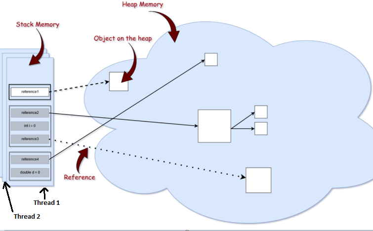
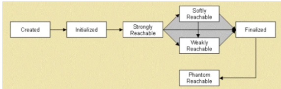

# Где хранится примитивная переменная класса

```В Java примитивы и ссылки на объекты хранятся в стэке, а объекты в куче```

Это не так. Ссылки и примитивы тоже могут храниться в куче.

Важно понимать разницу между переменной и полем.

```java

class User {
    private int age = 42;
    private String name = "John Doe";

    public void someMethod() {
        int someVar = 2;
        User user = new User();
    }
}

```

age - это поле. Оно имеет примитивный тип, но храниться будет там же, где и объект - в куче. Так же и поле ссылочного
типа name.

someVar и user - это переменные и они хранятся в стеке. В первой хранится значение 2, во втором ссылка на объект класса
User.

В том смысле, что когда завершится функция, которая создавала user - то указатель стэка должен сместиться вниз, и все
эти переменные - ссылка на user, примитив int age и ссылка на name должны исчезнуть из памяти.

При завершении метода someMethod кадр стека будет уничтожен и вместе с ним перестанут существовать переменные someVar и
user. Но сам объект user останется в куче до следующего вызова сборщика мусора. Сборщик мусора при запуске проверит все
существующие кадры стека, не найдёт в них ссылки на объект user и только тогда удалит его.

## Что такое стек в памяти java

Стек есть стек - структура типа LIFO. При вызове метода - создаётся фрейм этого метода и пушиться на верх стека. При
завершении выполнения фрейм с верха стека убирается. Фрейм наверху стека - это текущий фрейм.
Фреймы внутри содержат локальные переменные, параметры метода. Если метод не статический - ещё фрейм хранит неявный
параметр this.

Возможно, вы заметили, что на картинке выше отображено несколько стеков памяти. Это связано с тем, что стековая память в
Java выделяется для каждого потока. Следовательно, каждый раз, когда поток создается и запускается, он имеет свою
собственную стековую память и не может получить доступ к стековой памяти другого потока.

Фрейм стека - область выполнения в конкретном стеке. Например выполнение метода.
Кроме того, переменные в стеке имеют определенную видимость, также называемую областью видимости. Используются только
объекты из активной области.

## Куча (Heap)

Эта часть памяти хранит в памяти фактические объекты, на которые ссылаются переменные из стека. Например, давайте
проанализируем, что происходит в следующей строке кода:

```StringBuilder builder = new StringBuilder();```
Ключевое слово new несет ответственность за обеспечение того, достаточно ли свободного места на куче, создавая объект
типа StringBuilder в памяти и обращаясь к нему через «builder» ссылки, которая попадает в стек.

Для каждого запущенного процесса JVM существует только одна область памяти в куче. Следовательно, это общая часть памяти
независимо от того, сколько потоков выполняется. На самом деле структура кучи немного отличается от того, что показано
на картинке выше. Сама куча разделена на несколько частей, что облегчает процесс сборки мусора.

Максимальные размеры стека и кучи не определены заранее - это зависит от работающей JVM машины. Позже в этой статье мы
рассмотрим некоторые конфигурации JVM, которые позволят нам явно указать их размер для запускаемого приложения.

## Типы ссылок

Если вы внимательно посмотрите на изображение структуры памяти, вы, вероятно, заметите, что стрелки, представляющие
ссылки на объекты из кучи, на самом деле относятся к разным типам. Это потому, что в языке программирования Java
используются разные типы ссылок: сильные, слабые, мягкие и фантомные ссылки. Разница между типами ссылок заключается в
том, что объекты в куче, на которые они ссылаются, имеют право на сборку мусора по различным критериям. Рассмотрим
подробнее каждую из них.

1. Сильная ссылка
   Это самые популярные ссылочные типы, к которым мы все привыкли. В приведенном выше примере со StringBuilder мы
   фактически храним сильную ссылку на объект из кучи. Объект в куче не удаляется сборщиком мусора, пока на него
   указывает сильная ссылка или если он явно доступен через цепочку сильных ссылок.
   ```
   StringBuilder builder = new StringBuilder();
    ```
2. Слабая ссылка
   Попросту говоря, слабая ссылка на объект из кучи, скорее всего, не сохранится после следующего процесса сборки
   мусора. Слабая ссылка создается следующим образом:

   ```
   WeakReference<StringBuilder> reference = new WeakReference<>(new StringBuilder());
   ```
   WeakReference отлично подойдут для хранения метаданных, например для хранения ссылки на ClassLoader. Если нет
   классов для загрузки то нет смысла хранить ссылку на ClassLoader, слабая ссылка делает ClassLoader доступным для
   удаления как только мы назначим ее вместо крепкой ссылки (Strong reference).

3. Мягкая ссылка
   Эти типы ссылок используются для более чувствительных к памяти сценариев, поскольку они будут собираться сборщиком
   мусора только тогда, когда вашему приложению не хватает памяти. Следовательно, пока нет критической необходимости в
   освобождении некоторого места, сборщик мусора не будет касаться легко доступных объектов. Java гарантирует, что все
   объекты, на которые имеются мягкие ссылки, будут очищены до того, как будет выдано исключение OutOfMemoryError. В
   документации Javadocs говорится, что «все мягкие ссылки на мягко достижимые объекты гарантированно очищены до того,
   как виртуальная машина выдаст OutOfMemoryError».

   Подобно слабым ссылкам, мягкая ссылка создается следующим образом:

    ```
   SoftReference<StringBuilder> reference = new SoftReference<>(new StringBuilder());
   ```

   Главное отличие SoftReference от WeakReference в том как сборщик с ними будет работать. Он может удалить объект в
   любой момент если на него указывают только weak ссылки, с другой стороны объекты с soft ссылкой будут собраны только
   когда JVM очень нужна память. Благодаря таким особенностям ссылочных классов каждый из них имеет свое применение.
   SoftReference можно использовать для реализации кэшей и когда JVM понадобится память она освободит ее за счет
   удаления таких объектов.

4. Фантомная ссылка
   Используется для планирования посмертных действий по очистке, поскольку мы точно знаем, что объекты больше не живы.
   Используется только с очередью ссылок, поскольку .get()метод таких ссылок всегда будет возвращаться null. Эти типы
   ссылок считаются предпочтительными для финализаторов.

Strong ссылка самая простая, так как мы используем ее в программировании изо дня в день, например в коде вида
```String s = “abc”``` переменная s это и есть strong ссылка.

Любой объект что имеет strong ссылку запрещен для удаления сборщиком мусора. Разумеется что это объекты которые нужны
Java программе. Слабые ссылки представлены классом java.lang.ref.WeakReference, вы можете определить слабую ссылку так:

```java

Counter counter = new Counter();
WeakReference weakCounter = new WeakReference(counter);
counter =null;

```

Теперь, как только вы присвоили strong ссылке counter значение null (counter = null), тот объект что создан в первой
строке становится доступным для удаления сборщиком мусора, потому что он больше не имеет strong ссылки. Cозданная Weak
ссылка weakCounter не может предотвратить удаление сборщиком объекта Counter. С другой стороны если бы это была Soft
ссылка, объект типа Counter не был бы удален до тех пор пока JVM не нуждалась бы в памяти особенно сильно. Soft ссылки в
Java представлены классом java.lang.ref.SoftReference. Пример создания SoftReference в Java

```java
Counter prime = new Counter();
SoftReference soft = new SoftReference(prime);
prime =null;
```

После обнуления strong ссылки (в 3-ей строке) на объект Counter останется только 1 мягкая ссылка которая не сможет
предотвратить удаление этого объекта сборщиком мусора, но в отличие от weak ссылки сможет отложить этот процесс до тех
пор пока не появится острая нехватка памяти. Учитывая это отличие soft ссылки от weak, первая больше подходит для кэшей,
а weak для метаданных. Хорошим примером служит класс WeakHashMap который является наследником интерфейса Map как и
классы HashMap или TreeMap, но с одной отличительной особенностью. WeakHashMap оборачивает ключи как weak ссылки, что
означает что как только не осталось strong ссылок на объект, weak ссылки которые расположены внутри WeakHashMap не
спасут от сборщика мусора.

Фантомные ссылки - третий тип ссылок, доступных в пакете java.lang.ref. Phantom ссылки представлены классом
java.lang.ref.PhantomReference. Объект на который указывают только phantom ссылки может быть удален сборщиком в любой
момент. Phantom ссылка создается точно так же как weak или soft.

```java

DigitalCounter digit = new DigitalCounter();
PhantomReference phantom = new PhantomReference(digit);
digit =null;

```

Как только вы обнулите strong ссылки на объект DigitalCounter, сборщик мусора удалит его в любой момент, так как теперь
на него ведут только phantom ссылки.

Кроме классов WeakReference, SoftReference, PhantomReference, WeakHashMap, полезно знать о классе ReferenceQueue. Вы
можете воспользоваться этим классом при создании объекта класса WeakReference, SoftReference или PhantomReference:

```java
ReferenceQueue refQueue = new ReferenceQueue();
DigitalCounter digit = new DigitalCounter();
PhantomReference phantom = new PhantomReference(digit, refQueue);

```

Ссылка на объект будет добавлена в ReferenceQueue и вы сможете контролировать состояние ссылок путем опроса
ReferenceQueue. Жизненный цикл Object хорошо представлен на этой диаграмме:


Вот и все отличия между weak и soft ссылками в
Java. Так же мы познакомились с phantom ссылками, классом WeakHashMap и ReferenceQueue. Правильное использование ссылок
поможет при сборке мусора и в результате мы получим более гибкое управление памятью в Java.

### Ссылки на String

Ссылки на тип String в Java обрабатываются немного по- другому. Строки неизменяемы, что означает, что каждый раз, когда
вы делаете что-то со строкой, в куче фактически создается другой объект. Для строк Java управляет пулом строк в памяти.
Это означает, что Java сохраняет и повторно использует строки, когда это возможно. В основном это верно для строковых
литералов. Например:

```java

String localPrefix = "297"; //1
String prefix = "297"; //2

if(prefix ==localPrefix)
        {
        System.out.

println("Strings are equal");
}
        else
        {
        System.out.

println("Strings are different");
}
Строка localPrefix = «297» ; // 1

```

При запуске этот код распечатывает следующее:

```Strings are equal```

Следовательно, оказывается, что две ссылки типа String на одинаковые строковые литералы фактически указывают на одни и
те же объекты в куче. Однако это не действует для вычисляемых строк. Предположим, что у нас есть следующее изменение в
строке // 1 приведенного выше кода.

```java

String localPrefix = new Integer(297).toString(); //1

```

Вывод:

```Strings are different```

В этом случае мы фактически видим, что у нас есть два разных объекта в куче. Если учесть, что вычисляемая строка будет
использоваться довольно часто, мы можем заставить JVM добавить ее в пул строк, добавив .intern()метод в конец
вычисляемой строки:

```java

String localPrefix = new Integer(297).toString().intern(); //1

```

При добавлении вышеуказанного изменения создается следующий результат:

Строки равны