# Какое действие поможет оптимизировать следующий SQL запрос для улучшения его производительности?

```SELECT * FROM Orders WHERE CustomerID IN (SELECT CustomerID FROM Customers WHERE Country = ‘Germany');```
Использование INNER JOIN вместо подзапроса
Чтобы оптимизировать указанный SQL запрос для улучшения его производительности, наиболее эффективным действием будет
использование INNER JOIN вместо подзапроса.

Использование INNER JOIN позволяет базе данных более эффективно обрабатывать запрос, так как оно может создать
соединение между таблицами и использовать индексы более эффективно. Запрос с использованием JOIN может быть реализован
так:

``` SELECT * FROM Orders INNER JOIN Customers ON Orders.CustomerID = Customers.CustomerID WHERE Customers.Country = 'Germany' ```

Другие варианты:
Добавление индекса к столбцу Country в таблице Customers: это может помочь, но INNER JOIN будет более эффективным в этом
случае.
Увеличение размера памяти сервера базы данных: это может помочь в общем, но не решает проблему конкретного запроса.
Изменение типа данных столбца CustomerID: это не окажет значительного влияния на производительность данного запроса.
Таким образом, правильный ответ — использование INNER JOIN вместо подзапроса.

# Какое утверждение наилучшим образом описывает различие между первичным ключом и составным ключом в базе данных?

Первичный ключ может содержать только одно поле, в то время как составной ключ состоит из двух или более полей.

#### Пояснение:

Если у первичного ключа более 1 поля это уже составной ключ
Первичный ключ может содержать только одно поле, в то время как составной ключ состоит из двух или более полей.

Первичный ключ — это уникальный идентификатор для каждой записи в таблице, который обычно состоит из одного поля.
Составной ключ — это ключ, состоящий из двух или более полей, которые вместе уникально идентифицируют запись в таблице.
Другие утверждения неверны:

Первичный ключ и составной ключ автоматически создают индексы, так что это не является корректным отличием.
Оба типа ключей не используются для шифрования данных.
Первичный ключ и составной ключ функционально различны, а не идентичны.
Таким образом, правильный ответ — Первичный ключ может содержать только одно поле, в то время как составной ключ состоит
из двух или более полей

# Какой компонент ACID обеспечивает, что транзакция либо полностью выполнится, либо не выполнится вообще?

Компонент ACID, который обеспечивает, что транзакция либо полностью выполнится, либо не выполнится вообще, называется
Atomicity (Атомарность).

- Атомарность гарантирует, что все операции в рамках транзакции выполняются как единое целое: если одна из операций не
  может быть выполнена, то вся транзакция откатывается, и изменения не применяются. Это предотвращает частичное
  выполнение
  транзакции, что обеспечивает целостность данных.

Другие компоненты ACID:

- Consistency (Согласованность): обеспечивает переход системы из одного согласованного состояния в другое, соблюдая все
  правила и ограничения.
- Isolation (Изоляция): гарантирует, что транзакции выполняются независимо друг от друга, даже если они выполняются
  одновременно.
- Durability (Стойкость): гарантирует, что после успешного завершения транзакции изменения сохраняются, даже в случае
  сбоя системы.
  Таким образом, правильный ответ — Atomicity (Атомарность).
-

# Какой метод миграции данных наиболее подходит для больших объемов данных с минимальным временем простоя?

#### Объяснение:

- Перенос данных в реальном времени (Real-time data migration) позволяет синхронизировать данные между старой и новой
  системами в процессе миграции. Это обеспечивает минимальное время простоя, так как система может продолжать работу с
  текущими данными, пока новые данные поступают в целевую базу данных.
- Другие методы, такие как ETL-процессы или построчное копирование данных, могут требовать больше времени и приводить к
  простою, особенно при работе с большими объемами данных.
- Прямое копирование файлов базы данных может потребовать остановки системы для обеспечения целостности данных, что
  также увеличивает время простоя.
  Таким образом, перенос данных в реальном времени позволяет минимизировать простой системы, что критично для больших
  объемов данных.

# Какой шаг является критически важным после завершения миграции данных?

Критически важным шагом после завершения миграции данных является проведение тестирования целостности и точности
мигрированных данных.

Объяснение:

- Тестирование целостности и точности данных необходимо для того, чтобы убедиться, что все данные корректно перенесены в
  новую систему, данные не были утеряны или повреждены в процессе миграции, и что они точно соответствуют исходным
  данным.
- Повторное использование старой базы данных или удаление исходных данных без проведения тестирования может привести к
  потере критической информации или работе с некорректными данными.
- Увеличение объема хранилища может быть важным для дальнейшей работы, но оно не решает проблему проверки корректности
  миграции.
  Поэтому первоочередной задачей после миграции является проверка корректности данных.

# SQL-инъекция

SQL-инъекция или SQLi – уязвимость, которая позволяет атакующему использовать фрагмент вредоносного кода на языке
структурированных запросов (SQL) для манипулирования базой данных и получения доступа к потенциально ценной информации.
Атаки на основе таких уязвимостей – одни из самых распространенных и опасных: они могут быть нацелены на любое
веб-приложение или веб-сайт, которые взаимодействуют с базой данных SQL (а подавляющее большинство баз данных
реализованы именно на SQL).
Например, запрос может осуществлять передачу учетных данных пользователя через веб-форму для доступа к сайту. Обычно
подобные веб-формы сконфигурированы таким образом, чтобы принимать только определенные типы данных, такие как имя
пользователя и (или) пароль. Введенная информация сверяется с базой данных. Если все совпадает, пользователь сможет
войти на сайт. А если нет – в доступе будет отказано.

# Какие оптимизации запросов в БД существуют?

Вместо кучи insert делать один большой на все строки.
Использование индексов при поиске по таблицам.

# Что такое индексы

Индекс – сущность в бд, работает как указатель (вешаем на колонку). Индекс ускоряет процесс запроса, предоставляя
быстрый доступ к строкам данных в таблице, аналогично тому, как указатель в книге помогает вам быстро найти необходимую
информацию.
https://www.youtube.com/watch?v=LpEwssOYRKA
В общем виде, индекс в базах данных — это файл с последовательностью пар ключей и указателей.

# Какие типы индексов бывают

* Дерево (древовидный индекс) — это специального вида структура, у которой есть корневая вершина и у каждого узла может
  быть несколько дочерних узлов. При этом каждый узел встречается только один раз и может иметь всего один родительский
  узел. Выглядит это так:
  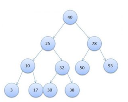
* Хэш-индексы – предполагают хранение не самих значений, а их хэшей, благодаря чему уменьшается размер(а,
  соответственно, и увеличивается скорость их обработки) индексов из больших полей. Таким образом, при запросах с
  использованием HASH-индексов, сравниваться будут не искомое со значения поля, а хэш от искомого значения с хэшами
  полей.
  Из-за нелинейнойсти хэш-функций данный индекс нельзя сортировать по значению, что приводит к невозможности
  использования в сравнениях больше/меньше и «is null». Кроме того, так как хэши не уникальны, то для совпадающих хэшей
  применяются методы разрешения коллизий.
* Bitmap index – метод битовых индексов заключается в создании отдельных битовых карт (последовательность 0 и 1)
  для каждого возможного значения столбца, где каждому биту соответствует строка с индексируемым значением, а его
  значение равное 1 означает, что запись, соответствующая позиции бита содержит индексируемое значение для данного
  столбца или свойства.
* Полнотекстовый (инвертированный) индекс – словарь, в котором перечислены все слова и указано, в каких местах они
  встречаются. При наличии такого индекса достаточно осуществить поиск нужных слов в нём и тогда сразу же будет получен
  список документов, в которых они встречаются.
  Уникальный индекс – состоит из множества уникальных значений поля.
* Плотный индекс (NoSQL) – индекс, при котором, каждом документе в индексируемой коллекции соответствует запись в
  индексе, даже если в документе нет индексируемого поля.
* Разреженный индекс (NoSQL) – тот, в котором представлены только те документы, для которых индексируемый ключ имеет
  какое-то определённое значение (существует).
* Пространственный индекс – оптимизирован для описания географического местоположения. Представляет из себя
  многоключевой индекс состоящий из широты и долготы.
* Составной пространственный индекс – индекс, включающий в себя кроме широты и долготы ещё какие-либо мета-данные (
  например теги). Но географические координаты должны стоять на первом месте.
* Обратный индекс (reverse index) – это тоже B-tree индекс но с реверсированным ключом, используемый в основном для
  монотонно возрастающих значений(например, автоинкрементный идентификатор) в OLTP системах с целью снятия конкуренции
  за последний листовой блок индекса, т.к. благодаря переворачиванию значения две соседние записи индекса попадают в
  разные блоки индекса. Он не может использоваться для диапазонного поиска.
* Функциональный (function-based) индекс (индекс по вычисляемому полю) – индекс, ключи которого хранят результат
  пользовательских функций. Функциональные индексы часто строятся для полей, значения которых проходят предварительную
  обработку перед сравнением в команде SQL. Например, при сравнении строковых данных без учета регистра символов часто
  используется функция UPPER. Создание функционального индекса с функцией UPPER улучшает эффективность таких сравнений.
  Кроме того, функциональный индекс может помочь реализовать любой другой отсутствующий тип индексов данной СУБД(кроме,
  пожалуй, битового индекса, например, Hash для Oracle)
* Первичный индекс – уникальный индекс по полю первичного ключа.
* Вторичный индекс – индекс по другим полям (кроме поля первичного ключа).
* XML-индекс – вырезанное материализованное представление больших двоичных XML-объектов (BLOB) в столбце с типом данных
  xml.

# Индекс по умолчанию в postgres

По умолчанию является индекс на основе B-дерева. Однако PostgreSQL поддерживает различные типы индексов для большого
спектра задач, и при желании можно выбрать другой тип вместо B-tree.
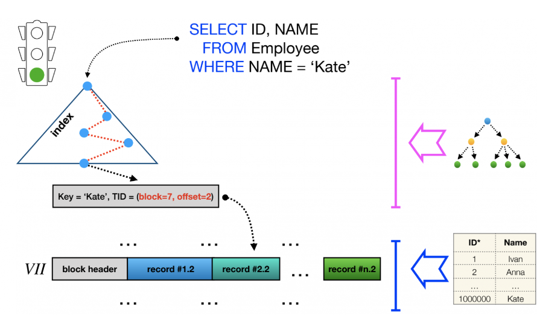

# Как можно создать индексы?

🔹 Индекс по столбцу (это чистая классика)

🔹 Индекс по нескольким столбцам

🔹 Уникальный индекс

🔹 Индекс на основе выражения

🔹 Частичный индекс

Для создания индекса используется примерно такой синтаксис:

```
CREATE [UNIQUE] INDEX <index_name> ON <table_name> ( <column_name>, ... ) [STATEMENT] ;
```

При этом:

для создания уникального индекса может использоваться слово UNIQUE
для создания выражения его записывают в скобках, например для создания выражения проверки индекса на нижний регистр
можно написать так:

``` . . . ( lower( <column_name> ) ) ;```
для создания частичного индекса после скобок запись продолжается, например для проверки на величину можно написать так:

```. . . ( . . . ) WHERE <column_name> > 1000 ;```

# Какие уровни изоляции существуют и феномены (аномалии)

| Уровень          | Феномен                                                              |
|------------------|----------------------------------------------------------------------|
| Read uncommitted | Грязное чтения <br/>Потерянное обновление                            |
| Read committed   | Неповторяющееся чтение<br/>Чтения фантомов<br/>Потерянное обновление |                                      |
| Repeatable read  | Чтение фантомов                                                      | 
| Serializable     | Аномалия сериализации                                                |                                                                                                       |

Что делает

| Феномен                | Что делает (видит транзакция)                                                                                                                                                                                |
|------------------------|--------------------------------------------------------------------------------------------------------------------------------------------------------------------------------------------------------------|
| Грязное чтения         | Незакомиченные данные                                                                                                                                                                                        |
| Потерянное обновление  | Одновременное изменение данных, потеря изменений одной из транзакций                                                                                                                                         |
| Неповторяющееся чтение | Обнавленные и удаленные строки                                                                                                                                                                               |
| Чтение фантомов        | Добавленные записи                                                                                                                                                                                           |
| Аномалия сериализации  | Результат успешной фиксации группы транзакций, выполняющихся параллельно, не совпадает с результатом ни одного из возможных вариантов упорядочения этих транзакций, если бы они выполнялись последовательно. |

На самом деле в MySQL отсутствует эффект чтения фантомов для уровня repeatable read. И в PostgreSQL от него тоже
избавились для этого уровня. Хотя в классическом представлении этого уровня, мы должны наблюдать этот эффект.

Немного теории

Сами транзакции особых объяснений не требуют, транзакция — это N (N≥1) запросов к БД, которые выполнятся успешно все
вместе или не выполнятся вовсе. Изолированность же транзакции показывает то, насколько сильно влияют друг на друга
параллельно выполняющиеся транзакции.
Выбирая уровень транзакции, мы пытаемся прийти к консенсусу в выборе между высокой согласованностью данных между
транзакциями и скоростью выполнения этих самых транзакций.
Стоит отметить, что самую высокую скорость выполнения и самую низкую согласованность имеет уровень read uncommitted.
Самую низкую скорость выполнения и самую высокую согласованность — serializable.

Подготовка окружения

Для примеров была выбрана СУБД MySQL. PostgreSQL мог бы тоже использоваться, но он не поддерживает уровень изоляции read
uncommitted, и использует вместо него уровень read committed. Да и как оказалось, разные СУБД по-разному воспринимают
уровни изолированности. Могут иметь разнообразные нюансы в обеспечении изоляции, иметь дополнительные уровни или не
иметь общеизвестных.

Создадим окружение с помощью готового образа MySQL с Docker Hub. И заполним базу данными.
docker-compose.yaml

```yaml
version: '3.4'
services:
  db:
    image: mysql:8
    environment:
      - MYSQL_ROOT_PASSWORD=12345
    command: --init-file /init.sql
    volumes:
      - data:/var/lib/mysql
      - ./init.sql:/init.sql
    expose:
      - "3306"
    ports:
      - "3309:3306"

volumes:
  data:
```

Заполнение базы данных

```sql
CREATE
database if NOT EXISTS bank;

use
bank;

CREATE TABLE if NOT EXISTS accounts
(
    id
    INT
    unsigned
    auto_increment
    PRIMARY
    KEY,
    login
    VARCHAR
(
    255
) NOT NULL,
    balance bigint DEFAULT 0 NOT NULL,
    created_at TIMESTAMP DEFAULT now
(
)
    ) COLLATE =utf8mb4_unicode_ci;

INSERT INTO accounts (login, balance)
VALUES ('petya', 1000);
INSERT INTO accounts (login, balance)
VALUES ('vasya', 2000);
INSERT INTO accounts (login, balance)
VALUES ('mark', 500);
```

Рассмотрим как работают уровни и их особенности.
Примеры будем выполнять на 2 параллельно исполняющихся транзакциях. Условно транзакцию в левом окне будем называть
транзакция 1 (Т1), в правом окне — транзакция 2 (Т2).

### Read uncommitted

Уровень, имеющий самую плохую согласованность данных, но самую высокую скорость выполнения транзакций. Название уровня
говорит само за себя — каждая транзакция видит незафиксированные изменения другой транзакции (феномен грязного чтения).
Посмотрим какое влияние оказывают друг на друга такие транзакции.

Шаг 1. Начинаем 2 параллельные транзакции.

```
mysql> START TRANSACTION;
```

Шаг 2. Смотрим какая информация имеется у нас в начале.

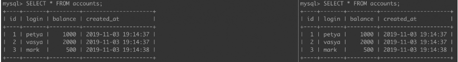
Шаг 3. Теперь выполняем операции INSERT, DELETE, UPDATE в Т1, и посмотрим, что теперь видит другая транзакция.

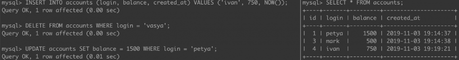
Т2 видит данные другой транзакции, которые еще не были зафиксированы.

Шаг 4. И Т2 может получить какие-то данные.

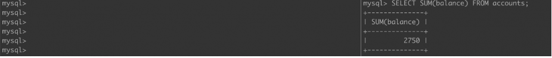
Шаг 5. При откате изменений Т1, данные полученные Т2 окажутся ошибочными.

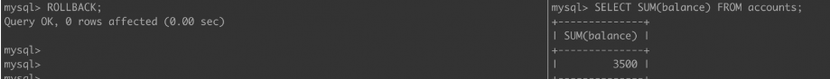
На данном уровне нельзя использовать данные, на основе которых делаются важные для приложения выводы и критические
решения т.к выводы эти могут быть далеки от реальности.
Данный уровень можно использовать, например, для примерных расчетов чего-либо. Результат COUNT(*) или MAX(*) можно
использовать в каких-нибудь нестрогих отчетах.
Другой пример это режим отладки. Когда во время транзакции, вы хотите видеть, что происходит с базой.

### Read committed

Для этого уровня параллельно исполняющиеся транзакции видят только зафиксированные изменения из других транзакций. Таким
образом, данный уровень обеспечивает защиту от грязного чтения.
Шаг 1 и Шаг 2 аналогичны предыдущему примеру.
Шаг 3. Также выполним 3 простейшие операции с таблицей accounts (Т1) и сделаем полную выборку из этих таблиц в обеих
транзакциях
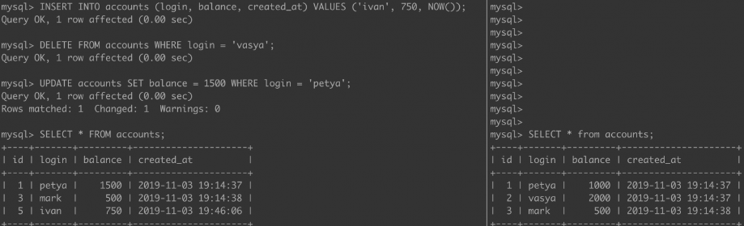

И увидим, что феномен грязного чтения в Т2 отсутствует.

Шаг 4. Зафиксируем изменения Т1 и проверим, что теперь видит Т2.
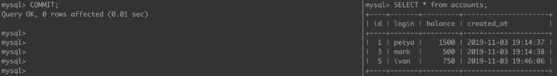

Теперь Т2 видит все, что сделала Т1. Это так называемые феномен неповторяющегося чтения, когда мы видим обновленные и
удаленные строки (UPDATE, DELETE), и феномен чтения фантомов, когда мы видим добавленные записи (INSERT).

### Repeatable read

Уровень, позволяющий предотвратить феномен неповторяющегося чтения. Т.е. мы не видим в исполняющейся транзакции
измененные и удаленные записи другой транзакцией. Но все еще видим вставленные записи из другой транзакции. Чтение
фантомов никуда не уходит.
Снова повторяем Шаг 1 и Шаг 2.
Шаг 3. В Т1 выполняем запросы INSERT, UPDATE и DELETE. После, в Т2 пытаемся обновить ту же самую строку, которую
обновили в Т1.

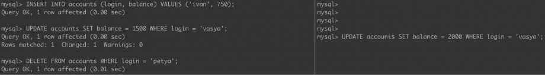
И получаем lock: T2 будет ждать, пока T1 не зафиксирует изменения или не откатится.

Шаг 4. Зафиксируем изменения, которые сделала Т1. И прочитаем снова данные из таблицы accounts в Т2.


Как видно, феноменов неповторяющегося чтения и чтения фантомов не наблюдается. Как же так, ведь по умолчанию, repeatable
read позволяет нам предотвратить только феномен неповторяющегося чтения?
На самом деле в MySQL отсутствует эффект чтения фантомов для уровня repeatable read. И в PostgreSQL от него тоже
избавились для этого уровня. Хотя в классическом представлении этого уровня, мы должны наблюдать этот эффект.
Небольшой абстрактный пример — сервис генерации подарочных сертификатов (кодов) и их использования. Например,
злоумышленник сгенерировал себе код сертификата и пытается его активировать, пытаясь послать несколько запросов подряд
на активацию купона. В таком случае у нас запустится несколько параллельно исполняемых транзакций, работающих с одним и
тем же купоном. И в некоторых ситуациях может возникнуть двойная или даже тройная активация купона (пользователь получит
2x/3x бонусов). При repeatable read в данном случае возникнет lock и активация пройдет единожды, а в предыдущих 2
уровнях возможна многократная активация. Подобную проблему можно также решить с помощью запроса SELECT FOR UPDATE,
который также заблокирует обновляемую запись (купон).

### Serializable

Уровень, при котором транзакции ведут себя как будто ничего более не существует, никакого влияния друг на друга нет. В
классическом представлении этот уровень избавляет от эффекта чтения фантомов.
Шаг 1. Начинаем транзакции.
Шаг 2. Т2 читаем таблицу accounts, затем Т1 пытаемся обновить данные прочитанные Т2.
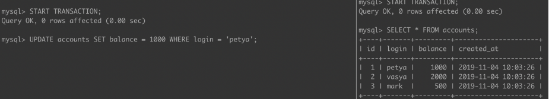

Получаем lock: мы не можем изменить данные в одной транзакции, прочитанные в другой.
Шаг 3. И INSERT и DELETE ведет нас к lock'у в Т1.

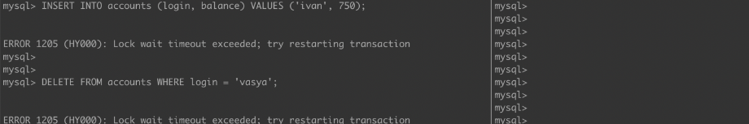

Пока Т2 не завершит свою работу, мы не сможем работать с данными, которые она прочитала. Мы получаем максимальную
согласованность данных, никакие лишние данные не зафиксируются. Цена за это медленная скорость транзакций из-за частых
lock'ов поэтому при плохой архитектуре приложения это может сыграть с Вами злую шутку.

Выводы

В большинстве приложений уровень изолированности редко меняется и используется значение по умолчанию (например, в MySQL
это repeatable read, в PostgreSQL — read committed).

Но периодически возникают, задачи, в которых поиск лучшего баланса между высокой согласованностью данных или скоростью
выполнения транзакций может помочь решить некоторую прикладную задачу.

# Есть ли преимущество у NoSQL над SQL?

Иногда можно добиться большего быстродействия у первого языка. Если кратко - преимущество есть в скорости выполнения
запросов. Это связано с отсутствием связей и конкретной схемы в NoSQL.

Так MongoDB может выигрывать у PostrgeSQL в запросах, которые подразумевают много связей и за которыми постгрес полезет
в другие таблицы, которые, вдобавок, могут оказаться очень большими.

# Аномалии при выполнении транзакций

Можно выполнять транзакции последовательно или параллельно
И если в первом случае все понятно, то со вторым могут возникать "феномены", например:

1. Потерянное обновление (lost update)
   Когда разные транзакции одновременно изменяют одни и те же данные, то после фиксации изменений может оказаться, что
   одна транзакция перезаписала данные, обновленные и зафиксированные другой транзакцией.

2. «Грязное» чтение (dirty read)
   Транзакция читает данные, измененные параллельной транзакцией, которая еще не завершилась. Если эта параллельная
   транзакция в итоге будет отменена, тогда окажется, что первая транзакция прочитала данные, которых нет в системе.

3. Неповторяющееся чтение (non-repeatable read)
   При повторном чтении тех же самых данных в рамках одной транзакции оказывается, что другая транзакция успела изменить
   и зафиксировать эти данные. В результате тот же самый запрос выдает другой результат.

4. Фантомное чтение (phantom read).
   Транзакция повторно выбирает множество строк в соответствии с одним и тем же критерием. В интервале времени между
   выполнением этих выборок другая транзакция добавляет новые строки и успешно фиксирует изменения. В результате при
   выполнении повторной выборки в первой транзакции может быть получено другое множество строк.

5. Аномалия сериализации (serialization anomaly)
   Результат успешной фиксации группы транзакций, выполняющихся параллельно, не совпадает с результатом ни одного из
   возможных вариантов упорядочения этих транзакций, если бы они выполнялись последовательно.

# Что такое аномалия сериализации?

Для двух транзакций, скажем, A и B, возможны только два варианта упорядочения при их последовательном выполнении:

1️⃣ сначала A, затем B

2️⃣ сначала B, затем A.

Причем результаты реализации двух вариантов могут в общем случае не совпадать.

Например, при выполнении двух банковских операций — внесения некоторой суммы денег на какой-то счет и начисления
процентов по этому счету — важен порядок выполнения операций.

Если изначально на счете было 1000 у.е. и первой операцией будет увеличение суммы на 1000 у.е., а второй — начисление
процентов (10%), то тогда итоговая сумма будет больше (2200 у.е.), чем при противоположном порядке выполнения этих
операций (2100 у.е.).

Если описанные операции выполняются в рамках двух различных транзакций, то оказываются возможными различные итоговые
результаты, зависящие от порядка их выполнения.

Сериализация двух транзакций при их параллельном выполнении означает, что полученный результат будет соответствовать
одному из двух возможных вариантов упорядочения транзакций при их последовательном выполнении. То есть мы знаем, что
результат может быть либо 2100 у.е. либо 2200 у.е. - не иначе. Соответственно, аномалия сериализации — несоответствие
результата ни одному из вариантов.

При этом нельзя сказать точно, какой из вариантов будет реализован.

Если распространить эти рассуждения на случай, когда параллельно выполняется более двух транзакций, тогда результат их
параллельного выполнения также должен быть таким, каким он был бы в случае выбора некоторого варианта упорядочения
транзакций, если бы они выполнялись последовательно, одна за другой.

Конечно, чем больше транзакций, тем больше вариантов их упорядочения. Концепция сериализации не предписывает выбора
какого-то определенного варианта. Речь идёт лишь об одном из них.

# Блокировки

Кроме поддержки уровней изоляции транзакций, многие СУБД позволяют также создавать блокировки данных как на уровне
отдельных строк, так и на уровне целых таблиц.

Команда SELECT имеет предложение FOR UPDATE, которое позволяет заблокировать отдельные строки таблицы с целью их
последующего обновления.

Если одна транзакция заблокировала строки с помощью этой команды, тогда параллельные транзакции не смогут заблокировать
эти же строки до тех пор, пока первая транзакция не завершится, и тем самым блокировка не будет снята.

Таким образом если выполнять данную команду:

SELECT * FROM table_tame WHERE column_name ~ 'some text' FOR UPDATE;
на двух терминалах — сначала на одном — а затем на втором (с учетом начала транзакции BEGIN)

То можно заметить, что выполнение на втором терминале приостановится до тех пор пока не завершится транзакция первого
терминала

При этом если на первом терминале выполнить какую-нибудь другую команду:

UPDATE table_name SET column_name = 'kek' WHERE column_value = 404;
То, перейдя на второй терминал станет видно, что там была, наконец, выполнена выборка, которая покажет уже измененные
данные с учетом данной UPDATE-команды

* Ловушка джокера
  тут могут спросить про такую штуку как DEAD LOCK - напишите в комментах пример дед лока)
  a

### Типы блокировок в БД

* Optimisic – один поток хранит копию данных которые будут подвержены изменению, и при коммите новых изменений будет
  сравниваться версия копии с измененной. И пытается на старую версию накатить новую. Проверка версии у бд происходит по
  доп столбцу версии этой строки которую надо хранить. И будет формироваться update с условием where version =5. Если
  такая строчка найдена, значит никакой поток не изменил.
* Pessimistic– когда полностью блокируем доступ к ресурсу и другой поток не может достучаться. Риски- проблема с
  DeadLock
  Как выбрать тот или другой варианта при проектировании
  Pessimistic -можно использовать на уровне java приложений прим- synchronized блок. У бд – это в рамках 1 транзакции
  например селект строчек для обновления (for update)- на эти строки повеситься эксклюзивная блокировка а другие будут
  ожидать завершение(комит или роллбек)
  Так же можно использовать таблицу куда вставляться айдишник строк которые необходимо заблокировать а другие будут
  проверять есть ли в этой табличке что им нужно.
  У блокировки нужно хранить срок действия, ведь если упадет сервис а запись останется, то никто не сможет с ней
  работать. Тогда нужен таймаут по истечении которого снимится блокировка.
  Пессимистическую блокировку можно использовать если у нас долгие тяжеловесные операции по обновлению данных
* Блокировка select for update когда блокируеться только маленкий участок строки которая изменяется. Это нужно когда два
  микросервиса изменяют 1 таблицу

# Планировщик

Это такой встроенный механизм в СУБД, перед выполнением запроса он формирует "план" выполнения запроса. Просмотреть план
выполнения любого запроса можно с помощью команды EXPLAIN. Для детального понимания планов выполнения сложных запросов
требуется опыт.

Планировщиком можно управлять с целью просмотра логики его работы и дальнейшей оптимизации запросов

# Оптимизация запросов

Повлиять на скорость выполнения запроса можно различными способами. Я запомнил их так:
изменить сам sql-запрос, обновить статистику планировщика, денормализация и 4 вариации изменения параметров
планировщика:

* изменение исходного кода запроса
* обновление статистики, на основе которой планировщик строит планы
* денормализация: создание временных таблиц или создание индексов
* изменение параметров планировщика, управляющих выбором порядка соединения наборов строк
    * изменение параметров планировщика, управляющих выбором метода доступа к данным (enable_seqscan, enable_indexscan,
      enable_indexonlyscan, enable_bitmapscan)
* изменение параметров планировщика, управляющих способом соединения наборов строк (enable_nestloop, enable_hashjoin,
  enable_mergejoin);
* изменение параметров планировщика, управляющих использованием ряда операций: агрегирование на основе хеширования,
  материализация временных наборов строк, выполнение явной сортировки при наличии других возможностей.

# Какие есть концепции масштабируемости БД

    Я всегда выделял 2 основных. Это Шардирование и Репликация. В обоих случаях подразумевается наличие нескольких
    инстансов БД.

* Для шардирования мы определяем срезы строк, которые будут храниться в конкретном инстансе, например для первого, это с
  1
  по 10 000, а для второго с 10 001 по 20 000 и так далее.

* Репликация подразумевает создание одного инстанса-контроллера и нескольких инстансов-нод. То есть по сути это полное
  копирование СУБД на другой сервер. Таким образом контроллер сам будет решать в какую ноду и что ему записывать.
  По статистике и, наверное, логике выборки данных SELECT в интернетах выполняются во много раз чаще, чем INSERT'ы, на
  этом фоне репликация выглядит привлекательнее.

Все выше сказанное относится к теме "Повышение отказоустойчивости". Вот пара статей про неё: раз, два

# Что будет если сделать EXPLAIN ANALYZE DROP DATABASE POSTGRES

    Ну и напоследок такой вопрос с подвохом: всё плохо будет, потому что из-за ANALYZE субд мало того что с радостью
    удалит главную бд, так она ещё и посчитает веса а также время выполнения данного действа.

То есть простой EXPLAIN показывает план а EXPLAIN ANALYZE его ещё и выполняет

# В чем разница между базой данных и схемой?

В SQL база данных – это набор связанных данных, которые хранятся в организованном структурированном виде. Обычно она
содержит одну или несколько таблиц, а также другие объекты, такие как представления, хранимые процедуры и индексы. А
схема – это контейнер для объектов базы данных, включая таблицы, представления и хранимые процедуры.

База данных может иметь несколько схем, причем каждая схема будет содержать подмножество объектов базы данных. Схема
позволяет логически сгруппировать связанные объекты и отделить их от других объектов в той же базе данных. Это может
помочь в организации, обеспечении безопасности и контроле доступа.

Например, представьте себе базу данных для розничного магазина. В ней может быть несколько схем для различных отделов,
таких как отдел продаж, отдел инвентаризации и отдел кадров. Каждая схема будет содержать таблицы и другие объекты,
относящиеся к данному отделу. Это облегчит управление базой данных и обеспечит доступ только к соответствующим данным
для каждого отдела.

В общем, база данных – это хранилище для всех данных и объектов, а схема – это контейнер для подмножества этих объектов,
обеспечивающий организацию и разделение задач.

# Какие существуют подходы при работе с базой данных в java

JDBC - это стандарт доступа к базам данных, JPA - это стандарт персистентности, Hibernate - это реализующий его ORM,
Spring Data - это механизм организации репозиториев, а репозиторий - это абстракция, лежащая на уровень выше ORM. То
есть Spring Data использует Hibernate, а Hibernate использует JDBC.

### Прямое использование JDBC (Java Database Connectivity)

* Преимущества:
  Полный контроль над SQL-запросами.
  Гибкость и производительность.
  Поддержка большинства реляционных баз данных.
* Недостатки:
  Требует много кода для реализации стандартных операций (например, открытие/закрытие соединений, обработка
  исключений).
  Увеличение вероятности ошибок при работе с SQL.

```java
    import java.sql.*;

public class JDBCExample {
    public static void main(String[] args) {
        String url = "jdbc:mysql://localhost:3306/mydatabase";
        String user = "username";
        String password = "password";

        try (Connection conn = DriverManager.getConnection(url, user, password);
             Statement stmt = conn.createStatement()) {

            ResultSet rs = stmt.executeQuery("SELECT * FROM my_table");
            while (rs.next()) {
                System.out.println(rs.getString("column_name"));
            }
        } catch (SQLException e) {
            e.printStackTrace();
        }
    }
}

  ```

### QueryBilders по типу QOOС

Генерирует нативные скули которые и сам выполняет

### JPA (Java Persistence API)

ЭТО СТАНДАРТ БЕЗ РЕАЛИЗАЦИИ
JPA — это стандартная спецификация для работы с объектно-реляционными базами данных. JPA абстрагирует работу с базой
данных и позволяет работать с данными как с объектами.

* Преимущества:
  Высокий уровень абстракции.
  Легкость в работе с базой данных (не нужно вручную писать SQL).
  Управление транзакциями и сессиями.
  Поддержка кэширования.
* Недостатки:
  Потенциально меньшая производительность по сравнению с использованием чистого SQL, особенно для сложных запросов.
  Необходимость конфигурации и понимания принципов ORM.
  Пример использования JPA с аннотациями:
  Принцип работы: JPA использует концепцию объектно-реляционного отображения (ORM), где таблицы базы данных
  отображаются
  на Java классы, а строки — на объекты

#### Hibernate

Hibernate — это одна из самых популярных реализаций JPA. Он предоставляет расширенные возможности для работы с базами
данных, такие как кэширование, ленивую загрузку (lazy loading) и т.д.
EntityManager который следит за жизненным циклом объектов.

Принцип работы: Hibernate использует объектно-реляционное отображение, как и JPA, но предлагает дополнительные
возможности, такие как кэширование, более гибкие механизмы настройки и поддержки различных баз данных.

* Преимущества:
  Расширение возможностей JPA.
  Поддержка сложных объектов и связей.
  Кэширование на уровне сессии и второго уровня.
  Удобное создание и выполнение запросов через HQL (Hibernate Query Language) или Criteria API.
* Недостатки:
  Может быть сложнее в освоении по сравнению с обычным JPA.
  Иногда Hibernate может генерировать неэффективные SQL-запросы, если его неправильно настроить.
  Пример использования Hibernate:
    ```
    Session session = sessionFactory.openSession();
    Transaction tx = session.beginTransaction();
    User user = new User("john_doe");
    session.save(user);
    tx.commit();
    session.close();
    ```

### Spring Data JPA

Основное понятие в Spring Data — это репозиторий. Это несколько интерфейсов которые используют JPA Entity для
взаимодействия с ней. Так например интерфейс

```
public interface CrudRepository<T, ID extends Serializable> extends Repository<T, ID>
```

обеспечивает основные операции по поиску, сохранения, удалению данных (CRUD операции
Spring Data JPA — это абстракция на основе JPA, предоставляемая фреймворком Spring, которая упрощает создание
репозиториев для работы с базой данных.
Spring Data JPA - дает возможность декларативной генерации скулей по именам методов

* Принцип работы: Spring Data JPA генерирует реализацию репозиториев на основе интерфейсов, что позволяет легко
  интегрировать работу с базой данных в приложении.
* Преимущества:
  Упрощает работу с репозиториями.
  Автоматическая реализация CRUD-операций.
  Встроенная поддержка запросов на основе именования методов (например, findByUsername).
* Недостатки:
  Меньше гибкости в сложных случаях, когда требуется использовать сложные SQL-запросы.
  Пример использования Spring Data JPA:

```java

@Repository
public interface UserRepository extends JpaRepository<User, Long> {
    List<User> findByUsername(String username);
}

```

### Микс SQL и ORM: MyBatis

MyBatis — это гибридный подход между ORM и прямым использованием SQL. Позволяет писать SQL-запросы вручную, но при этом
автоматически мапить результаты на объекты Java.

* Преимущества:
  Гибкость в написании SQL-запросов.
  Поддержка сложных запросов.
  Меньше магии, чем в ORM.
* Недостатки:
  Требует настройки XML или аннотаций для маппинга.
  Нужно больше кода по сравнению с ORM.

```java


Копировать код

@Mapper
public interface MyMapper {
    @Select("SELECT * FROM my_table WHERE id = #{id}")
    MyEntity findById(int id);
}

// Использование:
@Autowired
private MyMapper myMapper;

MyEntity entity = myMapper.findById(1);
```