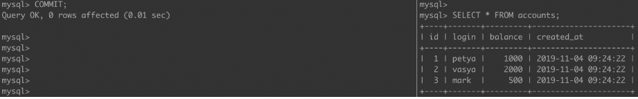

# Какое действие поможет оптимизировать следующий SQL запрос для улучшения его производительности?

```SELECT * FROM Orders WHERE CustomerID IN (SELECT CustomerID FROM Customers WHERE Country = ‘Germany');```
Использование INNER JOIN вместо подзапроса
Чтобы оптимизировать указанный SQL запрос для улучшения его производительности, наиболее эффективным действием будет
использование INNER JOIN вместо подзапроса.

Использование INNER JOIN позволяет базе данных более эффективно обрабатывать запрос, так как оно может создать
соединение между таблицами и использовать индексы более эффективно. Запрос с использованием JOIN может быть реализован
так:

``` SELECT * FROM Orders INNER JOIN Customers ON Orders.CustomerID = Customers.CustomerID WHERE Customers.Country = 'Germany' ```

Другие варианты:
Добавление индекса к столбцу Country в таблице Customers: это может помочь, но INNER JOIN будет более эффективным в этом
случае.
Увеличение размера памяти сервера базы данных: это может помочь в общем, но не решает проблему конкретного запроса.
Изменение типа данных столбца CustomerID: это не окажет значительного влияния на производительность данного запроса.
Таким образом, правильный ответ — использование INNER JOIN вместо подзапроса.

# Какое утверждение наилучшим образом описывает различие между первичным ключом и составным ключом в базе данных?

Первичный ключ может содержать только одно поле, в то время как составной ключ состоит из двух или более полей.

#### Пояснение:

Если у первичного ключа более 1 поля это уже составной ключ
Первичный ключ может содержать только одно поле, в то время как составной ключ состоит из двух или более полей.

Первичный ключ — это уникальный идентификатор для каждой записи в таблице, который обычно состоит из одного поля.
Составной ключ — это ключ, состоящий из двух или более полей, которые вместе уникально идентифицируют запись в таблице.
Другие утверждения неверны:

Первичный ключ и составной ключ автоматически создают индексы, так что это не является корректным отличием.
Оба типа ключей не используются для шифрования данных.
Первичный ключ и составной ключ функционально различны, а не идентичны.
Таким образом, правильный ответ — Первичный ключ может содержать только одно поле, в то время как составной ключ состоит
из двух или более полей

# Какой компонент ACID обеспечивает, что транзакция либо полностью выполнится, либо не выполнится вообще?

Компонент ACID, который обеспечивает, что транзакция либо полностью выполнится, либо не выполнится вообще, называется
Atomicity (Атомарность).

- Атомарность гарантирует, что все операции в рамках транзакции выполняются как единое целое: если одна из операций не
  может быть выполнена, то вся транзакция откатывается, и изменения не применяются. Это предотвращает частичное
  выполнение
  транзакции, что обеспечивает целостность данных.

Другие компоненты ACID:

- Consistency (Согласованность): обеспечивает переход системы из одного согласованного состояния в другое, соблюдая все
  правила и ограничения.
- Isolation (Изоляция): гарантирует, что транзакции выполняются независимо друг от друга, даже если они выполняются
  одновременно.
- Durability (Стойкость): гарантирует, что после успешного завершения транзакции изменения сохраняются, даже в случае
  сбоя системы.
  Таким образом, правильный ответ — Atomicity (Атомарность).
-

# Какой метод миграции данных наиболее подходит для больших объемов данных с минимальным временем простоя?

#### Объяснение:

- Перенос данных в реальном времени (Real-time data migration) позволяет синхронизировать данные между старой и новой
  системами в процессе миграции. Это обеспечивает минимальное время простоя, так как система может продолжать работу с
  текущими данными, пока новые данные поступают в целевую базу данных.
- Другие методы, такие как ETL-процессы или построчное копирование данных, могут требовать больше времени и приводить к
  простою, особенно при работе с большими объемами данных.
- Прямое копирование файлов базы данных может потребовать остановки системы для обеспечения целостности данных, что
  также увеличивает время простоя.
  Таким образом, перенос данных в реальном времени позволяет минимизировать простой системы, что критично для больших
  объемов данных.

# Какой шаг является критически важным после завершения миграции данных?

Критически важным шагом после завершения миграции данных является проведение тестирования целостности и точности
мигрированных данных.

Объяснение:

- Тестирование целостности и точности данных необходимо для того, чтобы убедиться, что все данные корректно перенесены в
  новую систему, данные не были утеряны или повреждены в процессе миграции, и что они точно соответствуют исходным
  данным.
- Повторное использование старой базы данных или удаление исходных данных без проведения тестирования может привести к
  потере критической информации или работе с некорректными данными.
- Увеличение объема хранилища может быть важным для дальнейшей работы, но оно не решает проблему проверки корректности
  миграции.
  Поэтому первоочередной задачей после миграции является проверка корректности данных.

# SQL-инъекция

SQL-инъекция или SQLi – уязвимость, которая позволяет атакующему использовать фрагмент вредоносного кода на языке
структурированных запросов (SQL) для манипулирования базой данных и получения доступа к потенциально ценной информации.
Атаки на основе таких уязвимостей – одни из самых распространенных и опасных: они могут быть нацелены на любое
веб-приложение или веб-сайт, которые взаимодействуют с базой данных SQL (а подавляющее большинство баз данных
реализованы именно на SQL).
Например, запрос может осуществлять передачу учетных данных пользователя через веб-форму для доступа к сайту. Обычно
подобные веб-формы сконфигурированы таким образом, чтобы принимать только определенные типы данных, такие как имя
пользователя и (или) пароль. Введенная информация сверяется с базой данных. Если все совпадает, пользователь сможет
войти на сайт. А если нет – в доступе будет отказано.

# Какие оптимизации запросов в БД существуют?

Вместо кучи insert делать один большой на все строки.
Использование индексов при поиске по таблицам.

# Что такое индексы

Индекс – сущность в бд, работает как указатель (вешаем на колонку). Индекс ускоряет процесс запроса, предоставляя
быстрый доступ к строкам данных в таблице, аналогично тому, как указатель в книге помогает вам быстро найти необходимую
информацию.
https://www.youtube.com/watch?v=LpEwssOYRKA
В общем виде, индекс в базах данных — это файл с последовательностью пар ключей и указателей.

# Какие типы индексов бывают

* Дерево (древовидный индекс) — это специального вида структура, у которой есть корневая вершина и у каждого узла может
  быть несколько дочерних узлов. При этом каждый узел встречается только один раз и может иметь всего один родительский
  узел. Выглядит это так:
  
* Хэш-индексы – предполагают хранение не самих значений, а их хэшей, благодаря чему уменьшается размер(а,
  соответственно, и увеличивается скорость их обработки) индексов из больших полей. Таким образом, при запросах с
  использованием HASH-индексов, сравниваться будут не искомое со значения поля, а хэш от искомого значения с хэшами
  полей.
  Из-за нелинейнойсти хэш-функций данный индекс нельзя сортировать по значению, что приводит к невозможности
  использования в сравнениях больше/меньше и «is null». Кроме того, так как хэши не уникальны, то для совпадающих хэшей
  применяются методы разрешения коллизий.
* Bitmap index – метод битовых индексов заключается в создании отдельных битовых карт (последовательность 0 и 1)
  для каждого возможного значения столбца, где каждому биту соответствует строка с индексируемым значением, а его
  значение равное 1 означает, что запись, соответствующая позиции бита содержит индексируемое значение для данного
  столбца или свойства.
* Полнотекстовый (инвертированный) индекс – словарь, в котором перечислены все слова и указано, в каких местах они
  встречаются. При наличии такого индекса достаточно осуществить поиск нужных слов в нём и тогда сразу же будет получен
  список документов, в которых они встречаются.
  Уникальный индекс – состоит из множества уникальных значений поля.
* Плотный индекс (NoSQL) – индекс, при котором, каждом документе в индексируемой коллекции соответствует запись в
  индексе, даже если в документе нет индексируемого поля.
* Разреженный индекс (NoSQL) – тот, в котором представлены только те документы, для которых индексируемый ключ имеет
  какое-то определённое значение (существует).
* Пространственный индекс – оптимизирован для описания географического местоположения. Представляет из себя
  многоключевой индекс состоящий из широты и долготы.
* Составной пространственный индекс – индекс, включающий в себя кроме широты и долготы ещё какие-либо мета-данные (
  например теги). Но географические координаты должны стоять на первом месте.
* Обратный индекс (reverse index) – это тоже B-tree индекс но с реверсированным ключом, используемый в основном для
  монотонно возрастающих значений(например, автоинкрементный идентификатор) в OLTP системах с целью снятия конкуренции
  за последний листовой блок индекса, т.к. благодаря переворачиванию значения две соседние записи индекса попадают в
  разные блоки индекса. Он не может использоваться для диапазонного поиска.
* Функциональный (function-based) индекс (индекс по вычисляемому полю) – индекс, ключи которого хранят результат
  пользовательских функций. Функциональные индексы часто строятся для полей, значения которых проходят предварительную
  обработку перед сравнением в команде SQL. Например, при сравнении строковых данных без учета регистра символов часто
  используется функция UPPER. Создание функционального индекса с функцией UPPER улучшает эффективность таких сравнений.
  Кроме того, функциональный индекс может помочь реализовать любой другой отсутствующий тип индексов данной СУБД(кроме,
  пожалуй, битового индекса, например, Hash для Oracle)
* Первичный индекс – уникальный индекс по полю первичного ключа.
* Вторичный индекс – индекс по другим полям (кроме поля первичного ключа).
* XML-индекс – вырезанное материализованное представление больших двоичных XML-объектов (BLOB) в столбце с типом данных
  xml.

# Индекс по умолчанию в postgres

По умолчанию является индекс на основе B-дерева. Однако PostgreSQL поддерживает различные типы индексов для большого
спектра задач, и при желании можно выбрать другой тип вместо B-tree.


# Какие уровни изоляции существуют и феномены (аномалии)

| Уровень          | Феномен                                     |
|------------------|---------------------------------------------|
| Read uncommitted | грязное чтения                              |
| Read committed   | неповторяющееся чтение,<br/>чтения фантомов |
| Repeatable read  | чтение фантомов                             |
| Serializable     | отсутсвуют                                  |

На самом деле в MySQL отсутствует эффект чтения фантомов для уровня repeatable read. И в PostgreSQL от него тоже
избавились для этого уровня. Хотя в классическом представлении этого уровня, мы должны наблюдать этот эффект.

Немного теории

Сами транзакции особых объяснений не требуют, транзакция — это N (N≥1) запросов к БД, которые выполнятся успешно все
вместе или не выполнятся вовсе. Изолированность же транзакции показывает то, насколько сильно влияют друг на друга
параллельно выполняющиеся транзакции.
Выбирая уровень транзакции, мы пытаемся прийти к консенсусу в выборе между высокой согласованностью данных между
транзакциями и скоростью выполнения этих самых транзакций.
Стоит отметить, что самую высокую скорость выполнения и самую низкую согласованность имеет уровень read uncommitted.
Самую низкую скорость выполнения и самую высокую согласованность — serializable.

Подготовка окружения

Для примеров была выбрана СУБД MySQL. PostgreSQL мог бы тоже использоваться, но он не поддерживает уровень изоляции read
uncommitted, и использует вместо него уровень read committed. Да и как оказалось, разные СУБД по-разному воспринимают
уровни изолированности. Могут иметь разнообразные нюансы в обеспечении изоляции, иметь дополнительные уровни или не
иметь общеизвестных.

Создадим окружение с помощью готового образа MySQL с Docker Hub. И заполним базу данными.
docker-compose.yaml

```yaml
version: '3.4'
services:
  db:
    image: mysql:8
    environment:
      - MYSQL_ROOT_PASSWORD=12345
    command: --init-file /init.sql
    volumes:
      - data:/var/lib/mysql
      - ./init.sql:/init.sql
    expose:
      - "3306"
    ports:
      - "3309:3306"

volumes:
  data:
```

Заполнение базы данных

```sql
create database if not exists bank;

use bank;

create table if not exists accounts
(
    id         int unsigned auto_increment
        primary key,
    login      varchar(255)        not null,
    balance    bigint    default 0 not null,
    created_at timestamp default now()
) collate=utf8mb4_unicode_ci;

insert into accounts (login, balance)
values ('petya', 1000);
insert into accounts (login, balance)
values ('vasya', 2000);
insert into accounts (login, balance)
values ('mark', 500);
```

Рассмотрим как работают уровни и их особенности.
Примеры будем выполнять на 2 параллельно исполняющихся транзакциях. Условно транзакцию в левом окне будем называть
транзакция 1 (Т1), в правом окне — транзакция 2 (Т2).

### Read uncommitted

Уровень, имеющий самую плохую согласованность данных, но самую высокую скорость выполнения транзакций. Название уровня
говорит само за себя — каждая транзакция видит незафиксированные изменения другой транзакции (феномен грязного чтения).
Посмотрим какое влияние оказывают друг на друга такие транзакции.

Шаг 1. Начинаем 2 параллельные транзакции.

```
mysql> START TRANSACTION;
```

Шаг 2. Смотрим какая информация имеется у нас в начале.

Шаг 3. Теперь выполняем операции INSERT, DELETE, UPDATE в Т1, и посмотрим, что теперь видит другая транзакция.

Т2 видит данные другой транзакции, которые еще не были зафиксированы.

Шаг 4. И Т2 может получить какие-то данные.

Шаг 5. При откате изменений Т1, данные полученные Т2 окажутся ошибочными.

На данном уровне нельзя использовать данные, на основе которых делаются важные для приложения выводы и критические
решения т.к выводы эти могут быть далеки от реальности.
Данный уровень можно использовать, например, для примерных расчетов чего-либо. Результат COUNT(*) или MAX(*) можно
использовать в каких-нибудь нестрогих отчетах.
Другой пример это режим отладки. Когда во время транзакции, вы хотите видеть, что происходит с базой.

#### Read committed

Для этого уровня параллельно исполняющиеся транзакции видят только зафиксированные изменения из других транзакций. Таким
образом, данный уровень обеспечивает защиту от грязного чтения.
Шаг 1 и Шаг 2 аналогичны предыдущему примеру.
Шаг 3. Также выполним 3 простейшие операции с таблицей accounts (Т1) и сделаем полную выборку из этих таблиц в обеих
транзакциях

И увидим, что феномен грязного чтения в Т2 отсутствует.

Шаг 4. Зафиксируем изменения Т1 и проверим, что теперь видит Т2.


Теперь Т2 видит все, что сделала Т1. Это так называемые феномен неповторяющегося чтения, когда мы видим обновленные и
удаленные строки (UPDATE, DELETE), и феномен чтения фантомов, когда мы видим добавленные записи (INSERT).

### Repeatable read

Уровень, позволяющий предотвратить феномен неповторяющегося чтения. Т.е. мы не видим в исполняющейся транзакции
измененные и удаленные записи другой транзакцией. Но все еще видим вставленные записи из другой транзакции. Чтение
фантомов никуда не уходит.
Снова повторяем Шаг 1 и Шаг 2.
Шаг 3. В Т1 выполняем запросы INSERT, UPDATE и DELETE. После, в Т2 пытаемся обновить ту же самую строку, которую
обновили в Т1.

И получаем lock: T2 будет ждать, пока T1 не зафиксирует изменения или не откатится.

Шаг 4. Зафиксируем изменения, которые сделала Т1. И прочитаем снова данные из таблицы accounts в Т2.


Как видно, феноменов неповторяющегося чтения и чтения фантомов не наблюдается. Как же так, ведь по умолчанию, repeatable
read позволяет нам предотвратить только феномен неповторяющегося чтения?
На самом деле в MySQL отсутствует эффект чтения фантомов для уровня repeatable read. И в PostgreSQL от него тоже
избавились для этого уровня. Хотя в классическом представлении этого уровня, мы должны наблюдать этот эффект.
Небольшой абстрактный пример — сервис генерации подарочных сертификатов (кодов) и их использования. Например,
злоумышленник сгенерировал себе код сертификата и пытается его активировать, пытаясь послать несколько запросов подряд
на активацию купона. В таком случае у нас запустится несколько параллельно исполняемых транзакций, работающих с одним и
тем же купоном. И в некоторых ситуациях может возникнуть двойная или даже тройная активация купона (пользователь получит
2x/3x бонусов). При repeatable read в данном случае возникнет lock и активация пройдет единожды, а в предыдущих 2
уровнях возможна многократная активация. Подобную проблему можно также решить с помощью запроса SELECT FOR UPDATE,
который также заблокирует обновляемую запись (купон).

### Serializable

Уровень, при котором транзакции ведут себя как будто ничего более не существует, никакого влияния друг на друга нет. В
классическом представлении этот уровень избавляет от эффекта чтения фантомов.
Шаг 1. Начинаем транзакции.
Шаг 2. Т2 читаем таблицу accounts, затем Т1 пытаемся обновить данные прочитанные Т2.


Получаем lock: мы не можем изменить данные в одной транзакции, прочитанные в другой.
Шаг 3. И INSERT и DELETE ведет нас к lock'у в Т1.


Пока Т2 не завершит свою работу, мы не сможем работать с данными, которые она прочитала. Мы получаем максимальную
согласованность данных, никакие лишние данные не зафиксируются. Цена за это медленная скорость транзакций из-за частых
lock'ов поэтому при плохой архитектуре приложения это может сыграть с Вами злую шутку.

Выводы

В большинстве приложений уровень изолированности редко меняется и используется значение по умолчанию (например, в MySQL
это repeatable read, в PostgreSQL — read committed).

Но периодически возникают, задачи, в которых поиск лучшего баланса между высокой согласованностью данных или скоростью
выполнения транзакций может помочь решить некоторую прикладную задачу.