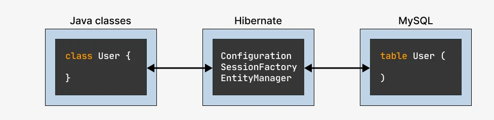

# Пример работы с hibernate

## Связываем Hibernate и базы данных

Мы научились подключать Hibernate к нашему приложению с помощью Maven, а также мапить таблицы на классы с помощью
аннотаций. И теперь возникает следующий вопрос — а как нам прочитать объекты из базы данных или сохранить их туда?

Не так быстро. Прежде всего нужно разобраться еще с тремя вещами:


* Конфигурирование подключения к базе данных
* Настройка Hibernate
* Работа с EntityManager

Hibernate полностью скрывает от твоего приложения работу с базой данных, но чтобы не было никаких эксцессов, его нужно
правильно сконфигурировать. Пропустить этот этап нельзя — как иначе Hibernate узнает, в какую базу данных ему сохранять
объекты?

Сконфигурировать Hibernate и задать ему информацию о базе данных можно тремя способами

* Использовать Properties-файл
* Использовать файл hibernate.cfg.xml
* Использовать методы бина Configuration
  И хотя мне больше всего нравиться последний, ты точно будешь сталкиваться со всеми тремя, так что мы все три тут и
  разберем.

## Авторизация в базе данных

Начнем с самого важного – подключения базы данных. Для этого тебе нужно будет указать данные, чтобы Hibernate мог
авторизоваться в нужной базе данных.

Properties File Configuration

```properties

hibernate.properties
hibernate.dialect=org.hibernate.dialect.Oracle9Dialect
hibernate.connection.driver_class=oracle.jdbc.driver.OracleDriver
hibernate.connection.url=jdbc:oracle:thin:@localhost:1521:supershop
hibernate.connection.username=root
hibernate.connection.password=secret
hibernate.show_sql=true
hibernate.hbm2ddl=update

```

Эти же настройки можно задать в виде xml-файла:
XML Based Configuration
hibernate.cfg.xml

```xml

<hibernate-configuration>
    <session-factory>

        <property name="dialect">org.hibernate.dialect.Oracle9Dialect</property>
        <property name="connection.driver_class">oracle.jdbc.driver.OracleDriver</property>
        <property name="connection.url">jdbc:oracle:thin:@localhost:1521:supershop</property>
        <property name="connection.username">root</property>
        <property name="connection.password">secret</property>
        <property name="hibernate.show_sql ">true</property>
        <property name="hbm2ddl.auto">update</property>

    </session-factory>
</hibernate-configuration> 
```

В обоих примерах мы видим одни и те же настройки с одними и теми же значениями. Просто первый пример представляет их в
виде properties-файла, а второй — в виде xml-файла.

Эти настройки делятся на три группы:

1. Указываем тип СУБД
    * Указываем диалект (тип СУБД), например, Oracle 9.0
    * Указываем имя JDBC-драйвера для работы с данной СУБД
2. Указываем данные для авторизации в базе
    * url базы
    * username
    * password
3. Конфигурируем движок Hibernate
    * hibernate.show_sql — Hibernate будет дублировать в консоль все запросы, которые выполняет
    * hbm2ddl.auto — Hibernate поменяет структуру базы данных, если надо
      Есть еще третий способ заданий конфигурации — через бины. Обычно он используется в паре со Spring, так что мы
      рассмотрим его, когда будем изучать SpringFramework.

## Получаем SessionFactory

Следующий этап — это получить объект SessionFactory. Есть несколько способов это сделать:

* Способ первый — используем файл hibernate.properties.

Для этого нужно просто написать такой код:

```java
SessionFactory sessionFactory = new Configuration().buildSessionFactory();
```

Если файл hibernate.properties не будет найден в текущей директории проекта, то кинется исключение.

* Способ второй — конфигурация с помощью hibernate.cfg.xml.

```java
SessionFactory sessionFactory = new Configuration().configure().buildSessionFactory();

```

Если ты напишешь такой код, то в качестве источника настроек будет использован файл hibernate.cfg.xml. Если такой файл
не будет найден, то метод buildSessionFactory() кинет исключение.

* Способ третий — задаем файл с конфигурацией вручную.

Иногда в процессе разработки возникает необходимость переключиться на тестовую базу или поменять какие-то другие
настройки для работы с базой, для этого можно задать файл конфигурации вручную:

```java
SessionFactory sessionFactory = new Configuration().configure("hibernate-dev.cfg.xml").buildSessionFactory();
```

* Способ четвертый — используем кастомный файл hibernate.properties:

```
ClassLoader classLoader = Thread.currentThread().getClassLoader();

Properties properties = new Properties();
properties.load(classLoader.getResourceAsStream("hibernate-dev.properties"));

SessionFactory sessionFactory = new Configuration()
                                    .addProperties(properties)
                                    .buildSessionFactory();
```

* И наконец можно просто зашить все нужные параметры прямо в код:

```
Properties properties = new Properties();
properties.put(Environment.DRIVER, "com.mysql.jdbc.Driver");
properties.put(Environment.URL, "jdbc:mysql://localhost:3306/supershop");
properties.put(Environment.USER, "root");
properties.put(Environment.PASS, "password");

SessionFactory sessionFactory = new Configuration()
                                    .setProperties(properties)
                                    .buildSessionFactory();
 ```

## Указываем, где искать Entity-классы

Но это еще не все. Когда мы конфигурируем объект SessionFactory в Hibernate, то этот SessionFactory проверяет, что в
базе данных существуют все необходимые таблицы с колонками требуемых типов.

И чтобы SessionFactory мог это сделать, ему нужно передать список entity-классов, которые ему нужно сопоставить с базой
данных.

Передать список entity-классов можно тремя способами:

* Способ первый. В hibernate.cfg.xml добавить строку вида:

```<mapping class="полное-имя класса" />```
Пример:

```xml

<mapping class="com.javarush.data.User"/>
<mapping class="com.javarush.data.Employee"/>
<mapping class="com.javarush.data.Task"/>
```

* Способ второй. Вызвать у объекта Configuration метод addAnnotatedClass(). Пример:

```
SessionFactory sessionFactory = new Configuration()
                                    .configure()
                                    .addAnnotatedClass(com.javarush.data.User.class)
                                    .buildSessionFactory();

```

Если классов много, то можно добавлять их целыми пакетами:

```
SessionFactory sessionFactory = new Configuration()
                                    .configure()
                                    .addPackage("com.javarush.data")
                                    .buildSessionFactory();
```

## Финальный пример

После того, как мы научились конфигурировать объект SessionFactory, давай напишем код, который будет его использовать.

Он будет состоять из трех методов:

* Конфигурируем Hibernate
* Метод, который получает всех сотрудников из базы
* Метод, который сохраняет нового сотрудника в базу
  Шаблон этого кода будет выглядеть примерно так:

```java


class EmployeeManager {
    private SessionFactory sessionFactory;

    public void

    class init() {
    	this.sessionFactory =new

        Configuration()
        	.

        configure()
        	.

        buildSessionFactory();
    }

    public List<Employee> getAllEmployes() {
        try (Session session = sessionFactory.openSession()) {
            Query<Employee> query = session.createQuery("from Employee", Employee.class);
            return query.list();
        }
    }

    public void addEmployee(Employee employee) {
        try (Session session = sessionFactory.openSession()) {
            Transaction transaction = session.beginTransaction();
            session.save(employee);
            transaction.commit();
        }
    }
}
```

Прежде чем выполнить запрос к базе, нужно создать отдельную сессию. Если запросы связанные, то они могут выполняться в
одной сессии. Если запросы не связанные (и между ними может пройти несколько минут), то для них нужно делать свои
собственные сессии.

Если ты хочешь прочитать данные из базы или выполнить сложный запрос, то нужно сначала создать объект Query и с помощью
него выполнить свой запрос.

Также каждый запрос к базе выполняется в своей собственной транзакции. Ее нужно открыть, выполнить нужные операции, и
затем закрыть (закоммитить).

В следующих лекциях мы детальнее разберем, как это все работает.

> <https://javarush.com/quests/lectures/questhibernate.level09.lecture02>