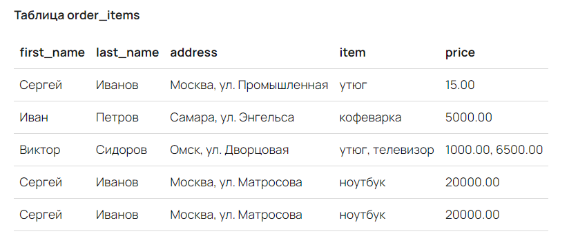
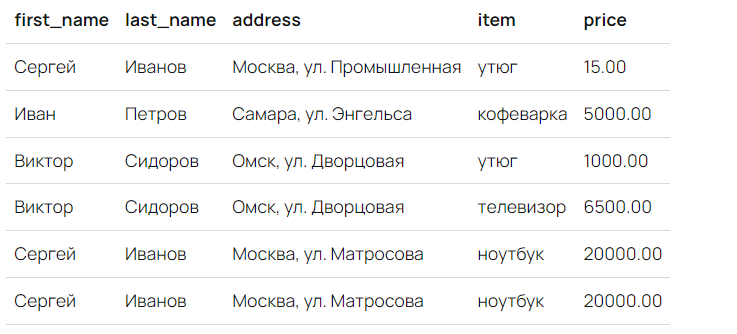
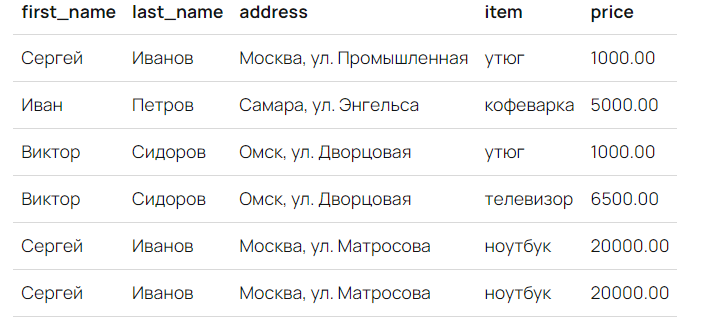
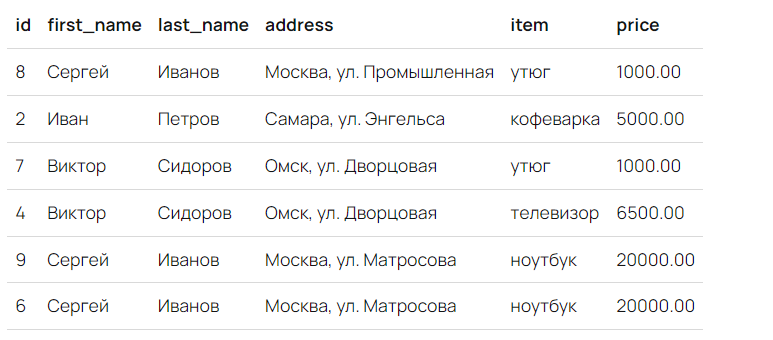
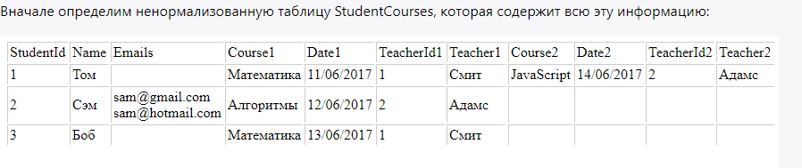
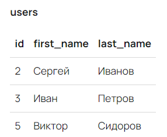
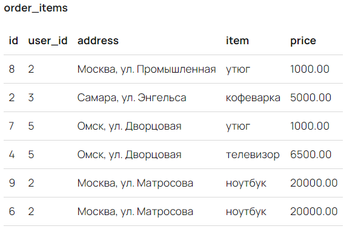
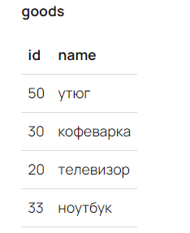
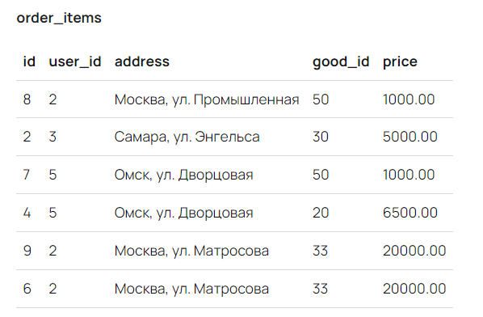

### Нормализация, формы


В первой строке последнего столбца цена указана в долларах, в остальных записях — это рубли. Последняя запись повторяет
предыдущую, потому что этот заказ выполнил тот же человек, но сделал это в другое время.

В этой табличке много повторяющейся информации. Приведем ее к правильной структуре с точки зрения реляционной модели.
Для этого приведем данные к нормальной форме — это требования, которые минимизируют избыточность данных, потенциально
приводящих к логическим ошибкам.

Всего существует шесть нормальных форм, которые включают определенные требования. С каждым следующим уровнем требования
все жестче, так как включают в себя предыдущие уровни.

В рамках курса мы разберем три нормальные формы. В этом уроке познакомимся с первой.

#### 1 Нормальная форма

##### 1 пример

Первая нормальная форма сводится к трем правилам:

- Каждая ячейка таблицы может хранить только одно значение (Отсутствуют массивы и списки в любом виде)
- Все данные в одной колонке могут быть только одного типа
- Каждая запись в таблице должна однозначно отличаться от других записей

Каждая ячейка – одно значение.
Вернемся к примеру выше. У одной записи поля item и price содержат два значения через запятую. У такого способа
организации данных много недостатков. Например, пропадает возможность делать обычную выборку по условиям:

-- Как задать условие, чтобы получить все записи о проданных утюгах?

```SELECT * FROM order_items WHERE item = ...;```

Другая проблема связана с типами данных. Поле price в таблице order_items имеет числовой тип (numeric). Если мы захотим
хранить там более одного значения, то тип превратится в строковый, а все данные станут обычными строками.

При такой организации невозможно проверить корректность данных и формат числа. Становится проблематично выполнить
агрегирующие запросы, например, считать выручку за определенный месяц одним запросом.

Чтобы избавиться от перечислений в ячейках, можно создать новые записи:


Теперь на одной строке находится информация только по одному товару. Так мы избавились от перечислений в поле, что
позволит выполнять агрегирующие запросы, а также не будет путаницы с типами данных.

Данные одного типа
Снова вернемся к таблице. Верхняя запись в ней содержит цену в долларах, хотя все остальные цены указаны в рублях.
Технически база никак не укажет на это. И доллары, и рубли представлены числами, но с точки зрения программы у этих
чисел разная природа.

Разные данные в рамках одного поля тоже не дают выполнить агрегирующие запросы, например, поиск сумм, максимального,
минимального. Еще усложняется обработка данных на уровне кода. В коде придется каким-то образом понимать, что из себя
представляют данные.

Вот еще несколько примеров с похожей ситуацией:

Хранение даты свадьбы в поле «день рождения»
Хранение номера телефона вместо адреса в поле «адрес»
Исправленная версия таблицы:


Мы конвертировали цену утюга в первой строке из долларов в рубли. Теперь у данных в поле price один тип. Так программе
будет легче выполнять агрегирующие запросы.

Уникальные записи
Последние две записи в таблице выглядят идентично, хотя это два разных заказа. Их сделал один человек, но в разное
время:
Сергей Иванов Москва, ул. Матросова ноутбук 20000.00
Сергей Иванов Москва, ул. Матросова ноутбук 20000.00
Реляционная модель требует от нас уникальности каждой записи. Иначе нельзя понять, что к чему относится и с какой
записью нужно работать при изменениях. Можно начать править не то и потерять важную информацию. При этом мы не можем
полагаться на порядок данных внутри таблицы, так как он не гарантирован.

Реализовать уникальность можно несколькими способами, например, добавить новое поле с датой заказа, которое сделает
запись уникальной. Этот способ не очень надежный и не очень удобный в работе. Придется постоянно анализировать весь
набор полей.

Лучше добавить первичный ключ (PRIMARY KEY) — поле или набор полей, которые содержат уникальное значение для каждой
записи. Первичный ключ не может меняться, его значение однозначно определяет любую запись в таблице.

Разберем два вида первичного ключа:

Естественный — когда используются значения из окружающего мира, например, email, ФИО или паспортные данные. При этом
нужно убедиться, что ключ не будет повторяться. Такие первичные ключи используют редко из-за их ненадежности. Часто они
не уникальны и могут изменяться или повторяться. Например, номер паспорта меняется при смене документа
Суррогатный — когда используются автоматически генерируемые уникальные значения. Такой ключ поддерживается любой базой
данных «из коробки». Иногда это просто числа, а иногда — сложные число-буквенные строки или хеши.
Добавим в нашу таблицу первичный ключ:


Первичный ключ принято создавать первым полем с названием id. Для первичного ключа обязательно указывать PRIMARY KEY в
описании таблицы:

``` 
-- Первичный ключ только один на таблицу 
        CREATE TABLE products   
        ( id bigint PRIMARY KEY, first_name varchar(255), last_name varchar(255), address varchar(255), item varchar(255),  
        price numeric -- специальный тип данных, который подходит под работу с деньгами. 
        Обеспечивает высокую точность при расчетах. )
```

Такой ключ все еще нужно формировать самостоятельно, но теперь база данных сама следит за уникальностью. При попытке
создать запись с повторяющимися первичными ключами возникнет ошибка.

##### 2 пример:

Первая нормальная форма предполагает, что таблица не должна содержать повторяющихся столбцов или таких столбцов, которые
содержат наборы значений. Ненормализованная таблица в этом случае может содержать одну или несколько повторяющихся групп
данных.
Повторяющаяся группа - это группа из одного или нескольких атрибутов таблицы, в которой возможно наличие
нескольких значений для ключевого атрибута таблицы.

Итогом применения первой формы должно стать наличие для одного атрибута сущности только одного столбца в таблице,
который при этом должен содержать скалярное значение.

Есть два похода к переходу к ненормализованной таблицы к первой нормальной форме.

- Первый способ называется выравниванием или flattening. Он предполагает декомпозицию строки с повторяющимися группами
  данных, при котором для каждой повторяющейся группы создается своя строка. Полученная в результате таблица будет
  содержать атомарные значения для каждого из атрибутов. Хотя в то же время этот подход увеличит избыточность данных.
- Второй подход предполагает, что один атрибут или группа атрибутов назначаются ключом ненормализованной таблицы, а
  затем повторяющиеся группы удаляются из таблицы и помещаются в отдельную таблицу вместе с копиями ключа из исходной
  таблицы.

Рассмотрим применение нормализации на примере. Пусть у нас есть система, которая описывается следующей информацией:

```
Том посещает курс по математике, который преподает Смит. Дата записи 11/06/2017.
Сэм посещает курс по алгоритмам, которые преподает Адамс. Дата записи 12/06/2017.
Боб посещает курс по математике, который преподает Смит. Дата записи 13/06/2017.
Том посещает курс по языку JavaScript, который преподает Адамс. Дата записи 14/06/2017.
Сэм имеет два электронных адреса: sam@gmail.com и sam@hotmail.com.
В университете может быть только один курс с определенным именем. Один преподаватель может преподавать несколько курсов.
Вначале определим ненормализованную таблицу StudentCourses, которая содержит всю эту информацию:
```



Нормализация базы данных
Для каждого студента определен уникальный идентификатор StudentId, а также атрибут Name (имя), Emails (все электронные
адреса), Course1 /Course2(курс), Date1/Date2 (дата поступления), Teacher1/Teacher2 (преподаватель). Также, чтобы
различать преподавателей (так как теоретически могут быть преподаватели с одной и той же фамилией), добавлен атрибут
TeacherId1/TeacherId2. Для курсов такой идентификатор не требуется, так как в нашем случае название курса уникально.

Поскольку Том записан сразу на два курса, то несколько атрибутов пришлось дублировать. Но что будет, когда Том в
стремлении получить никому не нужные сертификаты запишется еще на десяток курсов?

Эта таблица представляет прекрасный пример отклонения от первой нормальной формы. В первую очередь мы видим группу
повторяющихся атрибутов, которые представляют данные по одному курсу: Course, Date, TeacherId, Teacher. Эти атрибуты
представляют повторяющуюся группу, которую можно условно назвать StudentCourse.

StudentCourse = (Course, Date, TeacherId, Teacher)

Вторая проблема - атрибут Emails содержит набор электронных адресов. Фактически этот атрибут также образует
повторяющуюся группу.

Для избавления от первой повторяющейся группы атрибутов применим первый подход: создадим для каждой повторяющейся группы
отдельную строку.

| StudentId | Name | Emails                        | CourseId | Course     | Date       | TeacherId | Teacher |
|-----------|------|-------------------------------|----------|------------|------------|-----------|---------|
| 1         | Том  |                               | 1        | Математика | 11/06/2017 | 1         | Смит    |
| 1         | Том  |                               | 2        | JavaScript | 14/06/2017 | 2         | Адамс   |
| 2         | Сэм  | sam@gmail.com sam@hotmail.com | 3        | Алгоритмы  | 12/06/2017 | 2         | Адамс   |
| 3         | Боб  |                               | 1        | Математика | 13/06/2017 | 1         | Смит    |

В данном случае увеличилась избыточность данных, тем не менее мы избавились от повторяющейся группы. Также следует
отметить, что теперь атрибут StudentId не может использоваться в качестве первичного ключа. И в данном случае
просматривается только один потенциальный ключ, который и будет использоваться в качестве первичного - это сразу два
столбца StudentId и Course. Но название курса - не лучший ключ, если учитывать, что это название может редактироваться и
изменяться. Поэтому для каждого курса добавлен еще один атрибут - CourseId - уникальной номер курса, который вместе с
StudentId составляет первичный ключ. Хотя в принципе может было бы и оставить в качестве части первичного ключа имя
курса с учетом, что оно уникально.

Для избавления от второй повторяющейся группы - атрибута Emails применим второй подход: вынесение этой группы с копией
ключа в отдельную таблицу. Для этого определим таблицу Emails:

| Email           | StudentId |
|-----------------|-----------|
| sam@gmail.com   | 2         |
| sam@hotmail.com | 2         |

Так как электронный адрес в принципе уникален, то его можно сделать первичным ключом.

Таким образом, таблицы Emails с таблицей StudentCourses будет связана связью один ко многим (один студент - много
электронных адресов). И в этом случае таблица StudentCourses сократится следующим образом:

| StudentId | Name | CourseId | Course     | Date       | TeacherId | Teacher |
|-----------|------|----------|------------|------------|-----------|---------|
| 1         | Том  | 1        | Математика | 11/06/2017 | 1         | Смит    |
| 1         | Том  | 2        | JavaScript | 14/06/2017 | 2         | Адамс   |
| 2         | Сэм  | 3        | Алгоритмы  | 12/06/2017 | 2         | Адамс   |
| 3         | Боб  | 1        | Математика | 13/06/2017 | 1         | Смит    |

Теперь у нас нет повторяющихся столбцов, но увеличилась избыточность данных, так как для студента Том определено уже две
строки в таблице, и соответственно Id повторяется. Тем не менее 1-я нормальная форма применена.

В принципе можно отметить, что если повторяющиеся группы содержат уникальные значения для каждой строки таблицы (как в
случае с электронными адресами), то мы имеем дело с потенциальной связью один ко многим. Если же повторяющиеся группы
содержат неуникальные значения, которые могут иметь разные строки таблицы (как в случае с атрибутами курсов), то это
скрывается потенциальная связь многие ко многим.

#### 2 Нормальная форма

##### 1 пример:

Вторая нормальная форма включает в себя два требования:

1) должна быть в первой нормальной форме
2) Все неключевые атрибуты таблицы должны зависеть от первичного ключа

Это называется полная функциональная зависимость. Первичный ключ может быть составным. Но 2 форма предусматривает
что все неключевые атрибуты должны зависеть от первичного ключа всего
Иначе Частичной зависимостью (частичной функциональной зависимостью) называется зависимость неключевого атрибута от
части составного ключа (первичного).

Первое требование уже выполнено, так как в таблице:

- Каждая ячейка хранит только одно значение
- Все данные в одной колонке одного типа
- Каждая запись отличается от других записей

Поэтому разберем подробнее второе требование.

Зависимость от первичного ключа
Зависимость атрибута от первичного ключа — это ситуация, при которой ключ имеет значение, зависимое от конкретного
контекста. Предположим, что в таблице, Сергей — это всегда один и тот же человек, который делает заказ на разные адреса.
В таком случае видно, что заказ привязан к конкретному пользователю. Это и есть зависимость от первичного ключа. А вот
имя пользователя и его фамилия с заказом никак не связано. Оно имеет отношение к самому пользователю.

Согласно второй форме, атрибуты first_name и last_name необходимо вынести в свою таблицу, которая будет отвечать за
пользователей:

#### Зависимость от первичного ключа

Зависимость атрибута от первичного ключа — это ситуация, при которой ключ имеет значение, зависимое от конкретного
контекста. Предположим, что в таблице, Сергей — это всегда один и тот же человек, который делает заказ на разные адреса.
В таком случае видно, что заказ привязан к конкретному пользователю. Это и есть зависимость от первичного ключа. А вот
имя пользователя и его фамилия с заказом никак не связано. Оно имеет отношение к самому пользователю.

Согласно второй форме, атрибуты first_name и last_name необходимо вынести в свою таблицу, которая будет отвечать за
пользователей:



В этой таблице всего три записи, потому что у нас три уникальных пользователя. Каждому из этих пользователей
присваивается первичный ключ.

Теперь нужно связать таблицу order_items с таблицей users. Делается это через указание первичных ключей в зависимых
таблицах:


Мы удалили first_name, last_name и добавили user_id. В этом поле хранятся идентификаторы пользователей, а само поле
называется внешним или вторичным ключом.

Такую же операцию нужно произвести и с товаром. Вынесем item в свою таблицу:



Теперь свяжем эти данные с таблицей order_items:



Внешний ключ — это не ссылка. Таблицы существуют сами по себе, и во внешнем ключе указывается конкретное значение,
которое должно совпадать с первичным ключом другой таблицы.

Так выглядит синтаксис определения вторичного ключа:

```
-- Внешних ключей может быть любое количество: сколько ссылок — столько и ключей
CREATE TABLE orders (
id bigint PRIMARY KEY,
-- Тип внешнего ключа должен быть такой же,
-- как у первичного в той таблице, куда ссылается внешний
user_id bigint REFERENCES users (id),
-- остальные поля
);
```

Благодаря вторичному ключу поддерживаются гарантии корректности данных. Например, невозможно удалить запись из основной
таблицы, если на нее есть ссылки из внешних ключей в другой таблице. Так не получится случайно завести базу в
не консистентное состояние — когда данные ссылаются на несуществующие данные.

##### 2 пример

Во второй нормальной форме каждый столбец в таблице, который не является ключом, должен зависеть от ключа.

Ключевой момент второй нормальной формы - полная функциональная зависимость. Она предполагает, что атрибут В полностью
функционально зависим от атрибута А, если атрибут В функционально зависит от полного значения атрибута А, а не от
какого-либо подмножества значений из атрибута А. То есть, если атрибут А составляют несколько значений, скажем, А1 и А2,
то атрибут В полностью функционально зависит от А, если он зависит и от А1 и от А2 (А1, А2 → В).

Если атрибут В зависит только от какого-либо подмножества из атрибута А, например, только от А1, то имеет место
частичная функциональная зависимость.

Эта форма применяется к тем таблицам, которые имеют составной первичный ключ, то есть, где первичный ключ состоит из
нескольких атрибутов. Если в таблице несоставной первичный ключ, то в этом случае считается, что все остальные атрибуты
автоматически находятся в полной функциональной зависимости от первичного ключа.

Вторая нормальная форма применяется только к тем таблицам, которые находятся в первой нормальной форме. После применения
второй формы все столбцы таблицы зависят от первичного ключа.

Возьмем сформированную в прошлой теме таблицу StudentCourses после применения первой нормальной формы:

| StudentId | Name | CourseId | Course     | Date        | TeacherId | Teacher |
|-----------|------|----------|------------|-------------|-----------|---------|
| 1         | 	Том | 	1       | Математика | 	11/06/2017 | 	1        | 	Смит   |
| 1         | 	Том | 	2       | JavaScript | 	14/06/2017 | 	2        | 	Адамс  |
| 2         | 	Сэм | 	3       | Алгоритмы  | 	12/06/2017 | 	2        | 	Адамс  |
| 3         | Боб  | 1        | Математика | 13/06/2017  | 1         | Смит    |

На данный момент эта таблица имеет составной первичный ключ StudentId+CourseId. Какие функциональные зависимости от
ключевых атрибутов здесь можно выделить:

StudentId, CourseId → Date

StudentId → Name

CourseId → Course, TeacherId, Teacher

От обеих частей составного ключа StudentId+CourseId зависит только атрибут Date - дата, в которую студент с
идентификатором StudentId поступил на курс с идентификатором CourseId.

Атрибут Name зависит только от части составного ключа - от атрибута StudentId, так как зная идентификатор студента,
можно сказать, какое у него имя. В данном случае имеет факт частичной зависимости.

Атрибуты Course, TeacherId, Teacher зависит от другой части ключа - от атрибута CourseId. Зная значение
CourseId, можно сказать, как называется курс, какой у курса преподаватель, какую должность он занимает. Опять же здесь
частичная зависимость.

Наличие частичных зависимостей говорит о том, что таблица не находится во второй нормальной форме. И для перехода к этой
форме необходимо переместить атрибуты, которые не входят в первичный ключ. Переносим в новую таблицу вместе с копией
части
первичного ключа, от которой они функционально зависят.

В нашем случае из одной таблицы получатся три. Таблица Students:

| StudentId | Name |
|-----------|------|
| 1         | Том  |
| 2         | Сэм  |
| 3         | Боб  |

Таблица Courses:

| CourseId | Course     | TeacherId | Teacher |
|----------|------------|-----------|---------|
| 1        | Математика | 1         | Смит    |
| 2        | JavaScript | 2         | Адамс   |
| 3        | Алгоритмы  | 2         | Адамс   |

И таблица StudentCourses:

| StudentId | CourseId | Date       |
|-----------|----------|------------|
| 1         | 1        | 11/06/2017 |
| 1         | 2        | 14/06/2017 |
| 2         | 3        | 12/06/2017 |
| 3         | 1        | 13/06/2017 |

Итогом стало образование связи многие ко многим (много студентов - много курсов) между таблицами Students и Courses
через таблицу StudentCourses.

Таким образом, база данных перешла во вторую нормальную форму.

### 3 Нормальная форма

Третья нормальная форма предполагает, что каждый столбец, не являющийся ключом, должен зависеть только от столбца,
который является ключом, то есть должна отсутствовать ***транзитивная функциональная зависимость*** (transitive
functional
dependency)

Транзитивная функциональная зависимость выражается следующим образом: ```А → В и В → С```. То есть атрибут С транзитивно
зависит от атрибута А, если атрибут С зависит от атрибута В, а атрибут В зависит от атрибута А (при условии, что атрибут
А функционально не зависит ни от атрибута В, ни от атрибута С).

Если столбец зависит не только от первичного ключа, то данный столбец находится не в той таблице, в которой он должен
находиться, либо же является производным от других столбцов.

Для нормализации из исходной таблицы те атрибуты, которые находятся в транзитивной зависимости от ключа, должны быть вынесены в
отдельную таблицу с копией того атрибута, от которого они непосредственно зависят.

При применении третьей нормальной формы таблица должна находиться во второй нормальной форме. 3NF позволяет значительно
снизить избыточность данных.

Для примера возьмем сформированную в прошлой теме таблицу Courses, которая содержит информацию о курсах. Она
находится во второй нормальной форме:

| CourseId | Course     | TeacherId | Teacher |
|----------|------------|-----------|---------|
| 1        | Математика | 1         | Смит    |
| 2        | JavaScript | 2         | Адамс   |
| 3        | Алгоритмы  | 2         | Адамс   |

Какие функциональные зависимости здесь можно выделить:

```
CourseId → Course, TeacherId, Teacher

Course → CourseId, TeacherId, Teacher

TeacherId → Teacher
```

Вторая зависимость фактически аналогична первой и говорит о том, что атрибут Course является потенциальным ключом.

Третья зависимость говорит о том, что, зная идентификатор преподавателя, мы можем узнать его фамилию и должность. То
есть через атрибут TeacherId атрибут Teacher зависит от

```
CourseId (CourseId→ TeacherId и TeacherId → Teacher).
 ```

И в данном
случае мы можем говорить о транзитивной зависимости Teacher от CourseId.

Для нормализации необходимо вынести в отдельную таблицу атрибуты TeacherId и Teacher. Для этого пусть будет отдельная
таблица Teachers:

| TeacherId | Teacher |
|-----------|---------|
| 1         | Смит    |
| 2         | Адамс   |

А таблица Courses сократится следующим образом:

| CourseId | Course     | TeacherId |
|----------|------------|-----------|
| 1        | Математика | 1         |
| 2        | JavaScript | 2         |
| 3        | Алгоритмы  | 2         |

## Ссылки

- <https://ru.hexlet.io/courses/rdb-basics/lessons/1nf/theory_unit>
- <https://ru.hexlet.io/courses/rdb-basics/lessons/2nf/theory_unit>
- <https://metanit.com/sql/tutorial/2.2.php>
- <https://metanit.com/sql/tutorial/2.3.php>
- <https://metanit.com/sql/tutorial/2.4.php>