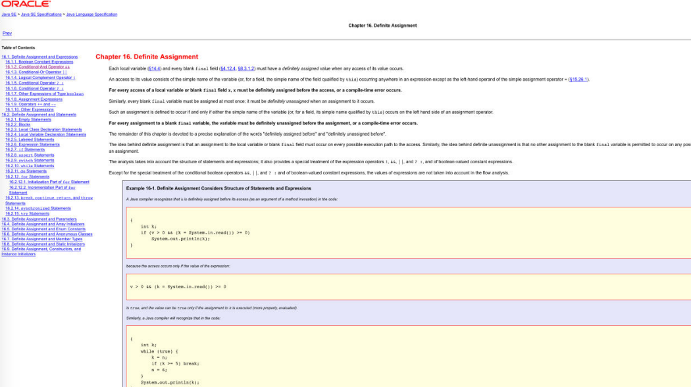
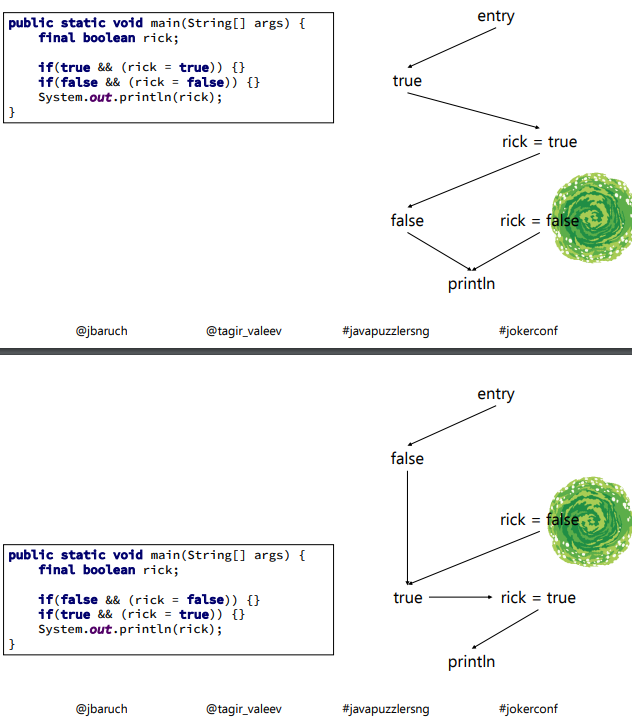
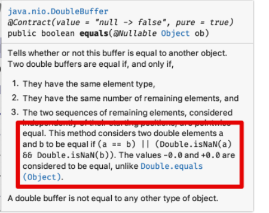
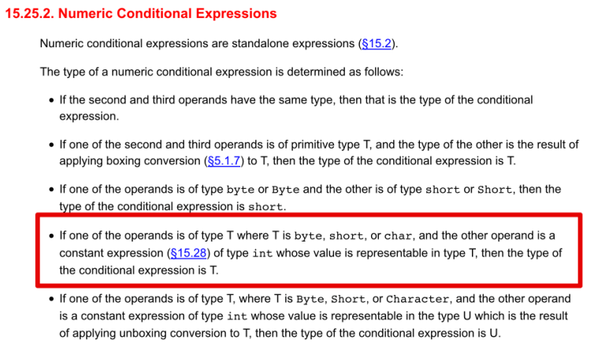

<https://www.youtube.com/watch?v=7PnYBYL9pnc>

A. Первый компилируется,
второй нет  
B. Второй компилируется,
первый нет  
C. Оба компилируются    
D. Наркоманству – бой!

```java 
class This {
    final String thіs;

    This() {
        this.thіs = This.this.thіs + "this";
    }

    public static void main(String[] args) {
        System.out.println(new
                This().thіs.length());
    }
}

class This {
    final String thіs;

    This() {
        this.thіs = this.thіs + "this";
    }

    public static void main(String[] args) {
        System.out.println(new
                This().thіs.length());
    }
} 
```

```java
class This {
    final String thіs;

    This() {
        this.thіs = This.this.thіs + "this";
    }

    public static void main(String[] args) {
        System.out.println(new
                This().thіs.length());
    }
}
```

A. Runtime Exception
B. 4
C. 8
D. Не скомпилируется (да, я тормоз)

Ответ с.
Null- 4 символа+ this 4 символа.
Здесь This.this - квалифаер this. Здесь можно достучаться до final поля до того как оно успеет инициализироваться
во 2 случае не компилируеться так как нет квалификатора

Что из этого не компилируется?

```
A. for (;;) {;;}
B.  for (;;) ;;
C. {;} for (;;) {;}
D.  ; for (;;) ;
E. Норм всё, чо! 
```

Ответ b
Потому что Unreachable statement. Во 2 примере Цикл бесконечный, все стейтменты после него недостижимы
<https://www.baeldung.com/java-unreachable-statements>

# Что компилируется

```java

public static void main(String[] args) {
    final boolean rick;
    if (true && (rick = true)) {
    }
    if (false && (rick = false)) {
    }
    System.out.println(rick);
}

public static void main(String[] args) {
    final boolean rick;
    if (false && (rick = false)) {
    }
    if (true && (rick = true)) {
    }
    System.out.println(rick);
}

```

A.Первый компилируется,
второй нет
B. Второй компилируется,
первый нет
C.Оба компилируются
D.Наркоманству – бой!

Ответ А.


В 1 случае в блок false не зайдет и сразу выполнит печать
Вдоль 1го пути у нас присваивание 1 раз, вдоль 2го пути присваивание 2 раза


# Что будет?

A. Не скомпилируется
B. Выдаст пустую строку  
C. Выдаст 0  
D. Упадёт с ClassCastException

```java
public class OrderCar {
    public static void main(String[] args) {
        System.out.println(order("бирюзовый"));
    }

    static <Color> Color order(Color color) {
        class ModelT extends RuntimeException {
            Color color;

            ModelT(Color color) {
                this.color = color; // 1
            }
        }
        if (color.equals(0x000000)) throw new ModelT(color); // 2
        try {
            order(0x000000);
        } catch (ModelT car) {
            color = car.color; // 3
        }
        return color;
    }

    class Color {
    }
}
```

в какой строчке будет предупреждение про unchecked:

A.//1   
B.//2   
C.//3   
D.Не будет

ответ - предупреждения не будет

# Что будет ?

```java

public class Main {
    public static void main(String[] args) throws InterruptedException {
        new Object().wait(9223372036854775807L, 1);
    }
}

```

A.Зависнет на много лет
B. Упадёт с IllegalMonitorStateException    
C.Упадёт с IllegalArgumentException: timeout value is negative  
D.Упадёт с InterruptedException

Ответ C;

# Что напечатает true?

```java

private static void doubleWtf(Double wtf1, Double wtf2) {
    if (!wtf1.equals(wtf2)) {
        DoubleBuffer dWtf1 = DoubleBuffer.allocate(1).put(wtf1);
        DoubleBuffer dWtf2 = DoubleBuffer.allocate(1).put(wtf2);
        System.out.println(dWtf1.equals(dWtf2));
    }
}

```

A. Double.NaN и Double.NaN  
B. Double.NaN и любой double    
C. 0.0 и -0.0   
D. Любой double и null  
E. Ничего

Ответ С



```
Set<Character> set = new HashSet<>();
for(char ch = 'а'; ch <= 'я'; ch++) {
    set.add(ch);
    set.remove(ch - 1);
}
System.out.println(set.size());

```

A. 0
B. 1
C. 32
D. 33
E. Упадёт с исключением

ответ - 32
если из символа вычитать инт- то символ приведеться тоже к инту в итоге будет число соотвевтующее символу, а в хешсете
таких символов нет
это сработало если было бы так

```
            set.add(ch);
            char test= (char) (ch - 1);
            set.remove(test)
```

# Что выведет

```
final var targaryens = 2; //int
final var lannisters = 25; //int
final var starks = '1'; //char
final var snow = true ? targaryens * lannisters : starks; //char
System.out.println(snow); 
```

A. 2    
B. 25   
C. 1    
D. 50

Ответ A
Особенность в приведении после тернарного оператора, после операций targaryens * lannisters : starks
получается 50, но она приводиться к char в итоге печатается 2.
Если один из операндов byte, short или char, а другой constans expresion(вычисляется во время компиляции) типа int и его
значение попадает в другой тип 50 -попадает в диапопзон char
В таком случае побеждает char


# А сейчас

```
var targaryens = 2;
final var lannisters = 25;
final var starks = '1';
final var snow = true ? targaryens * lannisters : starks;
System.out.println(snow);
```

Ответ D
