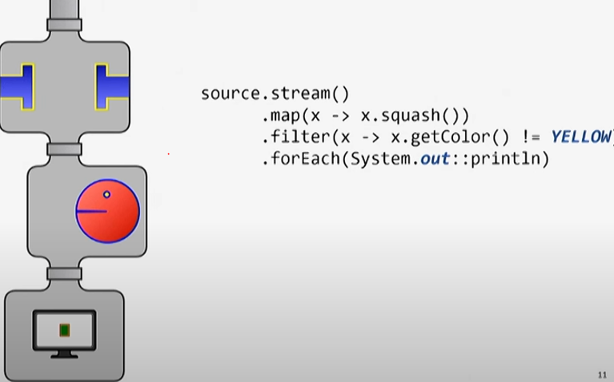
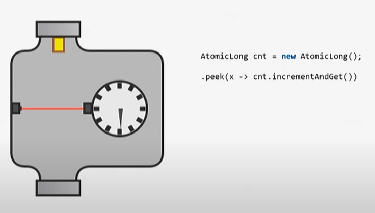
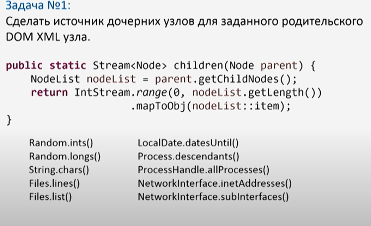
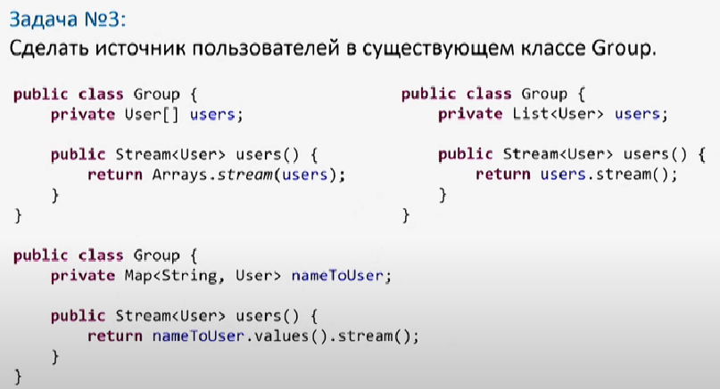
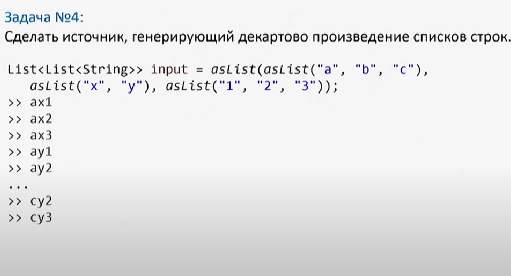
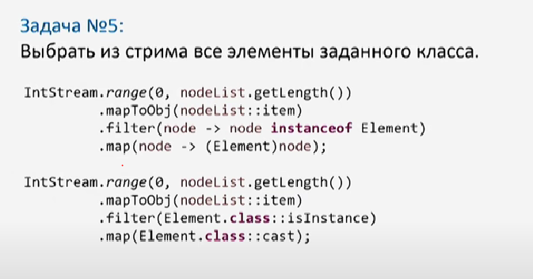

### Stream API: рекомендации лучших собаководов







List.stream нам не поможет, поэтому делаем
IntStream.range - создает поток целых чисел от 0 до list.size, далее mapToObject преобразует в объект где на вход Idx -
целое число.
List.get(i) -быстрая операция

В независимости от того в какой структуре хранятся юзеры - мы можем из любой структуры создать стрим, и не будет
накладных расходов.



Это решение для 3х элементов

Универсальное решение

```java
    public void generate(List<List<String>> input) {
    Supplier<Stream<String>> s = input.stream()             //создаем стрим из внешнего списка
            //Stream<List<String>>                                //стрим списка строк
            .<Supplier<Stream<String>>>map(list -> list::stream) //каждый список мепим на саплаер стрима
            //Stream<Supplier<Stream<String>>>                  //стрим саплаеров стримов строк
            .reduce((sup1, sup2) -> () -> sup1.get()           //редюс на функция саплаеров. Делаем новый саплаер `-> () ->`
                    .flatMap(e1 -> sup2.get().map(e2 -> e1 + e2))) //
            //Optional<Supplier<Stream<String>>>             //редьюс возвращает Optional
            .orElse(() -> Stream.of(""));               // дефолтное поведение когда исходный список абсолютно пуст, выдаем стрим из 1 пустой строки
    s.get().forEach(System.out::println);
}
```

Следующая задача

Здесь решение не особо красивое
потому что две последние операции связаны между собой и делают общее дело -
фильтруем по классу, кастуем до требуемого класса


Но здесь ломается красота стрим апи - чтение слева направо
Альтернатива


Метод select возвращает функцию с элемента на стрим.
Недостаток - затраты на много промежуточных стримов


Либа streamEx   
select- здесь написан в качестве библиотеки под stream api
