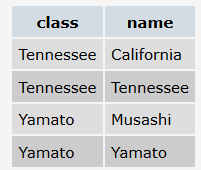

# Схема бд 1

Схема БД состоит из четырех таблиц:
Product(maker, model, type)
PC(code, model, speed, ram, hd, cd, price)
Laptop(code, model, speed, ram, hd, price, screen)
Printer(code, model, color, type, price)
Таблица Product представляет производителя (maker), номер модели (model) и тип ('PC' - ПК, 'Laptop' - ПК-блокнот или '
Printer' - принтер). Предполагается, что номера моделей в таблице Product уникальны для всех производителей и типов
продуктов. В таблице PC для каждого ПК, однозначно определяемого уникальным кодом – code, указаны модель – model (
внешний ключ к таблице Product), скорость - speed (процессора в мегагерцах), объем памяти - ram (в мегабайтах), размер
диска - hd (в гигабайтах), скорость считывающего устройства - cd (например, '4x') и цена - price (в долларах). Таблица
Laptop аналогична таблице РС за исключением того, что вместо скорости CD содержит размер экрана -screen (в дюймах). В
таблице Printer для каждой модели принтера указывается, является ли он цветным - color ('y', если цветной), тип
принтера - type (лазерный – 'Laser', струйный – 'Jet' или матричный – 'Matrix') и цена - price.

# Схема бд 2

Рассматривается БД кораблей, участвовавших во второй мировой войне. Имеются следующие отношения:
Classes (class, type, country, numGuns, bore, displacement)
Ships (name, class, launched)
Battles (name, date)
Outcomes (ship, battle, result)
Корабли в «классах» построены по одному и тому же проекту, и классу присваивается либо имя первого корабля, построенного
по данному проекту, либо названию класса дается имя проекта, которое не совпадает ни с одним из кораблей в БД. Корабль,
давший название классу, называется головным.
Отношение Classes содержит имя класса, тип (bb для боевого (линейного) корабля или bc для боевого крейсера), страну, в
которой построен корабль, число главных орудий, калибр орудий (диаметр ствола орудия в дюймах) и водоизмещение ( вес в
тоннах). В отношении Ships записаны название корабля, имя его класса и год спуска на воду. В отношение Battles включены
название и дата битвы, в которой участвовали корабли, а в отношении Outcomes – результат участия данного корабля в
битве (потоплен-sunk, поврежден - damaged или невредим - OK).
Замечания. 1) В отношение Outcomes могут входить корабли, отсутствующие в отношении Ships. 2) Потопленный корабль в
последующих битвах участия не принимает.

# Схема бд 3 "Фирма вторсырья":

Фирма имеет несколько пунктов приема вторсырья. Каждый пункт получает деньги для их выдачи сдатчикам вторсырья. Сведения
о получении денег на пунктах приема записываются в таблицу:
Income_o(point, date, inc)
Первичным ключом является (point, date). При этом в столбец date записывается только дата (без времени), т.е. прием
денег (inc) на каждом пункте производится не чаще одного раза в день. Сведения о выдаче денег сдатчикам вторсырья
записываются в таблицу:
Outcome_o(point, date, out)
В этой таблице также первичный ключ (point, date) гарантирует отчетность каждого пункта о выданных деньгах (out) не чаще
одного раза в день.
В случае, когда приход и расход денег может фиксироваться несколько раз в день, используется другая схема с таблицами,
имеющими первичный ключ code:
Income(code, point, date, inc)
Outcome(code, point, date, out)
Здесь также значения столбца date не содержат времени.

1) Найдите номер модели, скорость и размер жесткого диска для всех ПК стоимостью менее 500 дол. Вывести: model, speed и
   hd
   ```sql
   SELECT model, speed, hd
   FROM pc
   WHERE price<500
   ```
2) Найдите производителей принтеров. Вывести: maker
   ```sql
   SELECT DISTINCT p.maker FROM product p
   WHERE type='Printer'
   ```

3) Найдите номер модели, объем памяти и размеры экранов ПК-блокнотов, цена которых превышает 1000 дол
   ```sql
       SELECT l.model, l.ram, l.screen
       FROM Laptop l
       WHERE l.price > 1000
   ```

4) Найдите все записи таблицы Printer для цветных принтеров.
   ```sql
   SELECT *
   FROM Printer p
   WHERE p.color = 'y'
   ```

5) Найдите номер модели, скорость и размер жесткого диска ПК, имеющих 12x или 24x CD и цену менее 600 дол.
    - <https://github.com/VasiliyVelikyy/InterviewQuestions/blob/master/resourses/sql/examples/intersect_and_except.md>
    ```sql
    SELECT p.model, p.speed, p.hd
    FROM PC p
    WHERE p.cd = '12x'
       OR p.cd = '24x'
    INTERSECT
    SELECT p.model, p.speed, p.hd
    FROM PC p
    WHERE p.price < 600
    ```

   или

    ```sql
    SELECT p.model, p.speed, p.hd
    FROM PC p
    WHERE (p.cd = '12x' OR p.cd = '24x')
      AND p.price < 600
    ```

6) Для каждого производителя, выпускающего ПК-блокноты c объёмом жесткого диска не менее 10 Гбайт, найти скорости таких
   ПК-блокнотов. Вывод: производитель, скорость.
    ```sql
    SELECT DISTINCT p.maker,l.speed
    FROM Product p
    JOIN Laptop l ON l.model = p.model
    WHERE l.hd >= 10
    ```
7) Найдите номера моделей и цены всех имеющихся в продаже продуктов (любого типа) производителя B (латинская буква).
    - <https://github.com/VasiliyVelikyy/InterviewQuestions/blob/master/resourses/sql/examples/union.md>
   ```sql
   SELECT  p.model, pc.price 
   FROM Product p
   JOIN PC pc ON pc.model = p.model
   WHERE p.maker = 'B'
   
   UNION 
   
   SELECT p.model, l.price 
   FROM Product p
   JOIN Laptop l ON l.model = p.model
   WHERE p.maker = 'B'
   
   UNION 
   
   SELECT p.model, pr.price 
   FROM Product p
   JOIN Printer pr ON pr.model = p.model
   WHERE p.maker = 'B'
   ```

8) Найдите производителя, выпускающего ПК, но не ПК-блокноты.
    - <https://github.com/VasiliyVelikyy/InterviewQuestions/blob/master/resourses/sql/examples/intersect_and_except.md>
   ```sql
   SELECT p.maker FROM Product p
   WHERE type = 'PC'
   EXCEPT
   SELECT p.maker FROM Product p
   WHERE type = 'Laptop'
   ```

9) Найдите производителей ПК с процессором не менее 450 Мгц. Вывести: Maker
   ```sql
   SELECT DISTINCT p.maker FROM Product p
   JOIN PC ON p.model = PC.model
   WHERE PC.speed >= 450
    ```

10) Найдите модели принтеров, имеющих самую высокую цену. Вывести: model, price
    - <https://github.com/VasiliyVelikyy/InterviewQuestions/blob/master/resourses/sql/examples/agregation_functions.md>
   ```sql
   SELECT model, price
   FROM Laptop l
   WHERE price = (SELECT MAX(price) 
                   FROM Laptop)
   ```  

11) Найдите среднюю скорость ПК.
    - <https://github.com/VasiliyVelikyy/InterviewQuestions/blob/master/resourses/sql/examples/agregation_functions.md>
   ```sql
   SELECT AVG(speed)
   FROM PC
   ```
12) Найдите среднюю скорость ПК-блокнотов, цена которых превышает 1000 дол.
    - <https://github.com/VasiliyVelikyy/InterviewQuestions/blob/master/resourses/sql/examples/agregation_functions.md>

     ```sql
      SELECT AVG(speed) FROM Laptop
      WHERE price > 1000
     ```

13) Найдите среднюю скорость ПК, выпущенных производителем A.
    - <https://github.com/VasiliyVelikyy/InterviewQuestions/blob/master/resourses/sql/examples/agregation_functions.md>
   ```sql
   SELECT AVG(pc.speed)
   FROM PC
   JOIN Product p ON p.model = pc.model
   WHERE p.maker = 'A'
   ```

14) Найдите класс, имя и страну для кораблей из таблицы Ships, имеющих не менее 10 орудий.
   ```sql
   SELECT s.class, s.name, c.country 
  FROM Ships s
  JOIN Classes c ON c.class = s.class
  WHERE C.numGuns >= 10
   ```

15) Найдите размеры жестких дисков, совпадающих у двух и более PC. Вывести: HD
    - <https://github.com/VasiliyVelikyy/InterviewQuestions/blob/main/resourses/sql/examples/group_by_and_heaving.md>
     ```sql
    SELECT hd
    FROM PC
    GROUP BY hd
    HAVING COUNT(HD) >= 2
      ```

16) Найдите пары моделей PC, имеющих одинаковые скорость и RAM. В результате каждая пара указывается только один раз,
    т.е. (i,j), но не (j,i), Порядок вывода: модель с большим номером, модель с меньшим номером, скорость и RAM.
    - <https://github.com/VasiliyVelikyy/InterviewQuestions/blob/main/resourses/sql/examples/several_sourses.md>

    ```sql
      SELECT DISTINCT a.model AS model_1, b.model AS model_2, a.speed, a.ram
      FROM PC AS a,
           PC AS b
      WHERE a.speed = b.speed
        AND a.ram = b.ram
        AND b.model < a.model
      ```

17) Найдите модели ПК-блокнотов, скорость которых меньше скорости каждого из ПК.
    Вывести: type, model, speed
    - <https://github.com/VasiliyVelikyy/InterviewQuestions/blob/master/resourses/sql/examples/any_all.md>
    ```sql
    SELECT DISTINCT p.type, p.model, l.speed
    FROM Laptop l
             JOIN Product p ON p.model = l.model
    WHERE l.speed < ALL
          (SELECT speed FROM PC)
    ```

18) Найдите производителей самых дешевых цветных принтеров. Вывести: maker, price
    - <https://github.com/VasiliyVelikyy/InterviewQuestions/blob/master/resourses/sql/examples/join.md>
    - <https://github.com/VasiliyVelikyy/InterviewQuestions/blob/master/resourses/sql/examples/subqueries.md>
    - <https://github.com/VasiliyVelikyy/InterviewQuestions/blob/master/resourses/sql/examples/agregation_functions.md>

    ```sql
    SELECT DISTINCT b.maker, a.price
    FROM Printer a
             JOIN Product b ON b.model = a.model
    WHERE a.color = 'y'
      AND a.price = (SELECT MIN(price)
                     FROM Printer
                     WHERE color = 'y')
    ```

19) Для каждого производителя, имеющего модели в таблице Laptop, найдите средний размер экрана выпускаемых им
    ПК-блокнотов.
    Вывести: maker, средний размер экрана.
    - <https://github.com/VasiliyVelikyy/InterviewQuestions/blob/master/resourses/sql/examples/join.md>
    - <https://github.com/VasiliyVelikyy/InterviewQuestions/blob/master/resourses/sql/examples/group_by_and_heaving.md>

    ```sql
     SELECT p.maker, AVG(screen) AS Avg_screen
     FROM Product p
     JOIN Laptop l ON p.model = l.model
     GROUP BY p.maker
    ```

20) Найдите производителей, выпускающих по меньшей мере три различных модели ПК. Вывести: Maker, число моделей ПК.
    - <https://github.com/VasiliyVelikyy/InterviewQuestions/blob/master/resourses/sql/examples/group_by_and_heaving.md>

    ```sql
    SELECT DISTINCT p.maker, COUNT(model) AS Count_Model
    FROM Product p
    WHERE p.type = 'PC'
    GROUP BY P.maker
    HAVING COUNT(model) >= 3
    ```

21) Найдите максимальную цену ПК, выпускаемых каждым производителем, у которого есть модели в таблице PC.
    Вывести: maker, максимальная цена.
    - <https://github.com/VasiliyVelikyy/InterviewQuestions/blob/master/resourses/sql/examples/group_by_and_heaving.md>
    - <https://github.com/VasiliyVelikyy/InterviewQuestions/blob/master/resourses/sql/examples/join.md>

    ```sql
    SELECT p.maker, MAX(price)
    FROM PC pc
    JOIN Product p ON p.model = pc.model
    GROUP BY p.maker
    ```
22) Для каждого значения скорости ПК, превышающего 600 МГц, определите среднюю цену ПК с такой же скоростью. Вывести:
    speed, средняя цена.
    - <https://github.com/VasiliyVelikyy/InterviewQuestions/blob/master/resourses/sql/examples/group_by_and_heaving.md>

    ```sql
    SELECT speed, AVG(price) AS avg_price
    FROM PC
    WHERE speed > 600
    GROUP BY speed
    ```

23) Найдите производителей, которые производили бы как ПК
    со скоростью не менее 750 МГц, так и ПК-блокноты со скоростью не менее 750 МГц.
    Вывести: Maker
    - <https://github.com/VasiliyVelikyy/InterviewQuestions/blob/master/resourses/sql/examples/join.md>
    - <https://github.com/VasiliyVelikyy/InterviewQuestions/blob/master/resourses/sql/examples/intersect_and_except.md>

    ```sql
    SELECT p.maker
    FROM Product p
    JOIN PC ON PC.model = p.model
    WHERE pc.speed >= 750
    INTERSECT
    SELECT p.maker
    FROM Product p
    JOIN Laptop l ON p.model = l.model
    WHERE l.speed >= 750
    ```

24) Перечислите номера моделей любых типов, имеющих самую высокую цену по всей имеющейся в базе данных продукции.
    - <https://github.com/VasiliyVelikyy/InterviewQuestions/blob/master/resourses/sql/examples/join.md>
    - <https://github.com/VasiliyVelikyy/InterviewQuestions/blob/master/resourses/sql/examples/agregation_functions.md>
    - <https://github.com/VasiliyVelikyy/InterviewQuestions/blob/master/resourses/sql/examples/subqueries.md>

    ```sql
    WITH ALL_PRICE AS (SELECT model, price
                       FROM PC
                       UNION
                       SELECT model, price
                       FROM Laptop
                       UNION
                       SELECT model, price
                       FROM Printer)
    SELECT model
    FROM ALL_PRICE ap
    WHERE ap.price = (SELECT MAX(price) FROM ALL_PRICE)
    ```

25) Найдите производителей принтеров, которые производят ПК с наименьшим объемом RAM и с самым быстрым процессором среди
    всех ПК, имеющих наименьший объем RAM. Вывести: Maker
    - <https://github.com/VasiliyVelikyy/InterviewQuestions/blob/master/resourses/sql/examples/subqueries.md>
    - <https://github.com/VasiliyVelikyy/InterviewQuestions/blob/master/resourses/sql/examples/in.md>
    - <https://github.com/VasiliyVelikyy/InterviewQuestions/blob/master/resourses/sql/examples/join.md>
    - <https://github.com/VasiliyVelikyy/InterviewQuestions/blob/master/resourses/sql/examples/agregation_functions.md>

    ```sql
    SELECT DISTINCT p.maker
    FROM Product p
    WHERE p.maker IN (SELECT p.maker
                      FROM PC
                               JOIN Product p ON p.model = pc.model
                      WHERE PC.ram IN (SELECT MIN(ram) FROM PC)
                        AND PC.speed IN (SELECT MAX(speed)
                                         FROM PC
                                         WHERE ram IN (SELECT MIN(ram) FROM PC)))
      AND p.type = 'Printer'
    ```

26) Найдите среднюю цену ПК и ПК-блокнотов, выпущенных производителем A (латинская буква). Вывести: одна общая средняя
    цена.
    - <https://github.com/VasiliyVelikyy/InterviewQuestions/blob/master/resourses/sql/examples/subqueries.md>
    - <https://github.com/VasiliyVelikyy/InterviewQuestions/blob/master/resourses/sql/examples/union.md>
    - <https://github.com/VasiliyVelikyy/InterviewQuestions/blob/master/resourses/sql/examples/join.md>
    - <https://github.com/VasiliyVelikyy/InterviewQuestions/blob/master/resourses/sql/examples/agregation_functions.md>

    ```sql
    SELECT AVG(price) AS AVG_price
    FROM (SELECT price
          FROM PC
                   JOIN Product p ON PC.model = p.model
          WHERE p.maker = 'A'
          UNION ALL
          SELECT price
          FROM Laptop l
                   JOIN Product p ON p.model = l.model
          WHERE p.maker = 'A') AS result
    ```

27) Найдите средний размер диска ПК каждого из тех производителей, которые выпускают и принтеры. Вывести: maker, средний
    размер HD.
    - <https://github.com/VasiliyVelikyy/InterviewQuestions/blob/master/resourses/sql/examples/join.md>
    - <https://github.com/VasiliyVelikyy/InterviewQuestions/blob/master/resourses/sql/examples/agregation_functions.md>
    - <https://github.com/VasiliyVelikyy/InterviewQuestions/blob/master/resourses/sql/examples/in.md>

    ```sql
    SELECT p.maker, AVG(hd) AS Avg_hd
    FROM PC
             JOIN Product p ON PC.model = p.model
    WHERE p.maker IN (SELECT maker FROM Product WHERE type = 'Printer')
    GROUP BY p.maker
    ```

28) Используя таблицу Product, определить количество производителей, выпускающих по одной модели.
    - <https://github.com/VasiliyVelikyy/InterviewQuestions/blob/master/resourses/sql/examples/subqueries.md>
    - <https://github.com/VasiliyVelikyy/InterviewQuestions/blob/master/resourses/sql/examples/group_by_and_heaving.md>

    ```sql
    SELECT COUNT(*)
    FROM (SELECT maker, COUNT(maker) AS count_product
          FROM Product p
          GROUP BY maker
          HAVING COUNT(maker) = 1) AS result
    ```

29) В предположении, что приход и расход денег на каждом пункте приема фиксируется не чаще одного раза в
    день [т.е. первичный ключ (пункт, дата)], написать запрос с выходными данными (пункт, дата, приход, расход).
    Использовать таблицы Income_o и Outcome_o.
    - <https://github.com/VasiliyVelikyy/InterviewQuestions/blob/master/resourses/sql/examples/join.md>
    - <https://github.com/VasiliyVelikyy/InterviewQuestions/blob/master/resourses/sql/examples/union.md>
    - <https://github.com/VasiliyVelikyy/InterviewQuestions/blob/master/resourses/sql/examples/case.md>

    ```sql
    SELECT i.point, i.date, i.inc, o.out
    FROM Income_o i
             LEFT JOIN Outcome_o o ON i.point = o.point AND i.date = o.date
    UNION
    SELECT o.point, o.date, i.inc, o.out
    FROM Income_o i
             RIGHT JOIN Outcome_o o ON i.point = o.point AND i.date = o.date
    ```

30) В предположении, что приход и расход денег на каждом пункте приема фиксируется произвольное число раз (первичным
    ключом в таблицах является столбец code), требуется получить таблицу, в которой каждому пункту за каждую дату
    выполнения операций будет соответствовать одна строка.
    Вывод: point, date, суммарный расход пункта за день (out), суммарный приход пункта за день (inc). Отсутствующие
    значения считать неопределенными (NULL).
    - <https://github.com/VasiliyVelikyy/InterviewQuestions/blob/master/resourses/sql/examples/group_by_and_heaving.md>
    - <https://github.com/VasiliyVelikyy/InterviewQuestions/blob/master/resourses/sql/examples/join.md>
    - <https://github.com/VasiliyVelikyy/InterviewQuestions/blob/master/resourses/sql/examples/union.md>

    ```sql
    SELECT point, DATE, SUM (sum_out), SUM (sum_inc)
    FROM ( SELECT point, DATE, NULL AS sum_out, SUM (inc) AS sum_inc
        FROM Income
        GROUP BY point, DATE
        UNION
        SELECT point, DATE, SUM (OUT) AS sum_out, NULL AS sum_inc
        FROM Outcome
        GROUP BY point, DATE ) AS t
    GROUP BY point, DATE
    ORDER BY point
    ```

31) Для классов кораблей, калибр орудий которых не менее 16 дюймов, укажите класс и страну.
    ```sql
    SELECT class, country
    FROM Classes
    WHERE bore >= 16
    ```

32) Одной из характеристик корабля является половина куба калибра его главных орудий (mw). С точностью до 2 десятичных
    знаков определите среднее значение mw для кораблей каждой страны, у которой есть корабли в базе данных.
    - <https://github.com/VasiliyVelikyy/InterviewQuestions/blob/master/resourses/sql/examples/cast.md>
    - <https://github.com/VasiliyVelikyy/InterviewQuestions/blob/master/resourses/sql/examples/as.md>
    - <https://github.com/VasiliyVelikyy/InterviewQuestions/blob/master/resourses/sql/examples/group_by_and_heaving.md>
    - <https://github.com/VasiliyVelikyy/InterviewQuestions/blob/master/resourses/sql/examples/join.md>
    - <https://github.com/VasiliyVelikyy/InterviewQuestions/blob/master/resourses/sql/examples/union.md>

    ```sql
    SELECT country, CAST(AVG(bore * bore * bore / 2) AS NUMERIC(6, 2)) AS weight
    FROM (SELECT name, bore, country
          FROM Ships s
                   JOIN Classes c ON c.class = s.class
          UNION
          SELECT ship, bore, country
          FROM Outcomes o
                   JOIN Classes c ON c.class = o.ship) AS all_ships
    GROUP BY country
    ```
33) Укажите корабли, потопленные в сражениях в Северной Атлантике (North Atlantic). Вывод: ship.
    ```sql
    SELECT ship
    FROM Outcomes
    WHERE battle = 'North Atlantic'
      AND result = 'sunk'
    ```

34) По Вашингтонскому международному договору от начала 1922 г. запрещалось строить линейные корабли водоизмещением
    более 35 тыс.тонн. Укажите корабли, нарушившие этот договор (учитывать только корабли c известным годом спуска на
    воду). Вывести названия кораблей.
    - <https://github.com/VasiliyVelikyy/InterviewQuestions/blob/master/resourses/sql/examples/several_sourses.md>

    ```sql
    SELECT s.name
    FROM Classes c,
         Ships s
    WHERE c.class = s.class
      AND s.launched IS NOT NULL
      AND s.launched >= 1922
      AND c.type = 'bb'
      AND c.displacement > 35000
    ```

35) В таблице Product найти модели, которые состоят только из цифр или только из латинских букв (A-Z, без учета
    регистра).
    Вывод: номер модели, тип модели.
    - <https://github.com/VasiliyVelikyy/InterviewQuestions/blob/master/resourses/sql/examples/like.md>

    ```sql
    SELECT DISTINCT model, type
    FROM Product p
    WHERE model NOT LIKE '%[^0-9]%'
       OR model NOT LIKE '%[^a-zA-Z]%'
    
    ```

36) Перечислите названия головных кораблей, имеющихся в базе данных (учесть корабли в Outcomes).
    - <https://github.com/VasiliyVelikyy/InterviewQuestions/blob/master/resourses/sql/examples/union.md>
    - <https://github.com/VasiliyVelikyy/InterviewQuestions/blob/master/resourses/sql/examples/join.md>

    ```sql
    SELECT s.name
    FROM Classes c
             JOIN Ships s ON c.class = s.class
    WHERE s.name = c.class
    UNION
    SELECT ship
    FROM Outcomes o
             JOIN Classes c ON c.class = o.ship
    ```

37) Найдите классы, в которые входит только один корабль из базы данных (учесть также корабли в Outcomes).
    - <https://github.com/VasiliyVelikyy/InterviewQuestions/blob/master/resourses/sql/examples/union.md>
    - <https://github.com/VasiliyVelikyy/InterviewQuestions/blob/master/resourses/sql/examples/join.md>
    - <https://github.com/VasiliyVelikyy/InterviewQuestions/blob/master/resourses/sql/examples/group_by_and_heaving.md>

    ```sql
    SELECT c.class AS count_name
    FROM Classes c
             LEFT JOIN (SELECT class, name
                        FROM Ships
                        UNION
                        SELECT ship, ship
                        FROM outcomes) AS all_ships
                       ON c.class = all_ships.class
    GROUP BY c.class
    HAVING COUNT(all_ships.name) = 1
    
    ```
    Здесь в конце ограничение COUNT(all_ships.name) , потому что у одного класса (c.class) могут быть 2 разных коробля.
    Например классу Tennessee соответвует 2 коробля Tennessee и California
    ```
    вот подзапрос который вернет такой результат
    SELECT c.class, all_ships.name
    FROM Classes c
             LEFT JOIN (SELECT class, name
                        FROM Ships
                        UNION
                        SELECT ship, ship
                        FROM outcomes) AS all_ships
                       ON c.class = all_ships.class
    WHERE c.class IN (SELECT c.class 
                     FROM Classes c
                              LEFT JOIN (SELECT class, name
                                         FROM Ships
                                         UNION
                                         SELECT ship, ship
                                         FROM outcomes) AS all_ships
                                        ON c.class = all_ships.class
                     GROUP BY c.class
                     HAVING COUNT(all_ships.name) = 2)
    ```
    

38) Найдите страны, имевшие когда-либо классы обычных боевых кораблей ('bb') и имевшие когда-либо классы крейсеров ('
    bc').
    - <https://github.com/VasiliyVelikyy/InterviewQuestions/blob/master/resourses/sql/examples/intersect_and_except.md>

    ```sql
    SELECT c.country
    FROM Classes c
    WHERE c.type = 'bb'
    
    INTERSECT
    
    SELECT c.country
    FROM Classes c
    WHERE c.type = 'bc'
    ```
    ЛИБО
    ```sql
    SELECT country
    FROM classes
    GROUP BY country
    HAVING COUNT(DISTINCT type) = 2
    ```
39) Найдите корабли, `сохранившиеся для будущих сражений`; т.е. выведенные из строя в одной битве (damaged), они
    участвовали в другой, произошедшей позже.

    ```sql
    SELECT DISTINCT o.ship
    FROM Outcomes o,
         Battles b
    WHERE o.battle = b.name
      AND o.ship IN
          (SELECT o1.ship
           FROM Outcomes o1,
                Battles b1
           WHERE o1.battle = b1.name
             AND o1.result = 'damaged'
             AND b.date > b1.date)
    ```