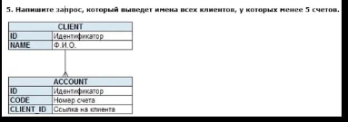

```sql
SELECT c.NAME, COUNT(a.CLIENT_ID)
FROM Client c
         LEFT JOIN Accounts a ON c.ID = a.CLIENT_ID
GROUP BY c.name, a.CLIENT_ID
HAVING COUNT(a.CLIENT_ID) < 5
   AND COUNT(a.CLIENT_ID) >= 0

```

LEFT JOINT - применяем чтобы показать клиентов, у которых может не быть счетов
требование агрегатной функции count мы вызываем, у name
так как для Name нет агригатной функции, необходимо перечислить в GROUP BY 