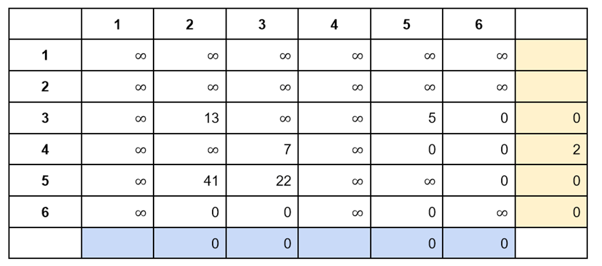

### Алгоритм Литтла: Механизм работы—Алгоритмы на графах
В прошлом уроке мы познакомились с задачей коммивояжера и решили ее с помощью перебора.
Перебор имеет алгоритмическую сложность O(n!), что очень медленно. Более эффективный способ решать задачи на графах — метод ветвей и границ.
Он применяется к широкому классу задач на графах и для решения конкретной задачи его нужно адаптировать.
Алгоритм Литтла — известная адаптаций метода ветвей и границ для решения задачи коммивояжера. Его разработала группа ученых и программистов под руководством профессора Джона Д. К. Литтла. Статья с описанием алгоритма была опубликована в 1963 году.
Как работает алгоритм Литтла
Алгоритм Литтла довольно громоздкий, так что мы будем знакомиться с ним по частям. Для представления графа в алгоритме используется матрица смежности. В качестве иллюстрации мы будем использовать матрицу из оригинальной публикации 1963 года:

У нас есть шесть городов, поэтому в матрице шесть строк и шесть столбцов. Обсудим эту матрицу подробнее:
•	Числа в матрице — это стоимость переезда из одного города в другой. Это условная цифра, которая может обозначать цену бензина, расстояние между городами или время езды.
•	Обратите внимание, что граф ориентированный. Это значит, что стоимость перемещения из города A в город B и из города B в город A необязательно равны между собой. В неориентированном графе эти стоимости совпадают.
Для примера рассмотрим дорогу между городами 1 и 4. Находим соответствующие столбцы и строки в матрице и видим два разных числа:
•	16 в первой строке в четвертом столбце — это стоимость перемещения из города 1 в город 4.
•	21 в четвертой строке в первом столбце — это стоимость перемещения из города 4 в город 1.
Некоторые ребра в графе не могут существовать физически — например, нельзя переместиться в тот же самый город. В матрице смежности таким переездам соответствуют ячейки:
•	В первой строке первом столбце
•	Во второй строке втором столбце
•	И так далее
Чтобы отличить невозможные переезды от возможных, мы придумаем для них особое обозначение.
В коде на JavaScript можно использовать константу Infinity — она соответствует бесконечности, которая больше любого конечного значения.
На иллюстрациях мы будем писать знак ∞ — символ бесконечности.
В матрице смежности маршрут записывается как последовательность переездов r:

r={1-3, 3-2, 2-5,5-6,6-4,4-1}
Длина этого маршрута l равна:

l=43+13+30+5+9+21=121

Каждый город встречается в этом списке ровно два раза:

•	В строке — точка отправления

•	В столбце — точка прибытия

Это не совпадение — по условиям задачи, коммивояжер должен посетить каждый город ровно один раз. Мы можем отметить ребра маршрута на матрице смежности и увидеть, что в каждой строке и каждом столбце находится ровно одно ребро:

Это утверждение верно для всех маршрутов, удовлетворяющих условию задачи коммивояжера. Из этого следует два интересных факта:
•	Если из всех элементов строки или столбца вычесть одно и то же число, то все маршруты сократятся на это число
•	После такой модификации самый короткий маршрут останется самым коротким, а самый длинный — самым длинным
Алгоритм Литтла использует эти свойства для вычисления нижней границы.
Нижняя граница
Обозначим длину кратчайшего маршрута как l_min. Эта длина не может быть меньше нуля, потому что в каждой ячейке матрицы находится положительные числа или ноль.
Возьмем число a. Если мы вычтем его из всех чисел строки или всех чисел столбца, то все маршруты сократятся на a.
Если при этом все элементы в матрице останутся неотрицательными, то и новая длина маршрута будет больше нуля:

•	l_min - a >= 0
•	или l_min >= a

Возьмем нашу матрицу и найдем минимальное число в каждой строке. Запишем его справа от строки:

Вычтем из каждой строки минимальное число. Обратите внимание, что после такого вычитания все ячейки в матрице останутся неотрицательными:

При этом минимальная длина будет больше суммы чисел, которые мы вычли:

l_min >= 16+1+0+16+5

Такая операция в алгоритме Литтла называется редукцией по строкам.
Как мы говорили выше, подобную редукцию можно сделать и по столбцам. Найдем минимальное число в каждом столбце. Запишем его под столбцом:

Выполним редукцию столбцов — вычтем минимальное число из каждого столбца:

Все числа в матрице все еще неотрицательные, поэтому можно утверждать следующее:

•	l_min >= (16+1+0+16+5)+(5+0+0+0+0+0)

•	l_min >= 43+5

•	l_min >= 48

Таким образом, кратчайший маршрут в графе не может быть меньше 48. Cледовательно, 48 — это и есть нижняя оценка длины маршрута.
Ветвление
На следующем шаге построим два поддерева. В начале работы алгоритма наш единственный узел — корень дерева, которое содержит все возможные маршруты:

Сейчас мы знаем два факта:

•	Нижняя граница длины маршрута в этом дереве равна 48

•	Пока у нас пока нет никакого маршрута, даже частичного

Предположим, в качестве очередного ребра маршрута мы выбрали 1-4. Построим два дочерних поддерева:

На половинах дерева мы видим два варианта:
•	Поддерево справа содержит маршруты, где есть ребро 1-4
•	Поддерево слева — маршруты, где его нет
Ребро 1-4 в левом узле помечено красным цветом, который будет означать, что ребро отсутствует. В фигурных скобках записываем маршрут, построенный к настоящему моменту.
Левое поддерево
Посмотрим, как изменится нижняя оценка для левого поддерева. Взглянем на редуцированную матрицу и выделим цветом ячейку, которая соответствует ребру 1-4:

Рассмотрим каждую точку по отдельности. Сначала обсудим город 1:
•	Из него можно приехать в города 2,3,4,5 и 6
•	Исключаем ребро 1-4 из маршрута и оставим города 2, 3, 5 и 6
•	Стоимость переезда в эти города равна 11, 27, 14 и 10
•	Куда бы мы не переехали, стоимость не может быть меньше 10 — это число мы видим в синей ячейке в первой строке
Перейдем к городу 4:
•	Из него можно приехать в города 1, 2, 3, 5 и 6
•	Исключаем ребро 1-4 и оставляем города 2, 3, 5 и 6
•	Стоимость переезда из этих городов равна 0, 35, 43 и 4
•	Откуда бы мы не переехали, стоимость не может быть меньше 0 — это число мы видим в синей ячейке в четвертом столбце
В итоге мы приходим к выводу — мы увеличим редуцированный маршрут минимум на 10+0 в двух случаях:
•	Уехав из города 1 в любой город, кроме 4
•	Приехав в город 4 из любого города, кроме 1
В то же время, если бы мы воспользовались ребром 1-4, редуцированный маршрут остался бы прежним. Так произошло бы, потому что в ячейке на пересечении первой строки и четвертого столбца сейчас находится 0.
Можно сказать, что 10 — это штраф за отказ от ребра 1-4. Нам известна нижняя граница кратчайшего пути — 48. Без ребра 1-4 она увеличится на 10 и станет равна 48+10=58:

Предположим, на одном из этапов мы достроим одну из ветвей дерева до конца и получим вариант маршрута с длиной 56.
Число 58 больше 56, поэтому мы можем игнорировать левое поддерево — маршрут с длиной 56 заведомо короче всех его маршрутов.
Чем выше нижняя граница в поддереве, тем больше шансов, что поддерево удастся отсечь. Именно поэтому полезно выбирать ребро с небольшим штрафом.
Штраф для элемента матрицы — это сумма минимумов в той же строке и том же столбце. Сам элемент учитывать не надо.
Если мы будем выбирать элементы 0, минимумами будут нули для которых суммарный штраф также будет равен 0. Чтобы найти ребро с наибольшим штрафом, достаточно проверять только нулевые элементы матрицы:

На рисунке цветом выделены все нулевые элементы. Рядом с каждым записан суммарный штраф. Максимальный штраф 10 — он как раз и соответствует ребру 1-4:
Исключение ребра
Спускаясь по левому поддереву, мы должны помнить, что ребро 1-4 в маршрут включать нельзя. Алгоритм Литтла предлагает хранить ее непосредственно в матрице смежности, поместив особое значение в первую строку четвертого столбца. Как и раньше, мы можем хранить очень большое число или константу Infinity.
Рассмотрим новую матрицу для левого поддерева. Обратите внимание, что она может оказаться нередуцированной, как получилось в нашем случае. Редуцируем ее по первой строке четвертого столбца:

Правое поддерево
Если мы переместились по маршруту 1→4, мы больше не можем вернуться в город 1 и уехать в любой другой город. Так происходит, потому что коммивояжер может посетить каждый город только один раз.
Это значит, что выбрав ребро 1-4, мы одновременно должны вычеркнуть первую строку четвертого столбца. Другими словами, нужно исключить из матрицы следующие ребра:

•	1→2
•	1→3
•	1→5
•	1→6
•	2→4
•	3→4
•	5→4
•	6→4

Простой способ вычеркнуть строку и столбец — заполнить их значением ∞.
Кроме того, переехав по маршруту 1→4 мы не можем вернуться. Поэтому ребро 4-1 также можно исключить, записав в соответствующую ячейку значение ∞.
На рисунке показана матрица после этих преобразований:

Ее можно редуцировать, вычтя минимумы из каждой строки и каждого столбца:

Посчитаем сумму минимумов:
(1+0+0+0+0+0)+(0+0+0+0+0+0)=1
Эту сумму минимумов надо прибавить к предыдущей нижней границе. Так мы получим нижнюю границу правого поддерева 48+1=49:

Цикл
Таким образом, мы построили два поддерева. Пока у нас не хватает информации для отсечения, поэтому мы оставляем оба поддерева и выбираем одно из них для последующего ветвления. Разумно выбирать узел с наименьшей нижней границей. В нашем примере это правый узел, включающий ребро 1-4.
Берем матрицу правого поддерева. Она уже редуцирована, так что мы ищем нулевой элемент с максимальным штрафом:

Максимальный штраф — 16, он соответствует ребру 2-1. Его мы и выберем для ветвления дерева. Как и на первом шаге, левое поддерево будет соответствовать маршрутам без ребра 2-1. В матрице левого поддерева достаточно записать ∞ во вторую строку первого столбца:

В правом поддереве мы вычеркиваем вторую строку первого столбца — заполняем их значением ∞.
Также нам надо избавиться от обратного ребра 1-2. Но оно уже вычеркнуто из матрицы на предыдущем шаге, так что мы ничего дополнительно не делаем:

В алгоритме Литтла маршрут не строится последовательно, как это было в методе перебора. На каждом шаге мы выбираем ребро с максимальным штрафом. Два последовательно выбранных ребра могут даже не соединяться друг с другом.
В нашем примере ребра 1-4 и 2-1 соединены через вершину 1. Добавим к ним ребро 4-2 и замкнем маршрут — правда, он будет пролегать не по всем шести городам, а только по трем.
Это нарушает условие задачи коммивояжера, поэтому мы должны исключить ребро 4-2 из матрицы, поместив в ячейку ∞.
Делаем редукцию получившейся матрицы:

Нижняя граница для правого поддерева увеличивается на:
(2+0+0+0)+(0+0+0+0 )=2
В итоге новая нижняя граница будет равна 49+2=51:

Сейчас у нас есть список вершин, доступных для ветвления. В нем находятся вершины с нижней границей 58, 65 и 51. Как и раньше, продолжим ветвление узла с наименьшей оценкой.
Выбираем ребро 5-6 с наибольшим штрафом (22):

Продолжаем ветвление узла с наименьшей оценкой 56. Здесь максимальный штраф 8 соответствует ребрам 3-5 и 6-2. Для ветвления мы можем выбрать любое ребро, для примера пусть будет 3-5:

В самом правом поддереве можно образовать короткий маршрут из трех ребер:
•	3-5
•	5-6
•	6-3
Этот короткий цикл не является решением, поэтому вычеркиваем ребро 6-3 из матрицы.
На этом этапе мы уже привыкли к тому, что продолжаем ветвление самого правого поддерева. Но сейчас нижняя граница длины маршрута в этом поддереве равна 63, хотя вверху слева у нас есть поддерево с оценкой 58.
Возвращаемся к узлу, где вычеркнуто ребро 1-4. Разбиваем его на два поддерева:

Среди всех ребер есть 6-3 с максимальным штрафом — 9. Таким образом:
•	Стоимость левого поддерева равна 58+9=67, если вычеркнуть ребро 6-3
•	Стоимость правого поддерева равна 58+5=63, если вычеркнуть ячейку 3-6 и шестую строку третьего столбца
На схеме это выглядит так:

На этом этапе мы ни разу не проводили отсечение, потому что пока у нас нет ни одного построенного маршрута.
Сейчас в дереве решений есть два узла с минимальной нижней границей 63. Мы можем выбрать любое из них. Выберем самое правое поддерево и посмотрим на его матрицу:

В этот момент мы останавливаемся, потому что у нас останется только два решения — два значения в матрице, которые меньше ∞.
Фактически, сейчас у нас нет выбора — нам нужно найти два недостающие ребра и вставить их в маршрут в произвольном порядке. В нашем случае это ребра 4-3 и 6-2. Если бы в ячейках были ненулевые значения, то нам бы потребовалась редукция — в данном случае она не нужна.
Нижняя граница длины маршрута в поддереве равна единственному маршруту в нем — а именно 63:

Итак, мы построили первый маршрут длиной 63. У нас есть недостроенные поддеревья с нижними границами 67, 63, 73 и 64. Нет ни одного поддерева с нижней границей меньше 63. Это значит, что в дереве решений точно нет маршрута, который мы уже нашли. Работу алгоритма можно завершить.
Если бы у нас оказалось несколько узлов с меньшей нижней границей, мы бы оставили только их, а остальные бы отсекли.
Самый короткий маршрут из найденных называется рекордным маршрутом или рекордом. На каждом шаге алгоритма мы можем отсекать поддеревья с нижней границей, которая больше или равна длине рекордного маршрута.
Мы последовательно достраиваем очередное поддерево до конца и получаем новый маршрут. При этом мы должны постоянно проверять, не короче ли новый маршрут текущего рекорда. Если короче, он сам должен стать новым рекордным маршрутом.

