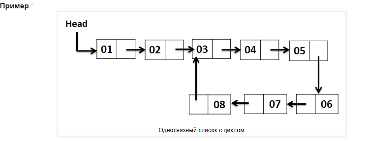

### Обнаружение цикла в односвязном списке - Tortoise & Hare

Несмотря на то, что доступно несколько алгоритмов, мы начнем с

Алгоритма поиска цикла Флойда.
Проще говоря, он также известен как " Алгоритм черепахи и зайца " или " Алгоритм обнаружения цикла Флойда ", названный в
честь его изобретателя Роберта Флойда. Это один из простых алгоритмов обнаружения цикла. Это простой подход, основанный
на указателях.

Давайте возьмем 2 указателя, а именно медленный указатель и быстрый указатель, чтобы пройти по односвязному списку с
разной скоростью. Медленный указатель (также называемый черепахой ) перемещается на один шаг вперед, а быстрый
указатель (также называемый зайцем ) перемещается на 2 шага вперед
Начните Черепаху и Зайца с первого узла Списка.
Если Заяц достигает конца списка , выполнить возврат , поскольку в списке нет цикла .
Иначе передвиньте Зайца на один шаг вперед.
Если Заяц достигает конца списка, выполнить возврат, так как в списке нет цикла .
В противном случае переместите Зайца и Черепаху на один шаг вперед.
Если Заяц и Черепаха указывают на один и тот же узел, то мы нашли цикл в списке.
В противном случае начните с ШАГА-2.

```
Псевдокод :
черепаха := первыйУзел
заяц := первыйУзел

навсегда:

если заяц == конец
вернуть «Цикл не найден»

заяц := заяц.следующий

если заяц == конец
вернуть «Цикл не найден»

заяц = заяц.следующий
черепаха = черепаха.следующий

если заяц == черепаха
возврат «Найден цикл»
```

Почему мы не можем позволить Зайцу идти самому, как Черепаха ?
Если есть цикл, Заяц будет идти вечно. Черепаха гарантирует, что вы сделаете не более 'n' шагов.

Как найти длину Цикла?
Как только Заяц и Черепаха найдут цикл в односвязном списке, перемещайте Черепаху на один шаг вперед каждый раз,
сохраняя количество узлов, пока она снова не достигнет Зайца.


И Черепаха, и Заяц начинают с первого узла списка, причем Черепаха делает 1 шаг вперед, а Заяц делает 2 шага вперед.


Ниже показана схема движения Зайца и Черепахи.

Заяц Черепаха
1 1
3 2
5 3
7 4
3 5
5 6
7 7

И Заяц, и Черепаха встречаются в узле 7. Это доказывает, что в списке есть цикл.


Сложность:

- Временная сложность: O(n)
- Сложность пространства: O(1)

Для расчета временной сложности форма цикла не имеет значения. Он может иметь длинный хвост и петлю к концу или просто
петлю от начала до конца без хвоста. Независимо от формы цикла, ясно одно — Черепаха никогда не сможет догнать Зайца.
Если им двоим придется встретиться, Заяц должен будет догнать Черепаху сзади.

Установив это, рассмотрим две возможности

- Заяц на шаг позади Черепахи
- Заяц на два шага позади Черепахи
  Все большие расстояния сократятся до одного или двух. Предположим, что Черепаха всегда ходит первой (может быть и
  по-другому).

В первом случае расстояние между Зайцем и Черепахой составляет один шаг. Черепаха делает один шаг вперед, и расстояние
между Зайцем и Черепахой становится 2. Теперь Заяц делает 2 шага вперед, встречаясь с Черепахой.

Во втором случае расстояние между Зайцем и Черепахой составляет два шага. Черепаха делает один шаг вперед, и расстояние
между Зайцем и Черепахой становится 3. Теперь Заяц делает 2 шага вперед, что делает расстояние между Зайцем и Черепахой
равным 1. Это похоже на первый случай, в котором мы уже доказали, что и Заяц, и Черепаха встретятся на следующем шаге.

Пусть длина цикла равна 'n', а перед циклом есть 'p' переменных. Заяц проходит цикл дважды за 'n' ходов, они
гарантированно встретятся за O(n).


> <https://codingfreak.blogspot.com/2012/09/detecting-loop-in-singly-linked-list_22.html>