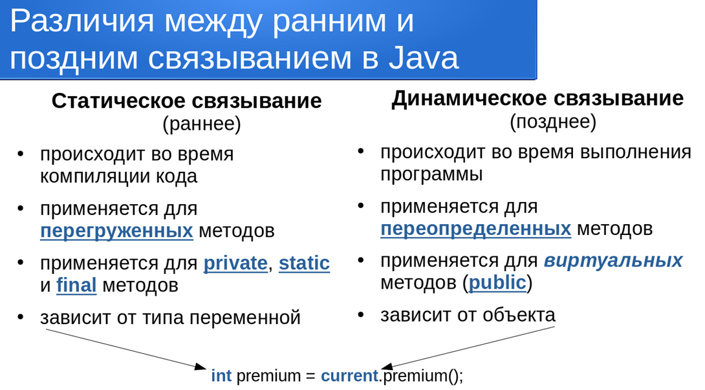
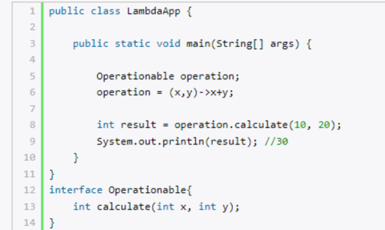

# Принцип работы компилятора java?

1) Создается файлы с расширением .java в котором описываеться логика работы программы
2) Файлы пропускаются через компилятор, который проверяет на ошибки. Выдает конечный результат (в виде файла байткода)
   когда уверен в работоспособности и корректности файлов
3) Создается файл закодированный с помощью байткода. Любое устройство, способное выполнять Java сможет интерпериторвать/
   транслировать этот файл в такой формат, который получится запустить. Скомпилированный байткод не зависит от
   платформы. Байт-код — это просто результат компиляции класса Java. Файл .class на самом деле представляет собой набор
   инструкций
   байт-кода, в которые преобразуется код. Он нуждается в интерпретаторе, таком как JVM, чтобы понимать и выполнять
   инструкции.
4) Виртуальная машина выполняет байткод - считывает, преобразует в машинный код и выполняет

# Что такое класс Object и почему все его наследуют

Так как у нас объектно-ориентированный язык программирования, то нам нужны методы и характеристики объектов.
В ООП есть наследование, поэтому методы описывающие класс object необходимы в любом классе который мы проектируем (
toString, equals, hashcode).
Мы должны уметь их отличать.
Помимо этого это свойство полиморфизма, когда переменной Object obj= new A() мы можем присвоить любой класс.
Там где переменная или дженерик класс предка - мы можем использовать любого его потомка.

Класс `Object` обеспечивает общие методы, которые могут быть использованы или переопределены любым классом для
выполнения таких задач, как сравнение объектов, их клонирование, возвращение строкового представления объекта, и
управление потоками

# Можно ли создать экземпляр класса Object. И для чего это может потребоваться

Да, так как он не является интерфейсом или абстрактным классом.
Нужен этот объект например - для многопоточности. Каждый объект может быть использован в качестве монитора
многопоточности.
Это нужно для синхронизации доступа.

```java
public class Test {
    final Object LOCK = new Object();

    public void method() {
        synchronized (LOCK) {
            System.out.println("run this method");
        }
    }
}
```

## Методы класса Object

* public String toString()
  Возвращает строковое представление объекта.

* public native int hashCode()
* public boolean equals(Object obj)
  Пара методов, которые используются для сравнения объектов.
  **Если у наследника не предопределять equals - он будет сравнивать ссылки в памяти**

* public final native Class getClass()
  Возвращает специальный объект, который описывает текущий класс.

* public final native void notify()
* public final native void notifyAll()
* public final native void wait(long timeout)
* public final void wait(long timeout, intnanos)
* public final void wait()
  Методы для контроля доступа к объекту из различных нитей. Управление синхронизацией нитей.
  Они работают только с synchronized блоками и методами. Иначе если вызвать то получим IllegalMonitorStateException

```java
public class WaitExample {
    public static void main(String[] args) {
        Object obj = new Object();
        try {
            obj.wait();
        } catch (InterruptedException e) {
            throw new RuntimeException(e);
        }
    }
}
//Exception in thread "main" java.lang.IllegalMonitorStateExceptio
```

* protected void finalize()
  Метод позволяет «освободить» родные не-Java ресурсы: закрыть файлы, потоки и т.д.
  метод вызывается перед сборкой мусора
  С 9 версии он @Deprecated. Расчитывать на то что этот метод вызовется перед сборкой мусора не нужно. Потому что не
  известно когда сработает сборщик мусора

* protected native Object clone()
  Метод позволяет клонировать объект: создает дубликат объекта

# Что такое hashCode. Какая у него реализация?

Отображение объекта в 32 битное число.
Дефолтная реализация написана на С++, об этом нам говорит сигнатура метода native int hashCode();
Когда мы прописываем для класса, нам нужно сформировать алгоритм с учетом всех полей объекта.
Например так

```java

@Override
public int hashCode() {
    int result = Objects.hashCode(propertyOne);
    result = 31 * result + propertyTwo;
    return result;
}
```

# Какой контракт  hashCode

1. (Согласованность) Повторный вызов hashCode для одного и того же объекта должен возвращать одинаковые хеш-значения,
   если поля объекта,
   участвующие в вычислении значения, не менялись.
2. Если equals() для двух объектов возвращает true, hashCode() также должен возвращать для них одно и то же число.
3. При этом неравные между собой объекты могут иметь одинаковый hashCode.

# Контракт equals() в Java

Каких правил к использованию equals, мы должны придерживаться , определённых в спецификации Java:

1. Рефлексивность — x.equals(x) возвращает true.
2. Симметричность — x.equals(y) <=> y.equals(x).
3. Транзитивность — x.equals(y) <=> y.equals(z) <=> x.equals(z).
4. Согласованность — повторный вызов x.equals(y) должен возвращать значение предыдущего вызова, если сравниваемые поля
   не изменялись.
5. Сравнение null — x.equals(null) возвращает false.

# Как работает метод equals() в Java если его не предопределять?

По умолчанию метод equals() возвращает True, только если ссылки двух объектов равны.
Допустим у нас не предопределен этот метод в классе String (реализация по умолчанию), тогда следующий код вернет

```
String a = new String("Привет");
String b = new String("Привет");
System.out.println(a == b);
System.out.println(a.equals(b)); 
//false
//false
```

А нам нужно чтобы содержимое было идентичным (true)

# Что будет если предопределить equals а hashcode нет.

Если предопределить только equals - у нас сломается логика использования hashmap или hashset. Equals и hashcode
работают вместе чтобы функционировала коллекция. Если не будет работать equals, то в коллекции найдется по hashcode
корзина,а элемент по equals не найдется. Если наоборот, то по hashcode не найдется корзина и до equals не дойдет дело.  
Так же если вдруг поменяется hashcode налету - то в коллекции попросту не найдет корзину.

Поэтому ключом hashmap выбирают неизменяемые классы такие как String, чтобы нельзя было поменять hashcode

# Раннее связывание (Статическое связывание)

Раннее связывание - это когда метод, который будет вызван, известен во время компиляции, например, вызов статического
метода.

Приватные, статические и final-методы связываются
при помощи статического связывания (Раннего), а виртуальные – динамического. Аналогично, лучший пример статического
связывания – перегрузка методов, а переопределение – динамического.

    Что выведет эта программа? Collection, Set или HashSet?

```java
public class Example {
    public static void main(String[] args) {
        Collection collection = new HashSet();
        print(collection);
    }

    private static void print(Collection collection) {
        System.out.println("collection");
    }

    private static void print(Set collection) {
        System.out.println("set");
    }

    private static void print(HashSet collection) {
        System.out.println("hashSet");
    }
}
```

# Позднее связывание (динамичкая диспетчеризация)

Позднее связывание - это когда вызов метода может быть осуществлен только во время выполнения и у компилятора нет
информации, чтобы проверить корректность такого вызова. В java это можно сделать при помощи рефлексии.

# Отличие раннего от позднего связывание



# Что такое сокрытие метода

Другим важным моментом является то, что вы НЕ можете переопределять (Override) статические методы. Если вы объявите
такой же метод в классе-наследнике (subclass), т.е. метод с таким же именем и сигнатурой, вы лишь «спрячете» метод
суперкласса (superclass) вместо переопределения. Это явление известно как ```сокрытие методов (hiding methods)```. Это
означает, что при обращении к статическому методу, который объявлен как в родительском, так и в дочернем классе, во
время компиляции всегда будет вызван метод исходя из ```типа переменной```. В отличие от переопределения, такие методы
не
будут выполнены во время работы программы.

# Отличие предопределения от сокрытия

Переопределение в основном поддерживает позднее связывание. Поэтому во время выполнения решается, какой метод будет
вызван. Это для нестатических методов.
Скрытие предназначено для всех остальных членов (статических методов, членов экземпляра, статических членов). В его
основе лежит раннее связывание. Более ясно, метод или член, который будет вызываться или использоваться, определяется во
время компиляции.

# Что такое static? Можно ли переопределить static метод?

Важным свойством статического метода является то, что он может обратиться только к статическим переменным/методам.
Предопределить static метод нельзя. ```См сокрытие```

```java
class Base {
    public static void main(String[] args) {
        Base b = new Child();
        b.printMe(); // хоть объект Child напечатается Base
    }

    static void printMe() {
        System.out.println("Base");
    }
}

class Child extends Base {
    static void printMe() {
        System.out.println("Child");
    }
}
```

Отвечая на этот вопрос, необходимо аккуратно обращаться с терминологией перегрузки и переопределения.

На перегрузку (overload) статического метода не накладывается никаких ограничений. С точки зрения компилятора, методы с
разным списком аргументов – разные методы. Но это не переопределение.

Метод с модификатором static относится к классу, а не к его объектам. Для него работает статическое связывание, поэтому
именно переопределение (override) в дочернем классе не работает.

Несмотря на это, в дочернем классе можно объявить static метод с такой же сигнатурой, как в родительском. В этом случае
произойдет не перегрузка и не переопределение, а перекрытие (shadowing). К такому методу нельзя применить аннотацию
@Override, в нём нельзя использовать ключевое слово super.

Если вы вызываете статический метод от переменной, а не типа, перекрытие таит в себе опасность. Без динамического
связывания компилятор знает только о типе переменной, но не о типе ее значения. Если объявленный тип переменной –
базовый класс, то метод-перекрытие никогда не вызовется. Поэтому при попытке такого вызова в IDE мы видим
предупреждение.

# Чем Lambda отличается от анонимного класса?

Анонимный класс - тип вложенного класса.
Лямбда представляет набор инструкций, которые можно выделить в отдельную переменную и затем многократно вызвать в
различных местах программы.
Основу лямбда-выражения составляет лямбда-оператор, который представляет стрелку ->. Этот оператор разделяет
лямбда-выражение на две части: левая часть содержит список параметров выражения, а правая собственно представляет тело
лямбда-выражения, где выполняются все действия.
Лямбда-выражение не выполняется само по себе, а образует реализацию метода, определенного в функциональном интерфейсе.
При этом важно, что функциональный интерфейс должен содержать только один единственный метод без реализации.
В роли функционального интерфейса выступает интерфейс Operationable, в котором определен один метод без реализации -
метод calculate.
Данный метод принимает два параметра - целых числа, и возвращает некоторое целое число.

По факту лямбда-выражения являются в некотором роде сокращенной формой внутренних анонимных классов, которые ранее
применялись в Java. В частности, предыдущий пример мы можем переписать следующим образом:


Лямбда-выражения появились в Java 8 как способ имплементации анонимных методов и,
в некоторых случаях, как альтернатива анонимным классам
Лямбда-выражение имеет более легковесный синтаксис. Не нужно явно указывать тип функционального интерфейса, который
лямбда реализует – он автоматически выведется из контекста. Лямбда-выражения добавлены в язык в первую очередь как
синтаксический сахар.

Экземпляр анонимного класса сохраняет свое состояние между вызовами, и меняет его при необходимости. Для лямбды доступен
лишь захват и effectively final использование внешних переменных. Эффективно Окончательной:
int number;
number = 34;

наша переменная сейчас "окончательным".. int variable = 123;

Лямбдой реализуется только функциональный интерфейс. Функциональный интерфейс – это тип с единственным абстрактным
методом. Анонимным классом же можно расширить любой расширяемый класс или реализовать интерфейс с любым количеством
абстрактных методов.

Анонимный класс создает новый скоуп, лямбда работает в текущем. Это значит, что объявление переменной с именем, которое
уже используется снаружи, в лямбде вызовет ошибку компиляции «variable is already defined», в анонимном классе скроет (
shadowing) внешнюю переменную.

С точки зрения реализации JVM, для лямбды не создается дополнительного .class файла, как это происходит для анонимного
класса. Соответственно, не происходит и обычной загрузки и верификации класса. Вместо этого используется механизм
invokedynamic и класс генерируется на лету с помощью LambdaMetafactory. Так что лямбда-выражения обычно работают
быстрее.

# Интерфейс, Функциональные интерфейсы

> <https://github.com/VasiliyVelikyy/InterviewQuestions/blob/master/resourses/theory/core/interfaces.md>

# Какие виды вложенных классов существуют

1) Вложенные внутренние классы – нестатические классы внутри внешнего класса.
2) Вложенные статические классы – статические классы внутри внешнего класса.
3) Локальные классы Java – классы внутри методов.
4) Анонимные Java классы – классы, которые создаются на ходу.

#### Вложенные внутренние классы – нестатические классы внутри внешнего класса.

``` java
  public class Airplane {
      private String name, id, flight;
      private Wing leftWing = new Wing("Red", "X3"), rightWing = new Wing("Blue", "X3");
  
      public Airplane(String name, String id, String flight) {
          this.name = name;
          this.id = id;
          this.flight = flight;
      }
  
      private class Wing {
          private String color, model;
  
          private Wing(String color, String model) {
              this.color = color;
              this.model = model;
          }
  
          // getters/setters
      }
  
      // getters/setters
  }
 ```

##### Особенности нестатических вложенных классов Java:

* Они существуют только у объектов, потому для их создания нужен объект. Другими словами: мы укомплектовали наше крыло
  так, чтобы оно было частью самолета, потому, чтобы создать крыло, нам нужен самолет, иначе оно нам не нужно.
* Внутри Java класса не может быть статических переменных. Если вам нужны какие-то константы или что-либо еще
  статическое, выносить их нужно во внешний класс. Это связано с тесной связью нестатического вложенного класса с
  внешним классом.
* У класса полный доступ ко всем приватным полям внешнего класса. Данная особенность работает в две стороны.
* Можно получить ссылку на экземпляр внешнего класса. Пример: Airplane.this – ссылка на самолет, this – ссылка на крыло.

#### Вложенные статические классы – статические классы внутри внешнего класса.

Данный вид классов не отличается ничем от обычного внешнего класса, кроме одного: для создания экземпляра такого класса,
нужно через точку перечислить весь путь от внешнего класса до нужного. Например: Building.Plaftorm platform = new
Building.Platform();

Статические классы используются для того, чтобы укомплектовать связанные классы рядышком, чтобы с логической структурой
было работать проще. Например: мы можем создать внешний класс Building, где будет конкретный список классов, которые
будут представлять из себя уже конкретную постройку.

```java

public abstract class Building {
    private String name, address, type;

    Building(String name, String address) {
        this.name = name;
        this.address = address;
    }

    public static class Platform extends Building {
        public Platform(String name, String address) {
            super(name, address);
            setType("Platform");
        }

        // some additional logic
    }

    public static class House extends Building {
        public House(String name, String address) {
            super(name, address);
            setType("House");
        }

        // some additional logic
    }

    public static class Shop extends Building {
        public Shop(String name, String address) {
            super(name, address);
            setType("Shop");
        }

        // some additional logic
    }

    // getters/setters
}

```

Данный пример демонстрирует, как статические классы позволяют укомплектовывать логическую структуру в более удобный вид.
Если бы их не было, нам бы понадобилось создавать 4 совершенно разных класса.

#### Плюсы такого подхода:

* Количество классов уменьшилось.
* Все классы внутри их класса-родителя. Мы способны прослеживать всю иерархию без открытия каждого класса отдельно.
* Мы можем обратиться к классу Building, а IDE уже будет подсказывать весь список всех подклассов данного класса. Это
  будет упрощать поиск нужных классов и показывать всю картину более цело.
* Пример создания экземпляра вложенного статического класса:
  ``` Building.Shop myShop = new Building.Shop(“Food & Fun!”, “Kalyaeva 8/53”);```

#### Локальные классы Java – классы внутри методов.

Локальные классы способны работать только с final переменными метода. Все дело в том, что экземпляры локальных классов
способны сохраняться в «куче» после завершения работы метода, а переменная может быть стёрта. Если же переменная
объявлена final, то компилятор может сохранить копию переменной для дальнейшего использования объектом. И еще: с 8+
версий Java можно использовать не final переменные в локальных классах, но только при условии, что они не будут
изменяться.
Локальные классы нельзя объявлять с модификаторами доступа.
Локальные классы обладают доступом к переменным метода.
Локальные классы можно встретить крайне редко, так как они затрудняют прочтение кода и не обладают никакими плюсами,
кроме одного – доступ к переменным метода. Я не знаю, какой можно взять пример локального класса, который бы показал их
эффективное применение, так что покажу просто свой пример.

Допустим, что у нас есть класс Person (будет считать, что это человек) со свойствами street (улица), house (дом). Нам бы
хотелось возвращать какой-то объект для доступа только к местоположению человека. Для этого, мы создали интерфейс
AddressContainer, который подразумевает собой хранилище данных об местоположении человека.

```java
public class Person {
    private String name, street, house;

    public Person(String name, String street, String house) {
        this.name = name;
        this.street = street;
        this.house = house;
    }

    private interface AddressContainer {
        String getStreet();

        String getHouse();
    }

    public AddressContainer getAddressContainer() {
        class PersonAddressContainer implements AddressContainer {
            final String street = Person.this.street, house = Person.this.house;

            @Override
            public String getStreet() {
                return this.street;
            }

            @Override
            public String getHouse() {
                return this.house;
            }
        }
        return new PersonAddressContainer();
    }

    public static void main(String[] args) {
        Person person = new Person("Nikita", "Sholohova", "17");
        AddressContainer address = person.getAddressContainer();
        System.out.println("Address: street - " + address.getStreet() + ", house - " + address.getHouse());
    }

    // getters/setters
}
```

Как можно заметить, внутри метода мы создали класс, реализующий хранилище местоположения человека, создали там
константные переменные (чтобы после выхода из метода переменные хранились в объекте) и реализовали метод для получения
адреса и дома. Теперь мы можем использовать данный объект в других местах программы, чтобы получать местоположение
человека.

#### Анонимные Java классы – классы, которые создаются на ходу.

Под капотом анонимные классы – просто обычные нестатические вложенные классы. Их особенность в удобстве их
использования. Вы можете написать свой класс прямо при создании экземпляра другого класса.

```java
public class Animal {
    public void voice() {
        System.out.println("Meow!");
    }

    public static void main(String[] args) {
        Animal doggy = new Animal() {
            @Override
            public void voice() {
                System.out.println("Gav!");
            }
        };

        Animal cat = new Animal();
        Animal cow = new Animal().new Cow();

        cat.voice(); // будет выведено Meow!
        cow.voice(); // будет выведено Moooo!
        doggy.voice(); //будет выведено Gav!
    }

    private class Cow extends Animal {
        @Override
        public void voice() {
            System.out.println("Moooo!");
        }
    }
}
```

По сути, мы просто совмещаем в одном месте две вещи: создание экземпляра одного класса (Animal) и создание экземпляра
его внутреннего-класса наследника (Cow). Иначе нам нужно создавать класс отдельно и использовать более длинные
конструкции, чтобы добиться того же самого результата.

#### Использование анонимных классов оправдано во многих случаях, в частности когда:

* тело класса является очень коротким;
* нужен только один экземпляр класса;
* класс используется в месте его создания или сразу после него;
* имя класса не важно и не облегчает понимание кода.

Часто анонимные классы используются в графических интерфейсах для создания обработчиков событий. Например для создания
кнопки и реакции на её нажатие:

```
JButton b2 = new JButton("Click");
b2.addActionListener(new ActionListener() {
  public void actionPerformed(ActionEvent e) {
    System.out.println("Кнопка нажата!");
  }
});

```

Однако после Java 8 начали использовать лямбда-выражения, но все равно много кода было написано до 8 версии и вы можете
столкнуться (и столкнетесь в ходе обучения на JavaRush) с такими вот надписями.\

Аналог с лямбдами:

```
JButton b2 = new JButton("Click");
b2.addActionListener(e -> System.out.println("Кнопка нажата!"));
```

Любой анонимный внутренний класс может за один раз реализовать только один интерфейс. Так же, за один раз можно либо
расширить класс, либо реализовать интерфейс, но не одновременно.

# Что такое Generic

https://github.com/VasiliyVelikyy/InterviewQuestions/blob/main/resourses/theory/core/generics.md

# Есть ли в java множественное наследование

Классы могут быть унаследованы от 1 супер класса. Классы могут реализовывать несколько интерфейсов.
Но интерфейсы могут быть унаследованы от нескольких супер интерфейсов

```java
interface A {
}

interface B {
}

interface C extends A, B { // сработает
}

class D {
}

class E {
}

//class I extends D, E { } //не сработает
```

# Если мы в бесконечном цикле добавляем элементы в  ArrayList и в LinkedList.То на момент падения ошибки OutOfMemory в какой структуре данных у нас будет больше элементов ?

При падении ошибки OutOfMemoryError в Java, когда вы добавляете элементы в ArrayList и LinkedList в бесконечном цикле,
количество элементов в этих структурах будет зависеть от особенностей их реализации.

ArrayList: Эта структура данных использует массив для хранения элементов. Когда количество элементов превышает размер
массива, ArrayList увеличивает свой массив в два раза, что приводит к дополнительным накладным расходам по памяти и
времени при изменении размера массива. Это означает, что при добавлении элементов в ArrayList он будет расширяться, а
память будет перераспределяться.

LinkedList: Эта структура данных использует связный список, где каждый элемент содержит ссылки на предыдущий и следующий
элементы. В случае с LinkedList каждый элемент хранит ссылку на предыдущий и следующий узел, что делает его более "
тяжелым" по памяти, чем ArrayList, поскольку для каждого элемента требуется дополнительная память для указателей. Однако
связанный список не требует перераспределения памяти, как это делает ArrayList.

На момент ошибки OutOfMemory:
ArrayList может иметь меньше элементов, так как для хранения данных ему требуется больше памяти (в результате
перераспределения массива). При расширении массива часто выделяется блок памяти, который может быть больше, чем
требуется для текущего числа элементов, что может привести к более быстрому истощению памяти.

LinkedList будет занимать больше памяти на элемент, так как каждый элемент имеет дополнительные указатели (ссылки).
Однако в случае с LinkedList структура не требует перераспределения памяти, как у ArrayList.

Таким образом, в LinkedList в момент падения ошибки OutOfMemoryError будет больше элементов, потому что он не тратит
память на перераспределение и не требует дополнительных усилий для роста структуры. Однако по объему памяти на элемент
LinkedList будет гораздо более затратным, чем ArrayList.

# Какие бывают модификаторы доступа и зачем они нужны.

Все члены класса в языке Java - поля и методы - имеют модификаторы доступа. В прошлых темах мы уже сталкивались с
модификатором public. Модификаторы доступа позволяют задать допустимую область видимости для членов класса, то есть
контекст, в котором можно употреблять данную переменную или метод.
В Java используются следующие модификаторы доступа:

- public: публичный, общедоступный класс или член класса. Поля и методы, объявленные с модификатором public, видны
  другим классам из текущего пакета и из внешних пакетов.
- protected: такой класс или член класса доступен из любого места в текущем классе или пакете или в классах наследниках
  даже если они находятся в других пакетах
- Модификатор по умолчанию (package private). Отсутствие модификатора у поля или метода класса предполагает применение к
  нему
  модификатора по умолчанию. Такие поля или методы видны всем классам в текущем пакете.
- private: закрытый класс или член класса, противоположность модификатору public. Закрытый класс или член класса
  доступен только из кода в том же классе.

# Что означает class final/final method. Как изменить значение final переменной.

Для ссылочных переменных это означает, что после присвоения объекта, нельзя изменить ссылку на данный объект. Это важно!
Ссылку изменить нельзя, но состояние объекта изменять можно.

```java
class FinalLink {
    public static void main(String[] args) {
        final ArrayList<Integer> list = new ArrayList<>(Arrays.asList(1, 2, 3));
        System.out.println(list);
        list.set(0, 5);
        System.out.println(list);
        //list=new ArrayList<>(); //ошибка компиляции
    }
}
//[1, 2, 3]
//[5, 2, 3]
```

# Блоки инициализации

```java
public class HelloWorld {

    static {
        System.out.println("static block");
    }

    {
        System.out.println("block");
    }

    public HelloWorld() {
        System.out.println("Constructor");
    }

    public static void main(String[] args) {
        HelloWorld obj = new HelloWorld();
    }

}
```

Порядок вывода будет: static block, block, Constructor. Как мы видим, блоки инициализации выполняются раньше, чем
конструктор. И иногда это может быть удобным средством для инициализации.

# Аннотации
- Это методанные, описывающие код
- Храняться внутри кода. И имеют скоуп жизни. По умолчанию class.
Применение:
- Информация для компилятора
- Генерирование документации, файлов
- Обработка во время выполнения.

Retention policy:
- Source -видна исключительно в исходниках(java файл). После компиляции в байткод она не попадает. Например @Override
    Если поставить эту аннотацию не в том месте, компилятор все равно будет ругатся и не даст скомпилировать
- Class -по умолчанию. В байт код попадет но при выполнении программы через reflection ее не увидим. Это нужно для АСТ траснформации, байткод инструментария
- Runtime - аннотации видны при выполнении. Их можно считать во время работы программы.
Аннотация определяется описанием с ключевым словом interface и может включать в себя несколько полей, которые можно
задать как обязательными, так и не обязательными. В последнем случае подставляется default значение поля.