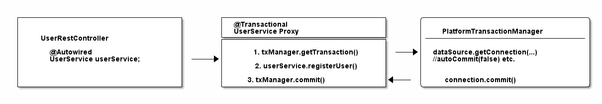
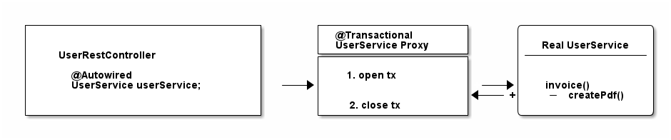
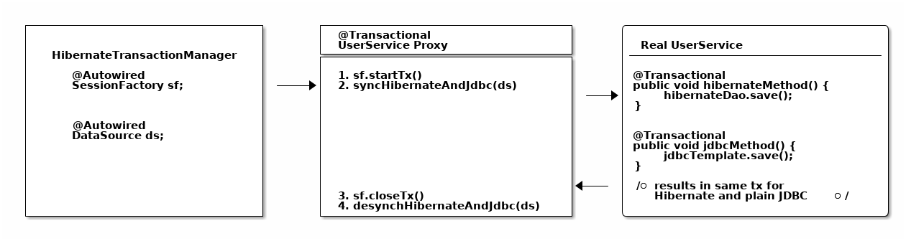

 Управление транзакциями в Spring: @Transactional в деталях 

https://habr.com/ru/articles/682362/

Вы можете использовать это руководство, чтобы получить простое и
практическое понимание того, как работает управление транзакциями
в Spring (Спринге) с помощью аннотации @Transacional .

Единственное необходимое условие? Вы должны иметь приблизительное
представление об ACID, то есть о том, что такое транзакции баз
данных и зачем их использовать. Также здесь не рассматриваются
распределенные транзакции или реактивные транзакции, хотя общие
принципы, с точки зрения Spring всё же применимы.

Введение

В этом руководстве вы узнаете об основных столпах "*transaction
abstraction framework"*("*структуры абстракции
транзакций*"*-*запутанный термин, не так ли?) Spring core -
описанных с большим количеством примеров кода:

- @Transactional(декларативное управление транзакциями) против
  программного управления транзакциями.

- Физические и логические транзакции.

- Интеграция @Transactional Spring и JPA / Hibernate .

- Интеграция @Transactional Spring и Spring Boot или Spring
  MVC .

- Откаты, прокси, общие проблемы и многое другое.

В отличие, скажем, от[официальной документации по
Spring](https://docs.spring.io/spring-framework/docs/5.3.x/reference/html/data-access.html#transaction-declarative)это
руководство не запутает вас, погрузившись сразу в тему Spring-first.

Вместо этого вы будете изучать управление
транзакциями Spring нетрадиционным способом: с нуля, шаг за шагом.
Это означает, что вы начнёте со старого доброго управления[транзакциями
JDBC](https://en.wikipedia.org/wiki/Java_Database_Connectivity).

Почему?

Потому что всё, что делает Spring , построено на этих самых
основах *JDBC *(соединение с базами данных на Java ) . И вы
сэкономите кучу времени при работе с
аннотацией @Transactional от Spring , если усвоите эти начала.

Как работает обычное Управление транзакциями JDBC

Если вы думаете пропустить этот раздел, не зная
транзакций JDBC изнутри: не стоит .

Как запускать, фиксировать или откатывать транзакции JDBC

Первый важный вывод заключается в следующем: Не имеет значения,
используете ли вы аннотацию @Transactional от Spring ,
обычный Hibernate , jOOQ или любую другую библиотеку баз данных.

В конечном счёте, все они делают одно и то же - открывают и закрывают
(назовём это "управлением") транзакции базы данных. Обычный код
управления транзакциями JDBC выглядит следующим образом:

```
import java.sql.Connection;

Connection connection = dataSource.getConnection(); // (1)

try (connection) {
    connection.setAutoCommit(false); // (2)
    // выполнить несколько SQL-запросов...
    connection.commit(); // (3)

} catch (SQLException e) {
    connection.rollback(); // (4)
}
```

- Для запуска транзакций необходимо подключение к базе
  данных. DriverManager.getConnection(url, user, password)тоже
  подойдёт, хотя в большинстве корпоративных приложений вы будете иметь
  настроенный источник данных и получать соединения из него.

- Это единственный способ "начать" транзакцию базы данных
  в Java , даже несмотря на то, что название может звучать немного
  странно. setAutoCommit(true)гарантирует, что каждый SQL -оператор
  будет автоматически завёрнут в собственную транзакцию,
  а setAutoCommit(false)- наоборот: Вы являетесь хозяином транзакции
  (транзакций), и Вам придётся начать вызывать commit и друзей. Обратите
  внимание, что флаг autoCommit действует в течение всего времени, пока
  ваше соединение открыто, что означает, что вам нужно вызвать метод
  только один раз, а не несколько.

- Давайте зафиксируем нашу транзакцию...

- Или откатим наши изменения, если произошло исключение.

Да, эти 4 строки - это (в упрощенном виде) всё, что Spring делает
всякий раз, когда вы используете аннотацию @Transactional . В следующей
главе вы узнаете, как это работает. Но прежде чем мы перейдём к этому,
вам нужно узнать ещё кое-что.

(Небольшое замечание для умников: Библиотеки пулов соединений, такие
как HikariCP, могут переключать режим автокоммита автоматически, в
зависимости от конфигурации. Но это уже продвинутая тема).

Как использовать уровни изоляции JDBC и точки сохранения

Если вы уже играли с аннотацией @Transactional от Spring , вы могли
столкнуться с чем-то подобным:

```
@Transactional(
  propagation=TransactionDefinition.NESTED,
  isolation=TransactionDefinition.ISOLATION_READ_UNCOMMITTED
)
```

Мы рассмотрим вложенные транзакции Spring и уровни изоляции позже
более подробно, но опять же полезно знать, что все эти параметры
сводятся к следующему, основному коду JDBC :

```
import java.sql.Connection;

// isolation=TransactionDefinition.ISOLATION_READ_UNCOMMITTED

connection.setTransactionIsolation(Connection.TRANSACTION_READ_UNCOMMITTED); // (1)

// propagation=TransactionDefinition.NESTED

Savepoint savePoint = connection.setSavepoint(); // (2)
...
connection.rollback(savePoint);

```

- Вот как Spring устанавливает уровни изоляции для соединения с
  базой данных. Не такое уж хитросплетённый, не так ли?

- Вложенные транзакции в Spring - это просто точки
  сохранения JDBC / базы данных. Если вы не знаете, что такое точка
  сохранения, посмотрите, например,[это
  руководство](https://docs.oracle.com/javase/tutorial/jdbc/basics/transactions.html).
  Обратите внимание, что поддержка точек сохранения зависит от вашего
  драйвера JDBC /базы данных.

Как работает управление транзакциями в Spring или Spring boot

Поскольку теперь у вас есть хорошее понимание транзакций JDBC ,
давайте посмотрим, как[Spring
core](https://docs.spring.io/spring/docs/current/spring-framework-reference/core.html)управляет
транзакциями. Здесь всё применимо 1:1 к[ Spring
boot ](https://spring.io/projects/spring-boot)и Spring MVC , но[об
этом](https://habr.com/ru/articles/682362/#Transactional%20%D1%81o%20Spring%20boot)чуть
позже...

Что*на самом деле представляет собой*управление
транзакциями Spring или его (довольно запутанно
названная)*структура абстракции транзакций*?

Помните, что управление транзакциями просто означает:
Как Spring запускает, фиксирует или откатывает транзакции JDBC ?
Звучит ли это как-то знакомо?

Вот в чём загвоздка: В то время как в обычном JDBC у вас есть только
один способ (setAutocommit(false)) управлять
транзакциями, Spring предлагает вам множество различных, более
удобных способов добиться того же самого.

Как использовать "программное управление транзакциями Spring"
(Programmatic Transaction Management)?

Первый, но довольно редко используемый способ определения транзакций
в Spring - программный: Либо через транзакционный
шаблон TransactionTemplate, либо непосредственно
через PlatformTransactionManager. С точки зрения кода это выглядит
следующим образом:

```
@Service
public class UserService {

    @Autowired
    private TransactionTemplate template;

    public Long registerUser(User user) {
        Long id = template.execute(status ->  {
            // выполнить некоторый SQL, который, например,
            // вставляет пользователя в базу данных 
            // и возвращает автогенерированный идентификатор
          return id;
        });
    }
}
```

По сравнению с[обычным примером
JDBC](https://habr.com/ru/articles/682362/#%D0%BF%D1%80%D0%BE%D1%81%D1%82%D0%BE%D0%B9_%D0%BF%D1%80%D0%B8%D0%BC%D0%B5%D1%80_JDBC):

- Вам не нужно возиться с открытием и закрытием соединений с базой
  данных самостоятельно (try-finally). Вместо этого вы
  используете[ обратные вызовы
  транзакций](https://docs.spring.io/spring/docs/current/javadoc-api/org/springframework/transaction/support/TransactionCallback.html).

- Вам также не нужно ловить SQLExceptions,
  поскольку Spring преобразует эти исключения в исключения времени
  выполнения (runtime exceptions).

- Кроме того, вы лучше интегрируетесь в
  экосистему Spring . TransactionTemplate будет
  использовать TransactionManager внутри, который будет использовать
  источник данных. Все это бины, которые вы должны указать в
  конфигурации контекста Spring , но о которых вам больше не придётся
  беспокоиться в дальнейшем.

Хотя это и считается незначительным улучшением, программное управление
транзакциями - это не то, чем в основном занимается транзакционная
структура (transaction framework) Spring . Вместо этого, все дело
в*декларативном управлении*транзакциями. Давайте выясним, что это
такое.

Как использовать декларативное управление транзакциями XML от Spring?

В те времена, когда конфигурация XML была нормой для
проектов Spring , вы могли конфигурировать транзакции непосредственно
в XML. За исключением нескольких старых корпоративных проектов, вы
больше не встретите такой подход в природе, поскольку он был вытеснен
гораздо более простой аннотацией @Transactional .

В этом руководстве мы не будем подробно останавливаться на конфигурации
XML, но вы можете использовать этот пример в качестве отправной точки,
чтобы углубиться в него - при необходимости (он взят прямо
из[официальной документации
Sprnig](https://docs.spring.io/spring/docs/4.2.x/spring-framework-reference/html/transaction.html#transaction-declarative)):

```xml
<!-- транзакционный совет (advice) (что "происходит"; см. <aop:advisor/> бин ниже) -->
<tx:advice id="txAdvice" transaction-manager="txManager">
    <!-- семантика транзакций... -->
    <tx:attributes>
        <!--все методы, начинающиеся с 'get', доступны только для чтения -->
        <tx:method name="get*" read-only="true"/>
        <!-- другие методы используют настройки транзакции по умолчанию (см. ниже) -->
        <tx:method name="*"/>
    </tx:attributes>
</tx:advice>

```

Вы определяете[advice
AOP](https://docs.spring.io/spring/docs/4.3.x/spring-framework-reference/htmlsingle/#aop-introduction)(Aspect
Oriented Programming, аспектно-ориентированное программировие) с помощью
приведенного выше блока XML, который затем можно применить к
бин UserService следующим образом:

```xml

<aop:config>
    <aop:pointcut id="userServiceOperation" expression="execution(* x.y.service.UserService.*(..))"/>
    <aop:advisor advice-ref="txAdvice" pointcut-ref="userServiceOperation"/>
</aop:config>

<bean id="userService" class="x.y.service.UserService"/>
```

Тогда ваш бин UserService будет выглядеть следующим образом:

```java
public class UserService {

    public Long registerUser(User user) { 
        // выполняем SQL, который, например.
        // вставляет пользователя в базу данных 
        // и извлекает автогенерированный id
      return id;
    }
}
```

С точки зрения кода Java, этот декларативный подход к транзакциям
выглядит намного проще, чем программный подход. Но он приводит к
большому количеству сложного, многословного XML с конфигурациями
указателей и советников (advisor).

Таким образом, это приводит к вопросу: Есть ли лучший способ управления
декларативными транзакциями вместо XML? Да, есть:
аннотация @Transacional .

Как использовать аннотацию @Transactional Spring (декларативное
управление транзакциями, Declarative Transaction Management)

Теперь давайте посмотрим, как обычно выглядит современное управление
транзакциями в Spring :

```java
public class UserService {

    @Transactional
    public Long registerUser(User user) {
        // выполнить некоторый SQL, который, например,
        // вставляет пользователя в базу данных 
        // и извлекает автогенерированный id
        // userDao.save(user);
        return id;
    }
}
```

Как это возможно? Больше нет конфигурации XML, а также нет необходимости
в другом коде. Вместо этого вам теперь нужно сделать две вещи:

- Убедитесь, что ваша Configuration *Spring *сопровождена
  аннотацией @EnableTransactionManagement Spring boot *это будет
  сделано автоматически*).

- Убедитесь, что вы указали менеджер транзакций в
  вашей Configuration *Spring *(это необходимо сделать в любом
  случае).

И тогда Spring покажет себя достаточно умным, чтобы явно
обрабатывать транзакции для вас: Любой публичный public метод бин,
который вы сопровождаете аннотацией @Transactional , будет
выполняться*внутри транзакции базы данных*(обратите внимание: есть
некоторые[подводные
камни](https://habr.com/ru/articles/682362/#%D0%BF%D0%BE%D0%B4%D0%B2%D0%BE%D0%B4%D0%BD%D1%8B%D0%B9_%D0%BA%D0%B0%D0%BC%D0%B5%D0%BD%D1%8C)).

Итак, чтобы аннотация @Transactional заработала, всё, что вам нужно
сделать, это следующее:

```java

@Configuration
@EnableTransactionManagement
public class MySpringConfig {

    @Bean
    public PlatformTransactionManager txManager() {
        return yourTxManager; // подробнее об этом позже
    }
}
```

Теперь, когда я говорю, что Spring явно обрабатывает транзакции для
вас. Что это*означает на самом деле*?

Вооружившись знаниями из[примера транзакций
JDBC](https://habr.com/ru/articles/682362/#%D0%BF%D1%80%D0%BE%D1%81%D1%82%D0%BE%D0%B9%20%D0%BF%D1%80%D0%B8%D0%BC%D0%B5%D1%80%20%D0%A1%D0%91%D0%94%D0%AF),
приведённый выше код @Transactional UserService переводится (упрощенно)
непосредственно следующим образом:

```java
public class UserService {

    public Long registerUser(User user) {
        Connection connection = dataSource.getConnection(); // (1)
        try (connection) {
            connection.setAutoCommit(false); // (1)

            // выполнить некоторый SQL, который, например.
            // вставляет пользователя в базу данных 
            // и извлекает автогенерированный идентификатор
            // userDao.save(user); <(2)

            connection.commit(); // (1)
        } catch (SQLException e) {
            connection.rollback(); // (1)
        }
    }
}
```

- Все это просто стандартное открытие и закрытие соединения JDBC .
  Это то, что транзакционная аннотация Spring делает для вас
  автоматически, без необходимости писать её явно.

- Это ваш собственный код, сохраняющий пользователя через DAO или
  что-то подобное.

Этот пример может выглядеть немного*магическим*, но давайте посмотрим,
как Spring вставляет этот код соединения для вас.

CGlib и JDK прокси - @Transactional под прикрытием

 Spring не может переписать ваш класс Java, как я сделал выше, чтобы
вставить код подключения (если только вы не используете продвинутые
техники, такие как плетение байткода (bytecode weaving), но мы пока
опускаем это).

Ваш метод registerUser()действительно просто
вызывает userDao.save(user), и нет способа изменить это на лету.

Но у Spring есть преимущество. По своей сути это IoC container
(*контейнер инверсии контроля*). Он создаёт для вас
экземпляр UserService и обеспечивает автоподключение этого UserService к
любому другому бины, которому нужен этот UserService.

Теперь, когда вы используете @Transactional над
бинами, Spring использует маленькую хитрость. Он не просто
инстанцирует UserService, но и
транзакционный*прокси*этого UserService.

Он делает это с помощью метода под названием proxy-through-subclassing с
помощью[библиотеки Cglib](https://github.com/cglib/cglib). Существуют и
другие способы построения прокси (например,[Dynamic JDK
proxies](https://docs.oracle.com/javase/8/docs/technotes/guides/reflection/proxy.html)),
но пока оставим это на потом.

Давайте посмотрим на прокси в действии на этом рисунке:


Как видно из этой диаграммы, у конкретного прокси есть одна задача.

- Открытие и закрытие соединений/транзакций с базой данных.

- А затем делегирование настоящему UserService, тому, который вы
  написали.

- А другие бины, такие как ваш UserRestController, никогда не узнают,
  что они разговаривают с прокси, а не с настоящим.

Короткий тест

Посмотрите на следующий исходный код и скажите мне, какой
тип UserService автоматически конструирует Spring , предполагая, что
он помечен @Transactional на уровне класса или имеет на уровне метода
внутри класса конфигурации.

```java

@Configuration
@EnableTransactionManagement
public static class MyAppConfig {

    @Bean
    public UserService userService() {  // (1)
        return new UserService();
    }
}
```

Ответ

Правильно. Spring создаёт здесь динамический CGLib-прокси вашего
класса UserService, который может открывать и закрывать транзакции базы
данных для вас. Вы или любые другие бины даже не заметят, что это не
ваш UserService, а прокси, обертывающий ваш UserService.

Для чего вам нужен менеджер транзакций (например,
PlatformTransactionManager)?

Теперь не хватает только одной важной части информации, хотя мы уже
несколько раз упоминали о ней.

Ваш UserService проксируется на лету, и прокси управляет транзакциями
для вас. Но не сам прокси управляет всем этим транзакционным состоянием
(открыть, зафиксировать, закрыть), прокси делегирует эту работу
менеджеру транзакций.

 Spring предлагает вам
интерфейс PlatformTransactionManager / TransactionManager, который по
умолчанию поставляется с парой удобных реализаций. Одна из них -
менеджер транзакций источника данных.

Он делает то же самое, что вы делали до сих пор для управления
транзакциями, но сначала давайте рассмотрим необходимую
конфигурацию Spring :

```java

@Bean
public DataSource dataSource() {
    return new MysqlDataSource(); // (1)
}

@Bean
public PlatformTransactionManager txManager() {
    return new DataSourceTransactionManager(dataSource()); // (2)
}
```

- Здесь вы создаёте источник данных, специфичный для базы данных или для
  пула соединений. В данном примере используется MySQL .

- Здесь вы создаёте свой менеджер транзакций, которому нужен источник
  данных, чтобы иметь возможность управлять транзакциями.

Всё просто. Все менеджеры транзакций имеют методы типа "doBegin" (для
запуска транзакции) или "doCommit", которые выглядят следующим образом -
взяты прямо из исходного кода Spring с некоторым упрощением:

```java
public class DataSourceTransactionManager implements PlatformTransactionManager {

    @Override
    protected void doBegin(Object transaction, TransactionDefinition definition) {
        Connection newCon = obtainDataSource().getConnection();
        // ...
        con.setAutoCommit(false);
        // Да, вот так.!
    }

    @Override
    protected void doCommit(DefaultTransactionStatus status) {
        // ...
        Connection connection = status.getTransaction().getConnectionHolder().getConnection();
        try {
            con.commit();
        } catch (SQLException ex) {
            throw new TransactionSystemException("Could not commit JDBC transaction", ex);
        }
    }
}
 ```

Таким образом, менеджер транзакций источника данных использует при
управлении транзакциями точно такой же код, который вы видели в
разделе JDBC .

Учитывая это, давайте расширим наш рисунок сверху:



Подведем итоги:

- Если Spring обнаруживает аннотацию @Transactional на бины, он
  создаёт динамический прокси этого бины.

- Прокси имеет доступ к менеджеру транзакций и будет просить его
  открывать и закрывать транзакции/соединения.

- Сам менеджер транзакций будет просто делать то, что вы делали в
  разделе "[Простой
  JDBC](https://habr.com/ru/articles/682362/#%D0%BF%D1%80%D0%BE%D1%81%D1%82%D0%BE%D0%B9_%D0%BF%D1%80%D0%B8%D0%BC%D0%B5%D1%80_JDBC)":
  Управлять старым добрым соединением JDBC .

В чём разница между физическими и логическими транзакциями?

Представьте следующие два класса транзакций.

```java

@Service
public class UserService {

    @Autowired
    private InvoiceService invoiceService;

    @Transactional
    public void invoice() {
        invoiceService.createPdf();
        // отправка счёта по электронной почте и т.д...
    }
}

@Service
public class InvoiceService {

    @Transactional
    public void createPdf() {
        // ...
    }
}
```

UserService имеет транзакционный метод invoice(). Который вызывает
другой транзакционный метод, createPdf()на InvoiceService.

Теперь, с точки зрения транзакций базы данных, это должна быть всего
лишь одна транзакция базы данных.
(Помните:getConnection().setAutocommit(false).commit()). Spring называет
это*физической*транзакцией, хотя сначала это может показаться немного
запутанным.

Однако со стороны Spring происходит две*логические транзакции*:
Первая - в UserService, вторая - в InvoiceService. Spring должен
быть достаточно умным, чтобы знать, что оба метода @Transacional должны
использовать*в основе*одну и ту же*физическую*транзакцию базы
данных.

Как изменится ситуация при следующем изменении InvoiceService?

```java

@Service
public class InvoiceService {

    @Transactional(propagation = Propagation.REQUIRES_NEW)
    public void createPdf() {
        // ...
    }
}
```

Изменение режима распространения (propagation)
на requires_new говорит Spring , что createPDF()должна выполняться в
собственной транзакции, независимо от любой другой, уже существующей
транзакции. Вспоминая раздел данного руководства, посвященный[простой
Java](https://habr.com/ru/articles/682362/#%D0%BF%D1%80%D0%BE%D1%81%D1%82%D0%BE%D0%B9_%D0%BF%D1%80%D0%B8%D0%BC%D0%B5%D1%80_JDBC),
видели ли вы способ "разделить" транзакцию пополам? Я тоже.

Это означает, что ваш код будет открывать два (физических)
соединения/транзакции с базой данных. (Снова:getConnection()*x2*.
setAutocommit(false)*x2*. commit()*x2*). Spring теперь должен быть
достаточно умным, чтобы две логические транзакции
(invoice()/createPdf()) теперь также отображались на две разные
физические транзакции базы данных.

Итак, подведем итоги:

- Физические транзакции: это ваши фактические транзакции JDBC .

- Логические транзакции: это (потенциально вложенные)
  аннотированные @Transactional методы Spring .

Это подводит нас к более подробному рассмотрению режимов
распространения.

What are @Transactional Propagation Levels used for?

Изучая исходный код Spring , вы найдете множество уровней или режимов
распространения, которые можно подключить к методу @Transactional.

```
 @Transactional(propagation = Propagation.REQUIRED)

  // или

  @Transactional(propagation = Propagation.REQUIRES_NEW)
  // и т.д.
```

Полный перечень:

- REQUIRED

- SUPPORTS

- MANDATORY

- REQUIRES_NEW

- NOT_SUPPORTED

- NEVER

- NESTED

Упражнение:

В разделе "[Обычный JDBC](https://xn--__jdbc-3ofxh6asalekfdjt/)" я
показал вам всё, на что способен JDBC , когда речь идёт о
транзакциях. Потратьте минуту, чтобы подумать о том, что каждый
отдельный режим распространения в Spring в итоге НА САМОМ ДЕЛЕ
делает с вашим источником данных или, скорее, с вашим
соединением JDBC .

Затем посмотрите на следующие ответы.

Ответы

-  Required (по умолчанию) : Моему методу нужна транзакция, либо
  откройте ее для меня, либо используйте существующую
  → getConnection().setAutocommit(false).commit()

-  Supports : Мне не важно, открыта транзакция или нет, я могу
  работать в любом случае → не имеет отношения к JDBC 

-  Mandatory : Я не собираюсь открывать транзакцию сам, но я буду
  плакать, если никто другой не откроет её → не имеет отношения
  к JDBC 

-  Require_new: Я хочу полностью собственную транзакцию
  → getConnection().setAutocommit(false).commit()

-  Not_Supported: Мне очень не нравятся транзакции, я даже попытаюсь
  приостановить текущую, запущенную транзакцию → ничего общего
  с JDBC 

-  Never: Я буду плакать, если кто-то другой запустит транзакцию → не
  имеет отношения к JDBC 

-  Nested: Это звучит так сложно, но мы просто говорим о точках
  сохранения! → connection.setSavepoint()

Как вы можете видеть, большинство режимов распространения на самом деле
не имеют ничего общего с базой данных или JDBC , но больше с тем, как
вы структурируете свою программу со Spring и
как/когда/где Spring ожидает присутствия транзакций.

Посмотрите на этот пример:

```java
public class UserService {

    @Transactional(propagation = Propagation.MANDATORY)
    public void myMethod() {
        // выполнить sql
    }

}
```

В этом случае Spring будет ожидать, что транзакция будет открыта,
когда вы вызовете myMethod()класса UserService. Он не открывает её сам,
вместо этого, если вы вызовете этот метод без предварительно
существующей транзакции, Spring выбросит исключение. Помните об этом
как о дополнительных нюансах для "логической обработки транзакций".

Для чего используются @Transactional уровни изоляции?

Это почти вопрос с подвохом, но что произойдет, если вы настроите
аннотацию @Transactional таким образом?

```@Transactional(isolation = Isolation.REPEATABLE_READ)```

Да, это просто приводит к этому:

```
connection
    .setTransactionIsolation(
            Connection.TRANSACTION_REPEATABLE_READ
    );
```

Уровни изоляции базы данных, однако, являются сложной темой, и вам
следует потратить некоторое время, чтобы полностью разобраться в них.
Хорошим началом является официальная документация Postgres и ее
раздел[об уровнях
изоляции](https://www.postgresql.org/docs/9.5/transaction-iso.html).

Также обратите внимание, что когда речь идет о переключении уровней
изоляции во время транзакции, вы должны обязательно проконсультироваться
о вашем драйвере JDBC /базы данных, чтобы понять, какие сценарии
поддерживаются, а какие нет.

Самый распространенный "подводный камень" @Transactional

Есть один подводный камень, на который обычно наталкиваются начинающие
разработчики Spring . Взгляните на следующий код:

```java

@Service
public class UserService {

    @Transactional
    public void invoice() {
        createPdf();
        // отправка счета по электронной почте и т.д.
    }

    @Transactional(propagation = Propagation.REQUIRES_NEW)
    public void createPdf() {
        // ...
    }
}
```

У вас есть класс UserService с транзакционным методом invoice(). Который
вызывает createPDF(), который также является транзакционным.

Сколько физических транзакций, по вашему мнению, будет открыто, когда
кто-то вызовет invoice()?

Нет, ответ будет не два, а один. Почему?

Давайте вернемся к разделу "Прокси" этого
руководства. Spring создает для вас транзакционный
прокси UserService, но как только вы оказываетесь внутри
класса UserService и вызываете другие внутренние методы, прокси больше
не задействован. Это означает, что новой транзакции не будет.

Давайте посмотрим на это на рисунке:



Есть несколько приёмов (например, самоинъекция), которые можно
использовать, чтобы обойти это ограничение. Но главный вывод: всегда
помните о границах транзакций прокси.

Как использовать @Transactional сo Spring boot или Spring MVC

До сих пор мы говорили только об обычном, базовом Spring . Но как
насчет Spring boot ? Или Spring MVC ? Обрабатывают ли они
транзакции по-другому?

Короткий ответ таков: Нет.

В обоих фреймворках (а точнее: во всех фреймворках
экосистемы Spring ) вы всегда будете использовать
аннотацию @Transactional в сочетании с менеджером транзакций и
аннотацией @EnableTransactionManager пути не существует.

Однако единственное отличие Spring заключается в том, что он
автоматически устанавливает аннотацию @EnableTransactionManager и
создает PlatformTransactionManager для вас - с помощью
автоконфигураций JDBC . Подробнее[об автоконфигурациях
здесь](https://www.marcobehler.com/courses/27-spring-core-masterclass).

Как Spring обрабатывает откат (и политики отката по умолчанию)

Раздел об откатах Spring будет рассмотрен в следующей редакции этого
руководства.

Как работает управление транзакциями Spring и JPA / Hibernate

Цель: синхронизация @Transactional от Spring и JPA / Hibernate

В какой-то момент вы захотите, чтобы ваше
приложение Spring интегрировалось с другой библиотекой баз данных,
такой как Hibernate(популярная реализация JPA ) или jOOQ и т.д.

В качестве примера рассмотрим простой Hibernate (примечание: не
имеет значения, используете ли вы Hibernate напрямую,
или Hibernate через JPA ).

Переписывание UserService из предыдущей версии в Hibernate будет
выглядеть следующим образом:

```java
public class UserService {

    @Autowired
    private SessionFactory sessionFactory; // (1)

    public void registerUser(User user) {

        Session session = sessionFactory.openSession(); // (2)

        // давайте откроем транзакцию. помните о setAutocommit(false)!
        session.beginTransaction();

        // сохранить == вставить (save == insert) наших объектов
        session.save(user);

        // и закрепить его
        session.getTransaction().commit();

        // закрыть сессию == наше соединение СБДЯ
        session.close();
    }
}
```

- Это обычная, старая SessionFactory Hibernate , точка входа для всех
  запросов в Hibernate .

- Ручное управление сессиями (читай: соединениями с базой данных) и
  транзакциями с помощью API Hibernate.

Однако в приведённом выше коде есть одна огромная проблема:

-  Hibernate не будет знать об
  аннотации @Transactional от Spring .

- @Transactional Spring не будет знать ничего о
  транзакциях Hibernate .

Но нам бы хотелось, чтобы Spring и Hibernate интегрировались без
проблем, то есть знали о транзакциях друг друга.

В простом коде:

```java

@Service
public class UserService {

    @Autowired
    private SessionFactory sessionFactory; // (1)

    @Transactional
    public void registerUser(User user) {
        sessionFactory.getCurrentSession().save(user); // (2)
    }
}
```

- Тот же SessionFactory, что и раньше

- Но больше никакого ручного управления состоянием. Вместо
  этого getCurrentSession()и @Transactional синхронизируются.

Как этого добиться?

Использование HibernateTransactionManager

Существует очень простое решение этой проблемы интеграции:

Вместо использования DataSourcePlatformTransactionManager в
конфигурации Spring , вы будете
использовать HibernateTransactionManager(при использовании обычного
Hibernate) или JpaTransactionManager(при
использовании Hibernate через JPA ).

Специализированный HibernateTransactionManager обеспечит:

Управлять транзакциями через Hibernate , т.е. через SessionFactory.

Быть достаточно умным, чтобы позволить Spring использоватJь ту же
самую транзакцию в коде Spring , не отвносящуюся к Hibernate ,
т.е. @Transactional.

Как всегда, картинка может быть проще для понимания (хотя обратите
внимание, что поток между прокси и реальным сервисом является лишь
концептуально правильным и упрощенным).



Вот, вкратце, как вы интегрируете Spring и Hibernate. 

Для других интеграций или более глубокого понимания поможет беглый
взгляд на все возможные реализации PlatformTransactionManager, которые
предлагает Spring .

Заключение

К этому моменту вы должны иметь довольно хорошее представление о том,
как управление транзакциями работает с фреймворком Spring и как оно
применяется к другим библиотекам Spring , таким как Spring
boot или Spring WebMVC . Самым главным выводом должно быть то, что
в конечном итоге не имеет значения, какой фреймворк вы используете, все
дело в основах JDBC .

Поймите их правильно
(помните:getConnection().setAutocommit(false).commit()) и вам будет
гораздо легче понять, что произойдет позже в вашем сложном корпоративном
приложении.

Спасибо за прочтение.

Благодарности

Спасибо[Андреасу Эйзеле](https://andreaseisele.com/)за отзывы о ранних
версиях этого руководства. Спасибо[Бену
Хорсфилду](http://horsfield.de/)за создание очень нужных
фрагментов Javascript для улучшения этого руководства.


Автономные транзакции - вид подтранзакций, которые не зависят от состояния родительской.
Их часто используют для построения систем аудита. Например происходит событие - денежный перевод и нужно в армках транзакции с одного счета списать а на другой зачислить.
При этом в независимо от того commit или rollback, мы хотим записать, что была попытка перевода.
В таком случае если бы мы все впихнули в 1 транзакцию  и произошел rollback- у нас не записалась попытка (событие).
Но если мы выделим событие аудита в новую транзакцию, она не будет зависеть от родительской.