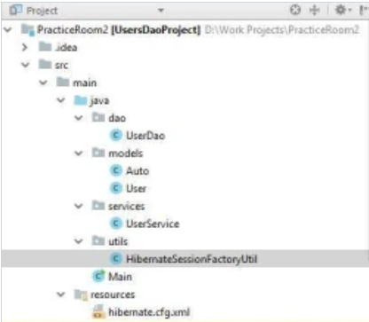
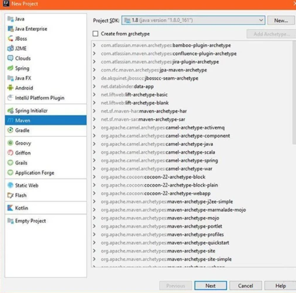
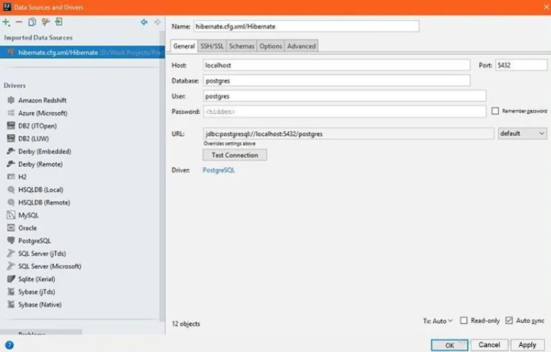
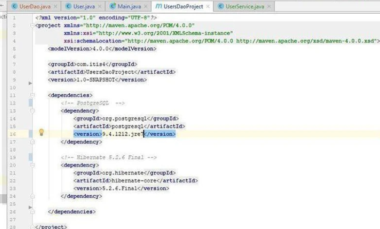
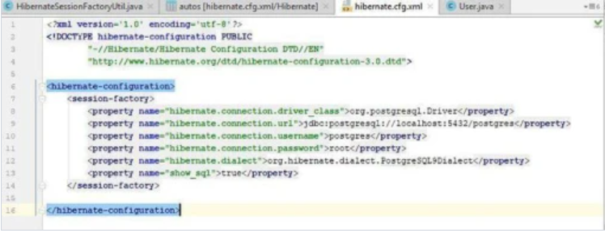
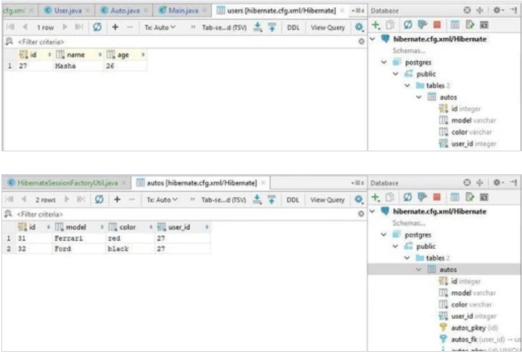
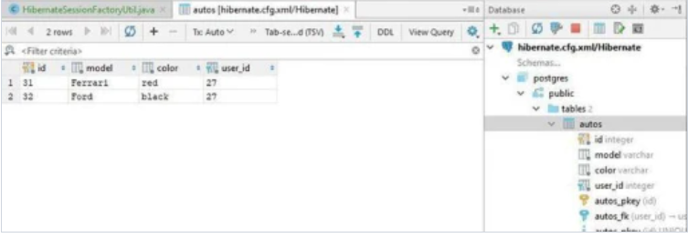

# Пример 2

### Что такое Hibernate?

Это — одна из наиболее популярных реализаций ORM-модели. Объектно-реляционная модель описывает отношения между
программными объектами и записями в БД.

Конечно, функционал Hibernate очень широк, но мы остановимся на самых простых функциях.

Наша цель: создать CRUD-приложение (Create,Read,Update,Delete), которое будет уметь:
Создавать пользователей (User), а также искать их в базе данных по ID, обновлять их данные в базе, а также удалять из
базы.
Присваивать пользователям объекты автомобилей (Auto). Создавать, редактировать, находить и удалять автомобили из базы
данных.
Кроме того, приложение должно автоматически удалять "бесхозные" автомобили из БД. Т.е. при удалении пользователя, все
принадлежащии ему автомобили также должны быть удалены из БД.
Структура нашего проекта будет следующей:

Как видите, ничего сложного. 6 классов + 1 файл с конфигами.

Для начала, создадим новый maven-проект в Intellij Idea. File -> New Project.

Из предлагаемых типов проектов выбирайте Maven и переходите дальше.


Apache Maven — фреймворк для автоматизации сборки проектов на основе описания их структуры в файлах на языке POM. Вся
структура вашего проекта будет описана в файле pom.xml, который IDEA сама создаст в корне вашего проекта.

В настройках проекта вам нужно будет указать параметры Maven — groupId и artifactId. Обычно в проектах groupId
наименование организации или подразделения, туда записывают доменное имя организации или сайта проекта. В свою очередь
artifactId — название проекта.

Для groupdId можете указать com.вашНикнейм.javarush, на работу приложения это никак не повлияет. Для artifactId выберите
любое понравившееся вам название проекта. Version тоже можете оставить без изменений.
Итак, проект мы создали, осталось всего ничего — написать код и заставить его работать :)

Прежде всего, если мы хотим создать приложение, работающие с базой данных — нам определенно не обойтись без базы данных!
Качаем PostgreSQL отсюда (я использую 9 версию).

В PostgreSQL имеется созданный по умолчанию пользователь 'postgres', пароль для него вам нужно будет придумать при
установке. Не забывайте пароль, он нам понадобится позже!

(Вообще, пользоваться дефолтной БД в приложениях — bad practice, но с целью сократить объем геморроя с созданием своей
БД обойдемся ей).

Если вы не дружите с командной строкой и SQL-запросами — есть хорошая новость. Intellij IDEA предоставляет вполне годный
пользовательский интерфейс для работы с БД. Выглядит он так:

(находится на правой боковой панели IDEA, вкладка Database)

Для создания поключения нажмите "+", выберите нашего провайдера (PostgeSQL). Заполните поля с пользователем, именем БД (
и то и другое — postgres) и введите пароль, который задали при установке PostgreSQL. При необходимости — скачайте
драйвер Postgres, это можно сделать на этой же странице. Намжмите "Test Connection", чтобы проверить, что соединение с
БД установлено. Если видите надпись "Successful" — едем дальше.

Теперь создадим нужные нам таблицы. Всего их будет две — users и autos.

Параметры для таблицы users:
Обратите внимание на то, что id является первичным ключом (Primary Key). Если не знаете что такое первичный ключ в SQL —
гугл, это важно.

Настройка для таблицы autos:
Для autos нужно настроить Foreign Key — внешний ключ. Он будет связывать наши таблицы. Советую почитать про него
подробнее; если говорить совсем просто - он ссылается на внешнюю таблицу, в нашем случае на users. Если машина
принадлежит юзеру с id=1, то в поле user_id таблицы autos у нее будет 1. Так мы в нашем приложении связываем
пользователей с их автомобилями.

В нашей таблице autos роль внешнего ключа будет выполнять поле user_id. Оно будет ссылаться на поле id таблицы users.
Таким образом, мы создали базу данных с двумя таблицами. Осталось понять, как управлять ей из Java-кода.

Начнем мы с файла pom.xml, в котором нам необходимо подключить нужные библиотеки (на языке Maven они называются
dependencies — "зависимости"). Все библиотеки хранятся в центральном репозитории Maven. Те из них, которые вы укажете в
pom.xml, вы сможете использовать в проекте. Ваш pom.xml должен выглядеть так:

Ничего сложного, как видите. Мы добавили всего 2 зависимости — для использования PostgreSQL и Hibernate.
Теперь перейдем к Java-коду. Создайте все необходимые пакеты и классы проекта. Для начала, нам понадобятся модели
данных — классыUser и Auto.

```java
package models;

import javax.persistence.*;
import java.util.ArrayList;
import java.util.List;

@Entity
@Table(name = "users")
public class User {

    @Id
    @GeneratedValue(strategy = GenerationType.IDENTITY)
    private int id;
    @Column(name = "name")
    private String name;

    private int age;

    @OneToMany(mappedBy = "user", cascade = CascadeType.ALL, orphanRemoval = true)
    private List<Auto> autos;

    public User() {
    }

    public User(String name, int age) {
        this.name = name;
        this.age = age;
        autos = new ArrayList<>();
    }

    public void addAuto(Auto auto) {
        auto.setUser(this);
        autos.add(auto);
    }

    public void removeAuto(Auto auto) {
        autos.remove(auto);
    }

    public int getId() {
        return id;
    }

    public String getName() {
        return name;
    }

    public void setName(String name) {
        this.name = name;
    }

    public int getAge() {
        return age;
    }

    public void setAge(int age) {
        this.age = age;
    }

    public List<Auto> getAutos() {
        return autos;
    }

    public void setAutos(List<Auto> autos) {
        this.autos = autos;
    }

    @Override
    public String toString() {
        return "models.User{" +
                "id=" + id +
                ", name='" + name + '\'' +
                ", age=" + age +
                '}';
    }
}
```

```java
package models;

import javax.persistence.*;

@Entity
@Table(name = "autos")
public class Auto {

    @Id
    @GeneratedValue(strategy = GenerationType.IDENTITY)
    private int id;

    @Column(name = "model")
    private String model;


    private String color;


    @ManyToOne(fetch = FetchType.LAZY)
    @JoinColumn(name = "user_id")
    private User user;

    public Auto() {
    }

    public Auto(String model, String color) {
        this.model = model;
        this.color = color;
    }

    public int getId() {
        return id;
    }

    public String getModel() {
        return model;
    }

    public void setModel(String model) {
        this.model = model;
    }

    public String getColor() {
        return color;
    }

    public void setColor(String color) {
        this.color = color;
    }

    public User getUser() {
        return user;
    }

    public void setUser(User user) {
        this.user = user;
    }

    @Override
    public String toString() {
        return color + " " + model;
    }
}
```

Как видите, классы снабжены кучей пока непонятных аннотаций. Давайте начнем с ними разбираться.

Главная для нас аннотация — @Entity (сущность). Прочитайте в о ней в Википедии и запомните все, это — основа основ. Эта
аннотация позволяет Java-объектам вашего класса быть связанными с БД.

Чтобы класс мог быть сущностью, к нему предъявляются следующие требования:
Должен иметь пустой конструктор (public или protected);
Не может быть вложенным, интерфейсом или enum;
Не может быть final и не может содержать final-полей/свойств;
Должен содержать хотя бы одно @Id-поле.
Проверьте ваши entity-классы, эти пункты — очень популярное место для "выстрела себе в ногу". Очень легко что-нибудь
забыть.

При этом entity может:
Содержать непустые конструкторы;
Наследоваться и быть наследованным;
Содержать другие методы и реализовывать интерфейсы.
Как видите, класс User во многом похож на таблицу users. Есть поля id, name, age. Расположенные над ними аннотации в
пояснениях особо не нуждаются: и так понятно, что @Id — это указание, что поле является идентификатором объектов этого
класса. Аннотация @Table над классом указывает как называется таблица, в которую записываются объекты. Обратите внимание
на комментарий над полем age: если имя поля в классе и таблице совпадает — можно не добавлять аннотацию @Column, будет
работать и так. Что касаемо указанного в скобках "strategy = GenerationType.IDENTITY": есть несколько стратегий
генерации ID. Можете погуглить, но в рамках нашего приложения можно не заморачиваться. Главное, что id для наших
объектов будут генерироваться автоматически, поэтому для id отсутствует сеттер, и в конструкторе мы его тоже не задаем.

Однако, кое-чем класс User все-таки выделяется.

У него есть список машин!

Над списком висит аннотация @OneToMany. Она означает, что одному объекту класса user может соответствовать несколько
машин. Настройка "mappedBY" указывает на поле user класса Auto. Таким образом машины и пользователи связаны между с
собой. Настройка orphanRemoval вполне хорошо переводится с английского — "удалять сирот". Если мы удалим юзера из БД —
все связанные с ним автомобили также будут удалены.

В свою очередь в классе Auto вы увидите поле user с аннотацией @ManyToOne (многим Auto может соответствовать один User)
и аннотацию @JoinColumn. Она указывает, через какой столбец в таблице autos происходит связь с таблицей users (тот самый
внешний ключ, о котором мы говорили ранее).

После создания модели данных пора научить нашу программу выполнять с этими данными операции в БД.

Начнем с утилитного класса HibernateSessionFactoryUtil. У него всего одна задача — создавать для нашего приложения
фабрику сессий для работы с БД (привет, паттерн "Фабрика!").

Больше он ничего не умеет.

```java
package utils;

import models.Auto;
import models.User;
import org.hibernate.SessionFactory;
import org.hibernate.boot.registry.StandardServiceRegistryBuilder;
import org.hibernate.cfg.Configuration;

public class HibernateSessionFactoryUtil {
    private static SessionFactory sessionFactory;

    private HibernateSessionFactoryUtil() {
    }

    public static SessionFactory getSessionFactory() {
        if (sessionFactory == null) {
            try {
                Configuration configuration = new Configuration().configure();
                configuration.addAnnotatedClass(User.class);
                configuration.addAnnotatedClass(Auto.class);
                StandardServiceRegistryBuilder builder = new StandardServiceRegistryBuilder().applySettings(configuration.getProperties());
                sessionFactory = configuration.buildSessionFactory(builder.build());

            } catch (Exception e) {
                System.out.println("Исключение!" + e);
            }
        }
        return sessionFactory;
    }
}
```

В этом классе мы создаем новый объект конфигураций Configuration, и передаем ему те классы, которые он должен
воспринимать как сущности — User и Auto.

Обратите внимание на метод configuration.getProperties().

Какие еще properties? Откуда?

Properties — это параметры для работы hibernate, указанные в специальном файле hibernate.cfg.xml.


Hibernate.cfg.xml зачитывается здесь: new Configuration().configure();

В нем, как видите, нет ничего особенного — параметры соединения с БД, и специальный параметр show_sql. Он нужен для
того, чтобы все sql-запросы, которые hibernate будет выполнять к нашей БД, выводились в консоль. Таким образом, вы
будете видеть что конкретно делает Hibernate в каждый момент времени и избавитесь от эффекта "магии".

Далее нам понадобится класс UserDAO.

(По-хорошему, программировать нужно через интерфейсы — создать интерфейс UserDAO и отдельно его реализацию UserDAOImpl,
но для сокращения объема кода я опущу это. Не делайте так в реальных проектах!).

DAO (data access object) — один из наиболее распространенных паттернов проектирования, "Доступ к данным". Его смысл
прост — создать в приложении слой, который отвечает только за доступ к данным, и больше ни за что. Достать данные из БД,
обновить данные, удалить данные — и все. Почитайте про DAO подробнее, в работе будете пользоваться ими постоянно.

Что же умеет наш класс UserDao?

Собственно, как и все DAO, он умеет только работать с данными. Найти юзера по id, обновить его данные, удалить его,
вытащить из БД список всех юзеров или сохранить в БД нового юзера — вот весь его функционал.

```java
package dao;

import models.Auto;
import models.User;
import org.hibernate.Session;
import org.hibernate.Transaction;
import utils.HibernateSessionFactoryUtil;

import java.util.List;

public class UserDao {

    public User findById(int id) {
        return HibernateSessionFactoryUtil.getSessionFactory().openSession().get(User.class, id);
    }

    public void save(User user) {
        Session session = HibernateSessionFactoryUtil.getSessionFactory().openSession();
        Transaction tx1 = session.beginTransaction();
        session.save(user);
        tx1.commit();
        session.close();
    }

    public void update(User user) {
        Session session = HibernateSessionFactoryUtil.getSessionFactory().openSession();
        Transaction tx1 = session.beginTransaction();
        session.update(user);
        tx1.commit();
        session.close();
    }

    public void delete(User user) {
        Session session = HibernateSessionFactoryUtil.getSessionFactory().openSession();
        Transaction tx1 = session.beginTransaction();
        session.delete(user);
        tx1.commit();
        session.close();
    }

    public Auto findAutoById(int id) {
        return HibernateSessionFactoryUtil.getSessionFactory().openSession().get(Auto.class, id);
    }

    public List<User> findAll() {
        List<User> users = (List<User>) HibernateSessionFactoryUtil.getSessionFactory().openSession().createQuery("From User").list();
        return users;
    }
}
```

Методы UserDao похожи друг на друга. В большинстве из них мы получаем объект Session (сессия соединения с нашей БД) с
помощью нашей Фабрики Сессий, создаем в рамках этой сессии одиночную транзакцию, выполняем необходимые преобразования
данных, сохраняем результат транзакции в БД и закрываем сессию. Сами методы тоже, как видите, довольно просты.

Именно DAO — "сердце" нашего приложения. Однако, мы не будем создавать DAO напрямую и вызывать его методы в нашем методе
main().

Вся логика будет перемещена в класс UserService.

```java
package services;

import dao.UserDao;
import models.Auto;
import models.User;

import java.util.List;

public class UserService {

    private UserDao usersDao = new UserDao();

    public UserService() {
    }

    public User findUser(int id) {
        return usersDao.findById(id);
    }

    public void saveUser(User user) {
        usersDao.save(user);
    }

    public void deleteUser(User user) {
        usersDao.delete(user);
    }

    public void updateUser(User user) {
        usersDao.update(user);
    }

    public List<User> findAllUsers() {
        return usersDao.findAll();
    }

    public Auto findAutoById(int id) {
        return usersDao.findAutoById(id);
    }
}
```

Service — слой данных в приложении, отвечающий за выполнение бизнес-логики.

Если ваша программа должна выполнить какую-то бизнес-логику — она делает это через сервисы. Сервис содержит внутри себя
UserDao, и в своих методах вызывает методы DAO. Это может показаться вам дублированием функций (почему бы просто не
вызывать методы из dao-объекта), но при большом количестве объектов и сложной логике разбиение приложения на слои дает
огромные преимущества (это good practice, запомните эту информацию на будущее и почитайте про "слои приложения"). У
нас-то в сервисе логика простая, а в реальных проектах методы сервисов будут содержать куда больше одной строки кода:)

Теперь у нас есть все нужно для работы приложения!
Давайте создадим в методе main() пользователя, машины для него, свяжем их друг с другом и сохраним в БД.

```java
import models.Auto;
import models.User;
import services.UserService;

import java.sql.SQLException;

public class Main {
    public static void main(String[] args) throws SQLException {

        UserService userService = new UserService();
        User user = new User("Masha", 26);
        userService.saveUser(user);
        Auto ferrari = new Auto("Ferrari", "red");
        ferrari.setUser(user);
        user.addAuto(ferrari);
        Auto ford = new Auto("Ford", "black");
        ford.setUser(user);
        user.addAuto(ford);
        userService.updateUser(user);
    }
}
```

Как видите, в таблице users появилась своя запись, а в таблице autos — свои.

Попробуем переименовать нашего пользователя. Очистим таблицу users и выполним код

```java
import models.Auto;
import models.User;
import services.UserService;

import java.sql.SQLException;

public class Main {
    public static void main(String[] args) throws SQLException {

        UserService userService = new UserService();
        User user = new User("Masha", 26);
        userService.saveUser(user);
        Auto ferrari = new Auto("Ferrari", "red");
        user.addAuto(ferrari);
        Auto ford = new Auto("Ford", "black");
        ford.setUser(user);
        user.addAuto(ford);
        userService.updateUser(user);
        user.setName("Sasha");
        userService.updateUser(user);
    }
}
```

Работает!


А что если удалить пользователя? Очистим таблицу users (autos очистится сама) и выполним код

```java

import models.Auto;
import models.User;
import services.UserService;

import java.sql.SQLException;

public class Main {
    public static void main(String[] args) throws SQLException {

        UserService userService = new UserService();
        User user = new User("Masha", 26);
        userService.saveUser(user);
        Auto ferrari = new Auto("Ferrari", "red");
        user.addAuto(ferrari);
        Auto ford = new Auto("Ford", "black");
        ford.setUser(user);
        user.addAuto(ford);
        userService.updateUser(user);
        user.setName("Sasha");
        userService.updateUser(user);
        userService.deleteUser(user);
    }
}

```

И наши таблицы абсолютно пусты (обратите внимание на консоль, туда выведутся все запросы, которые выполнил Hibernate).

Вы можете "поиграться" с приложением и попробовать все его функции.

Например, создайте пользователя с машинами, сохраните его в БД, посмотрите какой ID ему присвоен, и попробуйте в методе
main() "вытащить" пользователя из БД по этому id и вывести в консоль список его машин.

Конечно, мы увидели лишь небольшую часть функциональности Hibernate. Его возможности очень широки, и он давно является
одним из промышленных стандартов Java-разработки. Если вы хотите изучить его во всех подробностях – могу рекомендовать
книгу "Java Persistence API и Hibernate", обзор на которую я делал в одной из прошлых статей.

Надеюсь, эта статья была полезна читателям. Если у вас будут вопросы — задавайте их в комментариях, с радостью отвечу :)

Также не забывайте поддержать автора в конкурсе, поставив "Нравится". А лучше — "Очень нравится"

<https://habr.com/ru/articles/469415/>](https://habr.com/ru/articles/469415/)