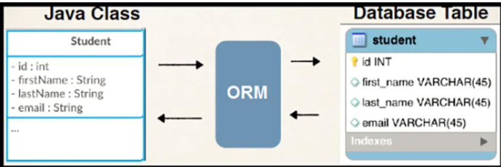

# Что такое JPA

JPA (Java Persistence API) это спецификация Java EE и Java SE, описывающая систему управления сохранением java объектов
в таблицы реляционных баз данных в удобном виде. Сама Java не содержит реализации JPA, однако есть существует много
реализаций данной спецификации от разных компаний (открытых и нет). Это не единственный способ сохранения java объектов
в базы данных (ORM систем), но один из самых популярных в Java мире.

ORM — Object-Relational Mapping или в переводе на русский объектно-реляционное отображение. Это технология
программирования, которая связывает базы данных с концепциями объектно-ориентированных языков программирования. Если
упростить, то ORM это связь Java объектов и записей в БД:


ORM — это по сути концепция о том, что Java объект можно представить как данные в БД (и наоборот). Она нашла воплощение
в виде спецификации JPA — Java Persistence API.

Спецификация — это уже описание Java API, которое выражает эту концепцию. Спецификация рассказывает, какими средствами
мы должны быть обеспечены (т.е. через какие интерфейсы мы сможем работать), чтобы работать по концепции ORM. И как
использовать эти средства.
Реализацию средств спецификация не описывает. Это даёт возможность использовать для одной спецификации разные
реализации. Можно упростить и сказать, что спецификация — это описание API.

Текст спецификации JPA можно найти на сайте Oracle: "JSR 338: JavaTM Persistence API".

Следовательно, чтобы использоать JPA нам требуется некоторая реализацию, при помощи которой мы будем пользоваться
технологией.

Реализации JPA ещё называют JPA Provider. Одной из самых заметных реализаций JPA является Hibernate. Поэтому, предлагаю
её и рассмотреть.
в основе JPA лежит понятие контекст персистенции (Persistence Context). Это место, где живут сущности. А мы управляем
сущностями через EntityManager. Когда мы выполняем комманду persist, то мы помещаем сущность в контекст. Точнее, мы
говорим EntityManager'у, что это нужно сделать.

Но контекст этот — это просто некоторая область хранения. Его даже иногда называют "кэшем первого уровня". Но его нужно
соединить с базой данных. Комманда flush, которая ранее у нас упала с ошибкой, синхронизирует данные из контекста
персистенции с БД. Но для этого требуется транспорт и этим транспортом является транзакция.

Транзакции в JPA описаны в разделе спецификации "7.5 Controlling Transactions". Для использования транзакций в JPA есть
специальный API:

```
entityManager.getTransaction().begin();
entityManager.getTransaction().commit();
```

# Отличие JPA от JDBC

Главный критерий выбора:

* JPA используется для ORM и удобства работы,
* а JDBC – для производительности и полного контроля над SQL.

```
JPA: entityManager.persist(user);
JDBC:
Java

// Работа JDBC с SQL-запросами
connection.prepareStatement("INSERT INTO users ...").executeUpdate();
```

### Что такое hibernate ?

Hibernate — это популярный фреймворк для объектно-реляционного отображения (ORM). Он предоставляет прозрачный слой для
маппинга (отображения) объектно-ориентированных моделей данных на традиционные реляционные базы данных. Он облегчает
разработку приложений, автоматизируя и скрывая многие сложности, связанные с взаимодействием с базой данных, такие как
установление соединения, выполнение SQL-запросов и обработка результатов.

Основные особенности Hibernate:

1) Упрощение разработки: Автоматизирует большую часть кода, который традиционно необходимо писать вручную для работы с
   базой данных, такого как SQL-запросы и обработка JDBC-результата. Это позволяет разработчикам сосредоточиться на
   бизнес-логике приложения.

2) Поддержка объектно-реляционного отображения: Предоставляет богатые возможности для маппинга сложных иерархий объектов
   Java в реляционные таблицы базы данных, включая наследование, композицию, ассоциации (один-к-одному, один-ко-многим,
   многие-ко-многим).

3) Независимость от базы данных: Обеспечивает независимость от конкретной СУБД, благодаря чему те же самые объектные
   модели и бизнес-логика могут использоваться с различными базами данных без изменения кода.

4) Кэширование: Предлагает мощные механизмы кэширования первого и второго уровней, что может значительно улучшить
   производительность приложения за счет уменьшения количества запросов к базе данных.

5) Управление транзакциями и сессиями: Управляет сессиями и транзакциями, обеспечивая гибкость и надежность в обработке
   данных.

6) HQL и Criteria API: Hibernate Query Language (HQL) — это объектно-ориентированный язык запросов, аналогичный SQL, но
   работающий с объектами, а не с таблицами. Criteria API предоставляет программный способ составления запросов через
   вызовы методов, что делает код более читаемым и безопасным от SQL-инъекций.

Аннотации и XML: Позволяет настраивать маппинг как с использованием XML-файлов, так и через аннотации в коде, что
упрощает конфигурацию и делает её более наглядной.

Hibernate значительно упрощает разработку Java EE-приложений, автоматизируя рутинную работу по взаимодействию с базой
данных и позволяя сосредоточиться на создании сложной логики приложения.

### Какие способы реализации пагинации данных с использованием JpaRepository в Spring Data JPA?

Для реализации пагинации данных с использованием JpaRepository в Spring Data JPA можно использовать следующие подходы:

1. Методы findAll(Pageable pageable): Это основной метод репозитория, который позволяет выполнять пагинацию. Метод
   findAll(
   Pageable pageable) возвращает объект Page, который содержит результаты для указанной страницы, а также метаинформацию
   о
   пагинации, такую как общее количество элементов и количество страниц.

Пример:

```java
public interface UserRepository extends JpaRepository<User, Long> {
}

// В сервисе или контроллере
@Autowired
private UserRepository userRepository;

public Page<User> getUsers(Pageable pageable) {
    return userRepository.findAll(pageable);
}
```

Использование класса PageRequest: Класс PageRequest используется для создания объектов Pageable, которые затем можно
передать в методы пагинации. PageRequest позволяет указать номер страницы и размер страницы.

Пример:

```java
Pageable pageable = PageRequest.of(0, 10); // Первая страница, 10 элементов на странице
Page<User> page = userRepository.findAll(pageable);
```

Методы с аннотацией @Query и параметром Pageable: Вы можете использовать аннотацию @Query для выполнения произвольных
запросов с поддержкой пагинации. Параметр Pageable позволяет передавать параметры пагинации в запрос.

Пример:

```java
public interface UserRepository extends JpaRepository<User, Long> {

    @Query("SELECT u FROM User u WHERE u.status = :status")
    Page<User> findByStatus(@Param("status") String status, Pageable pageable);
}
```

Использование аннотации @PageableDefault: В контроллерах можно использовать аннотацию @PageableDefault для задания
значений по умолчанию для параметров пагинации.

Пример:

```java

@GetMapping("/users")
public Page<User> getUsers(@PageableDefault(size = 10, page = 0) Pageable pageable) {
    return userRepository.findAll(pageable);
}
```

Не являются правильными:

Методы findAll() и findByCriteria(): Метод findAll() без параметров возвращает все элементы без пагинации. Метод
findByCriteria() является произвольным методом, который не поддерживает пагинацию напрямую.
Методы findAllByCriteria(Pageable pageable): Метод findAllByCriteria() не является частью стандартного интерфейса
JpaRepository и не поддерживается по умолчанию.
Использование класса PageRequest и методов findPage(): findPage() не является стандартным методом JpaRepository. Метод
findAll(Pageable pageable) используется для пагинации, а PageRequest — это способ создания объектов Pageable.
Таким образом, для реализации пагинации вы можете использовать методы findAll(Pageable pageable), классы PageRequest и
аннотацию @Query с параметром Pageable

### Какие способы описания составного ключа (composite key) в Entity существуют в JPA?

#### Составной первичный ключ

Составной первичный ключ у меня получился в таблице с содержимым заказа: одно поле соответствует релизу из каталога, а
другое – заказу. Логично, что сочетание заказ-релиз уникально. В случае, если в заказе оказывается несколько одинаковых
релизов (например, клиент покупает две пластинки: одну себе в коллекцию, а другую – другу), то мы просто увеличиваем
поле quantity.

Итак, код класса, соответствующего этой сущности получается довольно простым и коротким (спасибо скажем lombok и
аннотации @Data, которая позволяет скрывать геттеры и сеттеры и конструкторы):

```java

@Entity
@Data
public class OrderItem {

    private Order order;

    private Release release;

    private int quantity;

    private OrderItemStatus status;

}
```

Теперь пришло время обозначить первичный ключ. Это можно сделать двумя способами: с помощью аннотации @IdClass или
@Embeddable.
И в том и в другом случае для первичного ключа нужно создать отдельный класс, в который требуется поместить
оба поля и который должен реализовать интерфейс Serializable. Я называю свой класс OrderItemPK, и выглядит он пока что
следующим образом:

```java
public class OrderItemPK implements Serializable {

    private Order order;

    private Release release;

    //убрал для краткости геттеры, сеттеры

}
```

Не забудьте также переопределить методы equals(Object o) и hash().

### Составной первичный ключ и @IdClass

Если вы выбираете аннотацию @IdClass, то разместить её нужно перед классом, в котором первичный ключ находится – то есть
в моём случае перед OrderItem. В скобках необходимо указать имя класса с самим ключом, то есть OrderItemPK. При этом оба
поля дублируются: они оказываются и в классе-ключе и в классе-сущности, каждый с привычной аннотацией

```java

@Entity
@Data
@IdClass(OrderItemPK.class)
public class OrderItem {

    @Id
    private Order order;

    @Id
    private Release release;

    private int quantity;

    private OrderItemStatus status;

}
```

Преимущества этого подхода в том, что вы можете обращаться к полям, входящим в первичный ключ, по отдельности без
посредников. Других преимуществ я лично не уловил, потому что сам этим методом пользоваться не стал.

#### Составной первичный ключ и @EmbeddedId

Я предпочёл альтернативный вариант. В этом случае класс с сущностью мы подписываем @Embeddable, и нам не приходится
дублировать поля. Вместо полей, которые выходят в составной ключ, мы просто помещаем объект типа OrderItemPK с
аннотацией @EmbeddedId вместо привычного @Id. Получаются такие классы:.

```java

@Embeddable
public class OrderItemPK implements Serializable {

    private Order order;

    private Release release;

}

@Entity
@Data
public class OrderItem {

    @EmbeddedId
    private OrderItemPK pk;

    private int quantity;

    private OrderItemStatus status;

}
```

Отсутствии дублирования этот подход ещё отличается тем, что в HQL мы обращаемся к отдельным составляющим
первичного ключа немного длиннее: select o.OrderItemPK.release from OrderItem o. Но это не беда, зато можно первичный
ключ использовать, как полноценный цельный объект.

Код классов с диаграмм с отношением @OneToMany
Напоследок выложу все три класса, соответствующие сущностям с диаграммы, которую я поместил в начале статьи.

Про отношения один-ко-многим я уже говорил, поэтому не буду на них заострять внимание, Каждый заказ также связан с
клиентом, но клиентов в этой статье я оставляю за кулисами – от них осталось только поле client с аннотацией @ManyToOne.

Интереснее в этом случае связь @OneToMany с заветной таблицей OrderItem: в атрибуте mappedBy указываем поле pk.order,
так как теперь order это поле объекта pk в классе OrderItem.

```java

@Table(name = "ORDER_INFO")
@Entity
@Data
public class Order {

    @Id
    @GeneratedValue(strategy = GenerationType.IDENTITY)
    private long orderId;

    @ManyToOne
    @JoinColumn(name = "CLIENT_ID", nullable = false)
    private Client client;

    private OrderStatus status;

    @OneToMany(mappedBy = "pk.order",
            fetch = FetchType.LAZY,
            cascade = CascadeType.ALL)
    List<OrderItem> orderItems;
}

@Table(name = "ORDER_ITEM")
@Entity
@Data
public class OrderItem {

    @EmbeddedId
    private OrderItemPK pk;

    private int quantity;

    private OrderItemStatus status;

}

@Embeddable
public class OrderItemPK implements Serializable {

    @ManyToOne
    @JoinColumn(name = "ORDER_ID")
    @JsonIgnore
    private Order order;

    @ManyToOne
    @JoinColumn(name = "RELEASE_ID")
    private Release release;

}

@Table(name = "RELEASE")
@Entity
@Data
public class Release {

    @Id
    @GeneratedValue(strategy = GenerationType.IDENTITY)
    private long releaseId;

    @ManyToOne
    @JoinColumn(name = "ALBUM_ID")
    @JsonIgnore
    private Album album;

    private Date releaseDate;

    private String format;

    private String notes;

    private String label;

    private int price;

    private String img;
}
```

* <https://sky.pro/wiki/sql/sozdanie-sostavnogo-pervichnogo-klyucha-v-jpa-primery-koda/>
* <https://egorzimowski.com/2022/05/27/composite-primary-key-in-jpa//>

### Какие способы существуют для создания нативных SQL запросов в Spring Data JPA?

Быстрый ответ
Конечно, это вполне возможно. Для того чтобы использовать прямые SQL-запросы в Spring, можно применять аннотацию @Query
с установленным параметром nativeQuery=true. Возьмем за пример следующий код:

```Java
public interface MyRepository extends JpaRepository<MyEntity, Long> {

    @Query(value = "SELECT * FROM my_table WHERE my_column = :value", nativeQuery = true)
    List<MyEntity> findByColumn(@Param("value") String value);
}
```

И тут мы видим, что с помощью аннотации @Query выполнен нативный SQL-запрос.

Верное использование инструментов: Сценарии применения чистого SQL
Spring Data Repositories предлагает обширные возможности для выполнения стандартных операций. Но иногда возникают
ситуации, когда требуется работать непосредственно с SQL.

#### Создание представлений: Использование проекций

Для создания специальных представлений данных моделей применяются проекции:

```Java
public interface MyEntityProjection {
    String getMyColumn();
}
```

Проекция в репозитории используется следующим образом:

```Java
public interface MyRepository extends JpaRepository<MyEntity, Long> {

    @Query(value = "SELECT my_column as myColumn FROM my_table", nativeQuery = true)
    List<MyEntityProjection> findProjectedBy();
}
```

Прямой доступ с EntityManager
Если требуется более глубокий контроль, можно использовать EntityManager:

```Java

@Autowired
private EntityManager entityManager;

public List<MyEntity> customQueryMethod() {
    return entityManager.createNativeQuery("SELECT * FROM my_table", MyEntity.class).getResultList();
}
```

Пользовательский вывод: Маппинг массивов и классов ответов
Результаты SQL-запросов можно маппировать в массивы:

```
List<Object[]> results = query.getResultList();
for(Object[] result : results){
// Обработка результатов
}
```

Или может быть создан специальный класс для хранения результатов:

```Java
public class CustomResponse {
    private String columnValue; // значение поля может быть любым

// геттеры и сеттеры
}

List<CustomResponse> customResponses = entityManager
        .createNativeQuery("SELECT my_column FROM my_table", CustomResponse.class)
        .getResultList();
```

Безопасность превыше всего: Безопасность и принципы хорошей практики
Очень важно обезопасить SQL-запросы, используя параметризацию:

```Java

@Query(value = "SELECT * FROM my_table WHERE my_column = :value", nativeQuery = true)
List<MyEntity> findByColumn(@Param("value") String value);
```

Проверка пользовательского ввода
Всегда защищайте себя от SQL-инъекций:

```
try {
// Запрос
} catch (PersistenceException e) {
// Обработка исключения
}
```

Анализ производительности
Не забывайте контролировать эффективность запросов:

```SQL
    SELECT *
    FROM my_table
    WHERE my_column = :value LIMIT 10
```

* <https://sky.pro/wiki/java/ispolzovanie-raw-sql-v-spring-data-repository-rukovodstvo/>

### Что такое в Hibernate FetchType.LAZY и FetchType.EAGER

* FetchType.LAZY
  Когда используется LAZY, данные не извлекаются до тех пор, пока они действительно не понадобятся. Представьте себе
  ситуацию, когда у вас есть приложение, которое работает с книгами и авторами. Каждый автор может написать несколько
  книг. Но есть случаи, когда вам нужно получить информацию только об авторе, без деталей о его книгах. В этом случае
  LAZY
  подходит идеально, поскольку он позволяет избежать ненужного извлечения данных о книгах.

* FetchType.EAGER
  С другой стороны, EAGER загружает все данные сразу. Вернемся к примеру с книгами и авторами. Если каждый раз при
  выборе
  автора вам нужна информация о его книгах, использование EAGER будет более эффективным. Этот метод извлечения загружает
  все связанные данные одновременно, что уменьшает количество запросов к базе данных.

Однако использование EAGER может привести к проблемам производительности, если размер данных большой. Извлечение больших
объемов данных может замедлить работу приложения.

В зависимости от ситуации и требуемой производительности, можно выбирать между LAZY и EAGER. Основная идея состоит в
том, чтобы получить данные, когда они действительно нужны, и избегать извлечения ненужных данных.

```Java
import java.util.ArrayList;

@OneToOne  // По умолчанию: fetch = FetchType.EAGER
private RelatedEntity otoEntity;

@ManyToOne // По умолчанию: fetch = FetchType.EAGER
private RelatedEntity mtoEntity;

@OneToMany // По умолчанию: fetch = FetchType.LAZY
private Set<RelatedEntity> otmEntities;

@ManyToMany(mappedBy = 'authors') // По умолчанию: fetch = FetchType.LAZY
private List<Books> otmEntities = new ArrayList<Books>();
```

мой пример в тестовом проекте
<https://github.com/VasiliyVelikyy/ExampleProject/blob/master/src/Info.md>


### LazyInitializationException что за проблема.

Ситуация, когда в процессе работы с Hibernate возникает ошибка «failed to lazily initialize a collection of role» —
довольно распространённая проблема для начинающих разработчиков. Она обычно возникает при попытке обращения к лениво
инициализированной коллекции (lazy collection) после закрытия Hibernate-сессии.

В качестве примера можно привести ситуацию с классом Topic, который содержит коллекцию comments. Если попытаться
получить комментарии после закрытия сессии, возникнет указанная ошибка.

```java

@Entity
@Table(name = "T_TOPIC")
public class Topic {

    @Id
    @GeneratedValue(strategy = GenerationType.AUTO)
    private int id;

    // другие поля
    @OneToMany(mappedBy = "topic", cascade = CascadeType.ALL)
    private Collection<Comment> comments = new LinkedHashSet<Comment>();

    // геттеры и сеттеры
}
```

Основная причина возникновения этой ошибки — попытка загрузить данные, когда нет активной сессии Hibernate. Это
происходит, когда используется ленивая инициализация (FetchType.LAZY), которая загружает данные только по запросу. Если
сессия закрыта в момент запроса, Hibernate не сможет получить данные.

```
Topic topic = topicRepository.findById(id);
session.close(); // сессия закрывается
Collection<Comment> comments = topic.getComments(); // ошибка: сессия уже закрыта
```

#### Для решения этой проблемы можно использовать разные подходы.

1) Использование EAGER-загрузки
   Один из вариантов — использовать FetchType.EAGER вместо FetchType.LAZY. Это приведет к тому,
   что все данные загружаются сразу, и никаких проблем при обращении к ним не возникнет.

   ```java
   
   @OneToMany(mappedBy = "topic", cascade = CascadeType.ALL, fetch = FetchType.EAGER)
   private Collection<Comment> comments = new LinkedHashSet <Comment> ();
   ```

   Но этот подход не всегда оптимален, так как может привести к избыточной загрузке данных.


2) Использование Open Session in View
   Еще один подход — использование паттерна Open Session in View, который позволяет открывать сессию на начало обработки
   запроса и закрывать ее только после завершения обработки.

   Это можно сделать, например, с помощью фильтра OpenEntityManagerInViewFilter в Spring.

   ```java
   
   @Bean
   public FilterRegistrationBean<OpenEntityManagerInViewFilter> openEntityManagerInViewFilter() {
       FilterRegistrationBean <OpenEntityManagerInViewFilter> registrationBean = new FilterRegistrationBean<>();
       registrationBean.setFilter(new OpenEntityManagerInViewFilter());
       registrationBean.setOrder(Ordered.HIGHEST_PRECEDENCE);
   
       return registrationBean;
   }
   ```

   Такой подход также имеет свои недостатки, в том числе возможность возникновения проблем с производительностью и
   управлением транзакциями.
3) Использование JOIN FETCH
   Еще один способ обойти проблему — использовать JOIN FETCH в JPQL-запросе. Это позволит загрузить все необходимые
   данные одним запросом.

     ```sql
     SELECT t FROM Topic t JOIN FETCH t.comments WHERE t.id = :id
     ```

   Этот подход позволяет более гибко управлять загрузкой данных, но может быть более сложным в реализации.

   В заключение хочется отметить, что каждый из этих подходов имеет свои преимущества и недостатки, и выбор между ними
   зависит от конкретной ситуации.
4) Быстрый ответ
   Для эффективности работы с ленивой загрузкой (FetchType.LAZY) в Hibernate используйте аннотацию @Transactional.
   Взгляните на пример:

    ```Java
    @Transactional
    public SomeEntity fetchWithLAZY(Long id) {
        SomeEntity entity = repo.getById(id);
        Hibernate.initialize(entity.getLAZYAssn());
        return entity;
    }
    ```

   С применением этого подхода, ленивые связи инициализируются во время активной сессии Hibernate, что предотвращает
   появление исключения LazyInitializationException. Достаточно вызвать Hibernate.initialize() для требуемой ленивой
   связи.

Принципы работы FetchType.LAZY
При работе с LAZY загрузкой в контроллере Spring следует учесть следующее:

Использование соединений запросов
JOIN FETCH в JPQL позволяет загрузить все необходимые объекты за один запрос, вместо индивидуальной загрузки каждой
связи. Пример реализации в методе репозитория:

```Java

@Repository
public interface SomeEntityRepository extends JpaRepository<SomeEntity, Long> {
    @Query("SELECT e FROM SomeEntity e JOIN FETCH e.lazyRelation WHERE e.id = :id")
    SomeEntity findByIdAndFetchLazyRelationEagerly(@Param("id") Long id);
}
```

* Сервисный слой как регулятор сессии
  Сервисный слой выполняет функцию посредника между контроллером и репозиторием, регулируя сессию Hibernate при работе с
  отложенными коллекциями.

Настройка загрузки с помощью @EntityGraph
Аннотация @EntityGraph позволяет детально настроить стратегию загрузки прямо в методах репозитория:

``` Java
@EntityGraph(attributePaths = {"lazyRelation"})
Optional<SomeEntity> findById(Long id);
```

Выбор между единичным JOIN FETCH и множественными запросами
Тщательно рассмотрите использование JOIN FETCH и отдельных запросов, поскольку JOIN FETCH может привести к избыточной
загрузке данных.

Работа в рамках открытой транзакции с @Transactional
Убедитесь, что вся загрузка осуществляется в рамках открытой транзакции, с помощью аннотации @Transactional, чтобы
избежать LazyInitializationException.

Активация прокси-объектов.
Подумайте о возможности использования прокси-объектов для предотвращения ошибок при загрузке LAZY связей.

* Ориентация на производительность.
  Загружайте LAZY данные только при необходимости, чтобы не повышать нагрузку на систему.

Подробнее о FetchType.LAZY.
Управление сессиями.
Активная сессия Hibernate – ключ к успешной LAZY загрузке. OpenEntityManagerInViewFilter может помочь поддерживать
сессию открытой в течение всего HTTP-запроса.

Инициализация ленивой загрузки
Вызов методов сервиса или использование метода .size() для коллекции может инициировать LAZY загрузку.

Осмотрительное использование EAGER загрузки
Осторожно используйте EAGER загрузку и соответствующие методы репозитория, чтобы избежать потери производительности и
перерасхода памяти.

Инструментарий репозитория.
Рассмотрите возможность создания утилиты, такой как RepositoryHelper или использования JpaUtils для управления
инициализацией сущностей, сохраняя ваш код аккуратным и легко поддерживаемым.