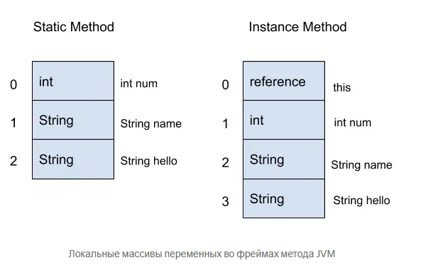
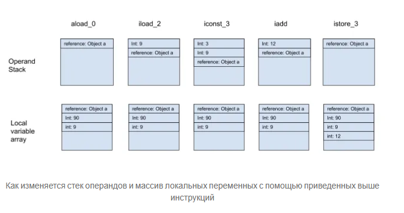

Каждому Java-разработчику известно, какую роль в экосистеме языка играет JVM. Однако большинство не разбирается в том,
как работает JVM под капотом. Хотя для разработки на Java это не обязательно, код станет лучше, если вы глубже поймете
JVM, потому что так вы будете знать, как каждая строка кода влияет на процессы внутри JVM.

Однако для начала нужно понять, что такое байт-код. Итак, поговорим о вводе и выводе байт-кода Java и о том, как он
влияет на JVM во время запуска программы.

## Что такое байт-код Java?

Если в какой-то момент профессиональной жизни вы слышали, как проповедуют независимость Java-программ от платформ,
скажите спасибо байт-коду.

Байт-код — это набор команд, который JVM применяет для запуска программы. Поскольку байт-код, сгенерированный для
программы, не зависит от платформы, где она запущена, вы можете без проблем запускать свою программу на любой машине, на
которой есть JVM для интерпретации байт-кода.

Как генерируется байт-код?
Байт-код — это просто результат компиляции класса Java. Файл .class на самом деле представляет собой набор инструкций
байт-кода, в которые преобразуется код. Он нуждается в интерпретаторе, таком как JVM, чтобы понимать и выполнять
инструкции.

## Компиляция

Исходный код Java компилируется в байт-код с помощью компилятора javac. Байт-код представляет собой
промежуточный код, который может быть выполнен JVM. Компиляция исходного кода в байт-код позволяет JVM
интерпретировать и выполнять программы на различных платформах без необходимости перекомпиляции.

Компилятор javac выполняет несколько этапов, включая синтаксический анализ, семантический анализ и
генерацию байт-кода. Синтаксический анализ проверяет правильность синтаксиса исходного кода, семантический анализ
проверяет корректность типов и других аспектов программы, а генерация байт-кода создает промежуточный код, который может
быть выполнен JVM.

## Интерпретация и JIT-компиляция

Когда программа запускается, JVM интерпретирует байт-код, переводя его в машинный код, который может быть выполнен
процессором. Однако интерпретация может быть медленной. Чтобы ускорить выполнение, JVM использует JIT-компиляцию,
которая переводит байт-код в машинный код "на лету" и кэширует его для повторного использования.

JIT-компиляция позволяет JVM анализировать выполнение программы и оптимизировать часто используемые части кода. Это
позволяет значительно улучшить производительность программ, особенно для долгоживущих приложений. Кроме того,
JIT-компилятор может выполнять различные оптимизации, такие как инлайнинг методов и устранение мертвого кода, что
позволяет еще больше улучшить производительность.

## Как посмотреть байт-код Java?

Если вы пытались открыть файл .class, то по опыту должны знать, что это невозможно без декомпилятора. Однако с
декомпилятором вы на самом деле видите не байт-код, а Java-код, в который декомпилятор ретранслирует байт-код.

Если вам хочется увидеть сам байт-код, простейший способ — воспользоваться командной строкой.

Следующая команда позволит увидеть фактический байт-код файла .class.

```javap -c -p -v [path to the .class file]```
Какие здесь флаги?

* -c нужен для дизассемблирования класса Java.
* -p нужен для раскрытия закрытых членов класса.
* -v нужен для просмотра подробной информации, такой как размер стека и пул констант.

## Как работает JVM

Прежде чем углубляться в байт-код, стоит понять, как JVM его обрабатывает.

Методы — одна из важнейших составляющих кода для JVM. Среда выполнения Java-программы — это, по сути, набор методов,
вызываемых JVM. JVM создает фрейм для каждого такого метода и помещает созданный фрейм наверх стека текущего потока для
выполнения.

Фрейм состоит из локальной среды, которая необходима для поддержания его выполнения. Как правило он содержит массив
локальных переменных и стек операндов. Посмотрим, что эти элементы из себя представляют.

## Массив локальных переменных

Массив локальных переменных, как следует из названия, нужен для хранения локальных переменных в методе. Также он хранит
аргументы, которые принимает метод.

В массиве локальных переменных с индексацией от нуля первые индексы используются для хранения аргументов метода. После
того, как они будут сохранены, в массив сохранятся другие локальные переменные. Если метод — не статический, а создаёт
экземпляры, нулевой индекс будет зарезервирован для хранения ссылки this, которая указывает на экземпляр объекта для
вызова метода.

Определим два метода: один статический и один метод экземпляра, но схожие во всем остальном.

```java

public String sayHello(int num, String name) {
    String hello = "Hello, " + name;
    return hello;
}

public static String sayHello(int num, String name) {
    String hello = "Hello, " + name;
    return hello;
}

```

Локальные массивы переменных для этих методов будут выглядеть следующим образом:


Локальные массивы переменных во фреймах метода JVM

## Стек операндов

Стек операндов — это рабочее пространство внутри фрейма метода. Поскольку это стек, вы можете помещать и забирать
значения только из верхней его части. Большинство инструкций байт-кода, принадлежащих определенному методу, либо
участвуют в помещении значений в стек, либо забирают значения из стека для обработки.

Инструкция байт-кода load и ее расширения нужны для перемещения значения, хранящегося в массиве переменных, в стек.
Инструкция store применяется для извлечения значений из стека и сохранения в массиве переменных. Существуют и другие
инструкции, которые извлекают значения из стека для обработки.

Пример такого сценария — команда add, которая извлекает два самых верхних значения из стека и складывает их вместе, а
также инструкции вызова метода, которые извлекают самые верхние значения (число зависит от количества параметров,
принятых методом) из стека, чтобы передать их в качестве аргументов методу. Если после выполнения команд будут получены
результирующие значения, они будут помещены обратно в стек.

```


aload_0 //отправляет ссылку на непримитивное значение данных в индексе 0 массива переменных
iload_2 //отправляет значение int в индекс 4 массива переменных
iconst_3 //отправляет int 3 в стек
iadd //добавляет два самых верхних значения int в стек
istore_3 //выводит результат операции добавления и сохраняет в индексе 6 массива переменных
```


Как изменяется стек операндов и массив локальных переменных с помощью приведенных выше инструкций
Посмотрим в байт-код
Ради возможности вглядеться в байт-код, я написал простой Java-класс:

```java


package demo;

import java.util.ArrayList;
import java.util.List;

public class SimpleClass {

    private List<Integer> evenNums;

    public SimpleClass() {
        evenNums = new ArrayList<>();
    }

    private boolean isEven(int num) {
        return num % 2 == 0;
    }

    public void addEven(int num) {
        if (isEven(num)) {
            evenNums.add(num);
        }
    }

}
```

Скомпилируем класс с помощью команды javac и посмотрим байт-код с помощью javap. Результат выглядит так:

```
Compiled from "SimpleClass.java"
public class demo.SimpleClass {
private java.util.List<java.lang.Integer> evenNums;

public demo.SimpleClass();
Code:
0: aload_0
1: invokespecial #1 // метод java/lang/Object."<init>":()V
4: aload_0
5: new #2 // класс java/util/ArrayList
8: dup
9: invokespecial #3 // метод java/util/ArrayList."<init>":()V
12: putfield #4 // поле evenNums:Ljava/util/List;
15: return

private boolean isEven(int);
Code:
0: iload_1
1: iconst_2
2: irem
3: ifne 10
6: iconst_1
7: goto 11
10: iconst_0
11: ireturn

public void addEven(int);
Code:
0: aload_0
1: iload_1
2: invokespecial #5 // Метод isEven:(I)Z
5: ifeq 22
8: aload_0
9: getfield #4 // Поле evenNums:Ljava/util/List;
12: iload_1
13: invokestatic #6 // Метод java/lang/Integer.valueOf:(I)Ljava/lang/Integer;
16: invokeinterface #7, 2 // Метод интерфейса java/util/List.add:(Ljava/lang/Object;)Z
21: pop
22: return
}
```

Посмотрев на инструкции байт-кода, вы обнаружите несколько знакомых команд, включая load и const. Остальное, однако,
может даже сбить с толку.

## Деконструкция байт-кода

Все не так страшно, как кажется. Попробуем деконструировать байт-код SimpleClasсs шаг за шагом. Начнем с самого простого
метода — isEven.

```java

private boolean isEven(int num) {
    return num % 2 == 0;
}

```

Вот его байт-код:

```
private boolean isEven(int);
Code:
0: iload_1
1: iconst_2
2: irem
3: ifne 10
6: iconst_1
7: goto 11
10: iconst_0
11: ireturn
```

1) Во-первых, инструкция iload_1 помещает значение массива локальных переменных с индексом 1 в стек операндов. Поскольку
   метод isEven является методом экземпляра, ссылка на него хранится в нулевом индексе. Тогда легко понять, что
   значение,
   хранящееся в индексе 1, на самом деле будет принятым значением параметра int.
2) iconst_2 помещает значение 2 в верхнюю часть стека операндов.

3) Инструкция irem применяется для нахождения остатка от деления между двумя числами. Это инструкция, которая
   представляет
   логику оператора %. Она извлекает два самых верхних значения в стеке и помещает результат обратно в стек.
   Команда ifne сообщает JVM перейти к инструкции с заданным смещением (в данном случае — 10), если значение,
   обрабатываемое командой, не равно 0. Для реализации этой логики команда берет верхний элемент стека. Если переданное
   число было четным, то верхний элемент будет равен 0, и в этом случае JVM получает команду перейти к инструкции с
   индексом 6. Однако, если значение стека не равно нулю, что происходит, когда число нечетное, JVM переходит к
   инструкции
   с индексом 10.
4) iconst_1 помещает значение int 1 в стек. Это происходит только в том случае, если результат irem равен 1. Здесь 1
   представляет логическое значение true.
   goto говорит JVM перейти к инструкции, приведенной в смещении, что в данном случае равно 11. Инструкция goto
   применяется
   для перехода с одного места в таблице инструкций на другое.
5) iconst_0 помещает в стек значение 0. Эта инструкция идет в дело, когда условие if оказывается ложным. Переданное
   значение 0 действует как логическое значение false. Инструкции 3, 6, 7 обрабатывают случай, когда условие if истинно.
6) ireturn возвращает значение int в верхней части стека.
   Здесь важно отметить еще одно: индексы, заданные инструкциям байт-кода — как видим, они не увеличиваются на единицу
   для
   каждой новой инструкции.

Число перед инструкцией указывает на индекс ее начального байта. А любой байт-код состоит из однобайтовых опкодов, за
которыми следует ноль или более операндов.

Опкоды — это такие команды, как iload, iconst и т.д. В зависимости от размера операндов размер байт-кода может
варьироваться от одного байта до нескольких. Отсюда и пробелы в индексах таблицы инструкций. Единственная здесь
двухбайтовая инструкция — ifne.

В байт-коде SimpleClass.class есть другие инструкции, такие как invokespecial, invokeinterface и invokestatic, которые в
свою очередь являются инструкциями вызова метода.

Вывод
Надеюсь, вам удалось узнать кое-что новое о том, как работает байт-код Java. С этим более четким знанием вы сможете
лучше писать код. Можете даже поэкспериментировать с самим байт-кодом во время выполнения программы, воспользовавшись
такими библиотеками, как ASM.

<https://medium.com/nuances-of-programming/%D0%B2%D0%B2%D0%B5%D0%B4%D>
<https://sky.pro/wiki/java/chto-takoe-java-mashina-i-kak-ona-rabotaet/>