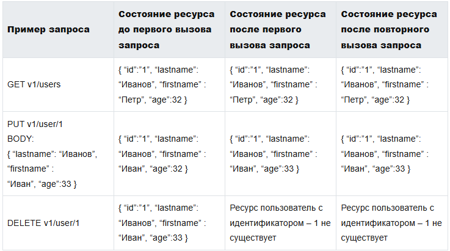
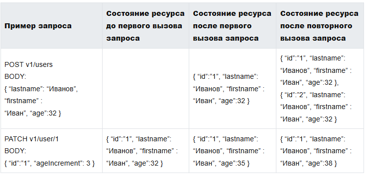

# Идемпотентность http методов

**Идемпотентность HTTP запросов** — это свойство определенных HTTP методов, при котором повторное выполнение одного и
того
же запроса с теми же параметрами не изменяет состояние ресурса на сервере. Другими словами, идемпотентные запросы можно
выполнять несколько раз, а результат будет как при однократном запросе.

**Безопасные методы** - это методы, которые не изменяют состояние в базе данных (read only методы). Примечательно, что
все безопасные методы также являются идемпотентными.

В RESTful идемпотентными являются HTTP методы ```GET, PUT, DELETE,``` потому что повторный вызов любого из этих запросов
с теми же данными и URI приведет к тому же состоянию ресурса, что и при первом запросе.

К не идемпотентным запросам в RESTful относятся ```POST и PATCH```, т.к. повторный вызов идентичных запросов может
привести к
изменению состояния ресурса. Применительно к POST запросу может быть создан дубль ресурса. Повторный вызов идентичного
PATCH запроса может привести к изменению состояния ресурса.

Рассмотрим пример не идемпотентного PATCH запроса. Предположим, нам необходимо с помощью PATCH запроса реализовать
увеличение возраста пользователя на указанную величину. Существует ресурс пользователь

```json
{
  "id": "1",
  "lastname": "Иванов",
  "firstname": "Петр",
  "age": 32
}
``` 

.
Получив от клиента запрос PATCH v1/user/1 с телом

```json
{
  "id": "1",
  "ageIncrement": 3
}
``` 

сервер изменит состояние ресурса на пользователь на

```json
{
  "id": "1",
  "lastname": "Иванов",
  "firstname": "Петр",
  "age": 35
},
``` 

т.е увеличит значение атрибута age на значение ageIncrement. Каждый последующий вызов идентичного запроса будет
увеличивать значение age на значение ageIncrement, т.е после повторного вызова идентичного запроса состояние ресурса на
пользователь будет

```json
{
  "id": "1",
  "lastname": "Иванов",
  "firstname": "Петр",
  "age": 38
}.
``` 



## Ключ идемпотентности (Idempotency-Key)

Idempotency-Key — это уникальный идентификатор, который помогает серверу отслеживать идемпотентность запросов. Клиенты
включают Idempotency-Key в запросы, чтобы сервер мог определить, что запрос уже обработан. Если сервер обнаруживает
Idempotency-Key вновь, он может игнорировать дублирующий запрос и вернуть тот же результат, что и в первый раз.

### Пример использования ключа идемпотентности

Вы системный аналитик на проекте мобильное приложение для заказа доставки еды. Одной из функций является «Мультизаказ»,
т.е. можно сделать новый заказ, пока существующий еще не доставлен. В процессе эксплуатации приложения некоторые
пользователи начали жаловаться, что им доставляют по 2 идентичных заказа. Разбор кейсов показал, что сервер при
получении двух идентичных POST запросов просто создавал новый заказ.

Пример POST запроса на создание заказа

```
POST https://someurl/api/v1/order
BODY: { «item»: «Название блюда», «count»: 1 }
```

При повторном получении этого запроса сервер создаст еще один заказ. Но если мы будем передавать в запросе
Idempotency-Key, то сервер получив запрос проверит значение Idempotency-Key. Если заказ с таким Idempotency-Key уже был
создан ранее, то сервер просто вернет статус заказа.

Пример идемпотентного POST запроса на создание заказа

```
POST https://someurl/api/v1/order
Idempotency-Key: c2913fr3-de4r-4er6-5tr6-rt5ttg5re0fa

BODY: { «item»: «Название блюда», «count»: 1 }
```

- <https://itonboard.ru/analysis/1429-idempotentnost_http_zaprosov_actual_guide_s_primerami/>
- <https://stepik.org/lesson/844731/step/5>
- <https://tyapk.ru/blog/post/http-idempotent-methods>
- <https://developer.mozilla.org/ru/docs/Glossary/Cacheable>
- <https://habr.com/ru/articles/868382/>

# Чем отличается PUT PATCH POST

Запрос PATCH является набором инструкций о том, как изменить ресурс. В отличие от PUT, который полностью заменяет
ресурс.

PATCH может как быть идемпотентным, так и не быть, в отличие от PUT, который всегда идемпотентен. Операция считается
идемпотентной, если её многократное выполнение приводит к тому же результату, что и однократное. Например, если
автоинкрементное поле является важной частью ресурса, то PUT перезапишет его (т.к. он перезаписывает всё), но PATCH
может и не перезаписать

POST это всегда создание нового ресурса