Stream – таинственный мир функциональщины, несвойственный староверцам в
мире объектной Java. Одновременно интересен и чужд мир лямбд,
позволяющий вытворять с наборами данных порой такие вещи, что иные,
увидев такое, захотят вас сжечь на костре.

Сегодня мы поговорим об Stream API и попробуем приоткрыть завесу тайны 
до сих пор до конца неизведанном мире. Несмотря на то, что Java 8 вышла
достаточно давно, далеко не все используют полный набор ее возможностей
в своих проектах. Открыть этот ящик Пандоры и узнать, что собственно
скрывается внутри столь загадочного явления, нам поможет разработчик из
JetBrains – Тагир [lany](https://habr.com/ru/users/lany/) Валеев,
который давно изучил этого фантастического зверя и места его обитания
вдоль и поперек (и совсем недавно написал [**очередной
гайд**](https://habrahabr.ru/post/337350/)о том, как правильно, и как
неправильно писать стримы), да еще и написал свою библиотеку StreamEx,
улучшающую работу с джавовыми стримами. Кому стало интересно, просим под
кат!

*В основе материала
— [доклад](http://2016.jokerconf.com/talks/weird-stream-api/)Тагира
Валеева на конференции Joker, которая прошла в октябре 2016 года в
Санкт-Петербурге.*

Примерно за пару месяцев перед докладом я сделал небольшой опрос в
Twitter:

Делаю новый доклад про Stream API
на[\#jokerconf](https://twitter.com/hashtag/jokerconf?src=hash). Что вы
хотите видеть?

— Tagir Valeev (@tagir_valeev)August 4, 2016

Поэтому я буду меньше говорить про *Parallel Stream*. Но о них мы все
равно поговорим.

В этом докладе я расскажу вам про некоторое количество причуд.

  

Все знают, что в Java помимо интерфейса Stream есть еще несколько
интерфейсов:

- IntStream

- LongStream

- DoubleStream

И, вроде бы, возникает закономерный вопрос: «Зачем их использовать,
какой в них смысл?»

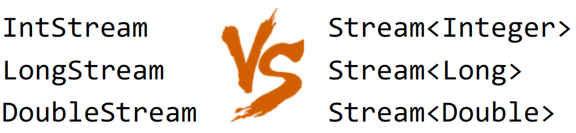  

Смысл заключается в том, что это дает скорость. Примитивное всегда
быстрее. Так, как минимум, указано в документации по Stream.

Проверим, на самом ли деле примитивные Stream быстрее. Для начала нам
необходимы тестовые данные, которые мы сгенерируем случайным образом при
помощи того же Stream API:

**int**\[ \] ints;  
**Integer**\[ \] integers;

@Setup  
**public** **void** setup() {  
ints = **new** Random(1).ints(1000000, 0, 1000)  
.toArray();

integers = **new** Random(1).ints(1000000, 0, 1000)  
.boxed().toArray(**Integer**\[\]::**new**);  


Здесь мы генерируем один миллион чисел в диапазоне от 0 до 1000 (не
включая). Затем собираем их в примитивный массив *ints*, а после —
упаковываем в объектный массив *integers*. При этом числа у нас
получаются абсолютно одинаковые, так как генератор мы инициализируем
одним и тем же числом.

Выполним над числами какую-либо операцию — посчитаем, сколько у нас
уникальных чисел в обоих массивах:

@Benchmark  
**public** **long** stream() {  
**return** Stream.of(integers).distinct().count();  
}

@Benchmark  
**public** **long** intStream() {  
**return** IntStream.of(ints).distinct().count();  
}

Результат, естественно, будет одинаковый, но вопрос в том, какой Stream
будет быстрее и насколько. Мы считаем, что примитивный Stream будет
быстрее. Но чтобы не гадать, проведем тест и посмотрим, что же у нас
получилось:

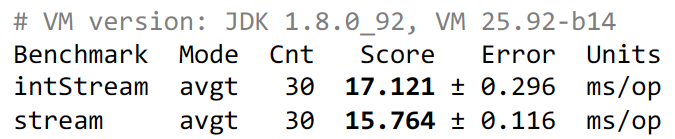  

Хм, примитивный Stream, как ни странно, проиграл. Но если тесты
запустить на Java 1.9, то примитивный будет быстрее, но все же меньше,
чем в два раза. Возникает вопрос: «Почему так, ведь все же обещают, что
примитивные Stream'ы быстрее?». Чтобы это понять, надо посмотреть
исходный код. Например, рассмотрим метод distinct(), и как он работает в
примитивном Stream. Да, все с этим вроде бы понятно, но так как Stream —
это интерфейс, то в нем, естественно, не будет реализации. Вся
реализация лежит в пакете *java.util.stream*, где помимо публичных
пакетов лежит много приватных пакетов, в которых, собственно, и
находится реализация. Основной класс, который реализует Stream, —
это *ReferencePipeline*, наследующий *AbstractPipeline*. Соответствующим
образом происходит реализация и для примитивных Stream'ов:

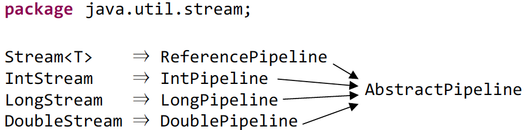  

Поэтому идем в IntPipeline и смотрим реализацию distinct():

```
import java.util.stream.IntPipeline;

@Override
public final IntStream distinct() {
// While functional and quick to implement,  
// this approach is not very efficient.  
// An efficient version requires an  
// int-specific map/set implementation.  
    return boxed().distinct().mapToInt(i -> i);
}
```

Мы видим, что происходит упаковка примитивного типа, формирование Stream
вызов на нем distinct'a, после чего обратно формируется примитивный
Stream.

Соответственно, если мы подставим это, то получаем, что во втором случае
у нас та же самая работа и даже больше. Мы берем наш поток примитивных
чисел, упаковываем его и после этого
вызываем *distinct()* и *mapToInt()*. Сам *mapToInt* практически ничего
не съедает, а вот упаковка требует памяти. В первом случае у нас уже
была выделена память заранее, так как мы уже имели объекты, а вот втором
случае ее надо выделять, и там уже GC начинает срабатывать. В чем мы
убедимся:

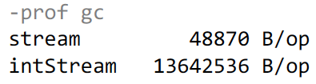

В первом случае у нас тест занимает 48 кБайт памяти, которая в основном
уходит на поддержку *HashSet*, используемый внутри *distinct'a* для
проверки тех чисел, которые уже были. Во втором случае у нас выделяется
существенно больше памяти, около 13 мегабайт.

Но в целом, хочу вас успокоить, это единственное исключение из правил. В
целом примитивные Stream'ы ведут себя значительно быстрее. Почему это
так сделано в JDK — потому что в Java нет специализированных коллекций
для примитивов. Чтобы реализовать *distinct()* на примитивных *int*, вам
необходима коллекция для примитивных типов. Есть библиотеки,
предоставляющие подобную функциональность:

- <https://habrahabr.ru/post/187234/>

- <https://github.com/leventov/Koloboke>

- <https://github.com/vigna/fastutil>

Но в JDK этого нет, а если реализовывать
примитивный *HashSet* для *int*, то тогда необходимо делать *HashSet* и
для *long* и *double*. А также еще есть параллельные Stream’ы, а
параллельные Stream’ы есть *ordered* и *unordered*. В ordered там
есть *LinkedHashSet*, а в unordered нужен Concurrent. Поэтому нужно
реализовать кучу кода, и ее просто никто не стал писать. Все надеются на
специализацию *Generic*, которая, возможно, выйдет в десятой Java.

Посмотрим другую причуду.

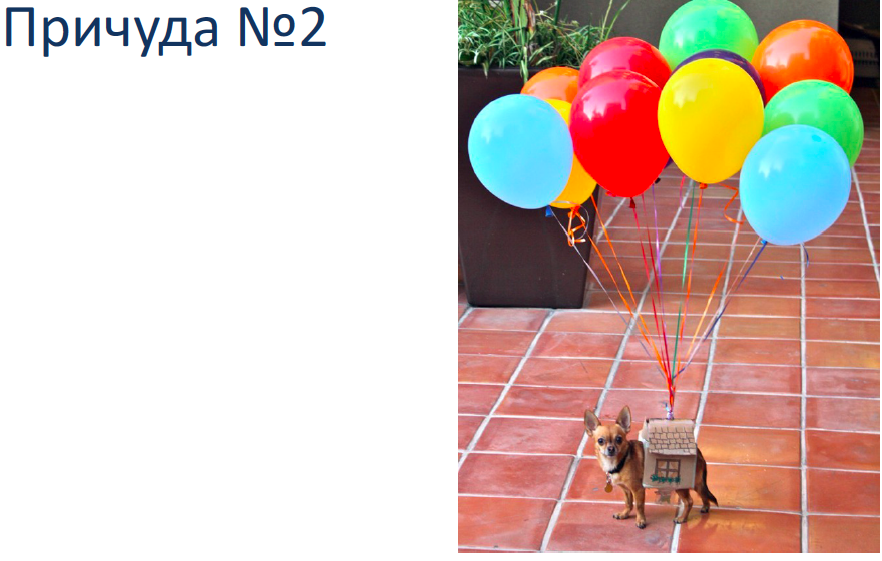

Продолжим играться со случайными числами и возьмем миллион чисел.
Диапазон станет побольше – от 0 до 50 000 (не включая), чтобы числа реже
повторялись. Заранее их отсортируем и сложим в примитивный массив:

**private** **int**\[\] data;

@Setup  
**public** **void** setup() {  
data = **new** Random(1).ints(1_000_000, 0, 50_000)  
.sorted().toArray();  
}

Затем при помощи distinct'a посчитаем сумму уникальных чисел:

@Benchmark  
**public** **int** distinct() {  
**return** IntStream.of(data).distinct().sum();  
}

Это самая тривиальная реализация, она работает и корректно вычисляет
результат. Но мы хотим придумать что-нибудь быстрее. Я вашему вниманию
предлагаю еще несколько вариантов:

@Benchmark  
**public** **int** distinct() {  
**return** IntStream.of(data).distinct().sum();  
}

@Benchmark  
**public** **int** sortedDistinct() {  
**return** IntStream.of(data).sorted().distinct().sum();  
}

@Benchmark  
**public** **int** boxedSortedDistinct() {  
**return** IntStream.of(data).boxed().sorted().distinct()  
.mapToInt(x -\> x).sum();  
}

Во втором варианте мы еще раз заранее отсортируем перед *distinct()*, а
в третьем варианте мы еще упакуем, потом отсортируем,
выполним *distinct()* и приведем к примитивному массиву и потом
суммируем.

Возникает вопрос: «Зачем сортировать? У нас же и так все было
отсортировано. Потом и результат суммы от сортировки не зависит».

Тогда исходя из здравого смысла можно предположить, что первый вариант
будет самый быстрый, второй медленнее, а третий — самый долгий.

Однако мы можем вспомнить, что *distinct()* делает упаковку, а потом
приводит к примитивному типу, поэтому описанные выше примеры можно
представить так:

@Benchmark  
**public** **int** distinct() {  
**return** IntStream.of(data).boxed().distinct()  
.mapToInt(x -\> x).sum();  
}

@Benchmark  
**public** **int** sortedDistinct() {  
**return** IntStream.of(data).sorted().boxed().distinct()  
.mapToInt(x -\> x).sum();  
}

@Benchmark  
**public** **int** boxedSortedDistinct() {  
**return** IntStream.of(data).boxed().sorted().distinct()  
.mapToInt(x -\> x).sum();  
}

Примеры теперь более друг на друга похожи, но в любом случае мы делаем
упаковку как лишнюю работу. Теперь посмотрим результаты:

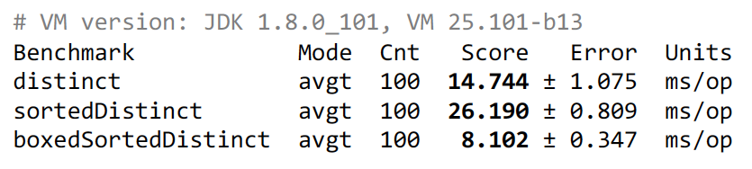

Второй вариант, как ожидалось, работает медленнее, однако последний
вариант, как ни странно, работает быстрее всех. Загадочное поведение, не
правда ли?

В целом можно выделить сразу несколько факторов. Во-первых, сортировка в
Java работает быстро, если данные уже отсортированы. То есть, если она
увидела, что числа идут в правильном порядке, то она сразу же выходит.
Поэтому сортировать сортированное достаточно дешево. Однако
операция *sorted()* в Stream'e добавляет характеристику, что он уже
отсортирован. У нас изначально массив уже был упорядочен, но Stream об
этом не знает. Об этом знаем только мы. Поэтому когда *distinct()* видит
отсортированный Stream, он включает более эффективный алгоритм. Он уже
не собирает *HashSet* и смотрит наличие повторяющихся чисел, а просто
сравнивает каждое следующее число с предыдущим. То есть теоретически
сортировка может нам помочь, если у нас уже входные данные
отсортированы. Тогда непонятно, почему второй тест медленнее, чем
третий. Чтобы это понять, необходимо посмотреть на реализацию
метода *boxed()*:

// java.util.stream.IntPipeline

@Override  
**public** **final** Stream\<**Integer**\> boxed() {  
**return** mapToObj(**Integer**::\<i\>valueOf\</i\>);  
}

И если мы его подставим в код:

@Benchmark  
**public** **int** distinct() {  
**return** IntStream.of(data).mapToObj(**Integer**::valueOf)  
.distinct().mapToInt(x -\> x).sum();  
}

@Benchmark  
**public** **int** sortedDistinct() {  
**return** IntStream.of(data).sorted().mapToObj(**Integer**::valueOf)  
.distinct().mapToInt(x -\> x).sum();  
}

@Benchmark  
**public** **int** boxedSortedDistinct() {  
**return** IntStream.of(data).mapToObj(**Integer**::valueOf).sorted()  
.distinct().mapToInt(x -\> x).sum();  
}

А *mapToObj()* удаляет характеристику о том, что Stream отсортирован. И
в третьем случае мы сортируем объекты и помогаем *distinct()*, который
после этого начинает быстрее работать. А если между ними
попадается *mapToObj()*, то он эту сортировку делает бессмысленной.

Мне это показалось странным. Можно написать *boxed()* немного длиннее и
сохранить характеристику о сортировке Stream. Поэтому я внес патч в Java
1.9:

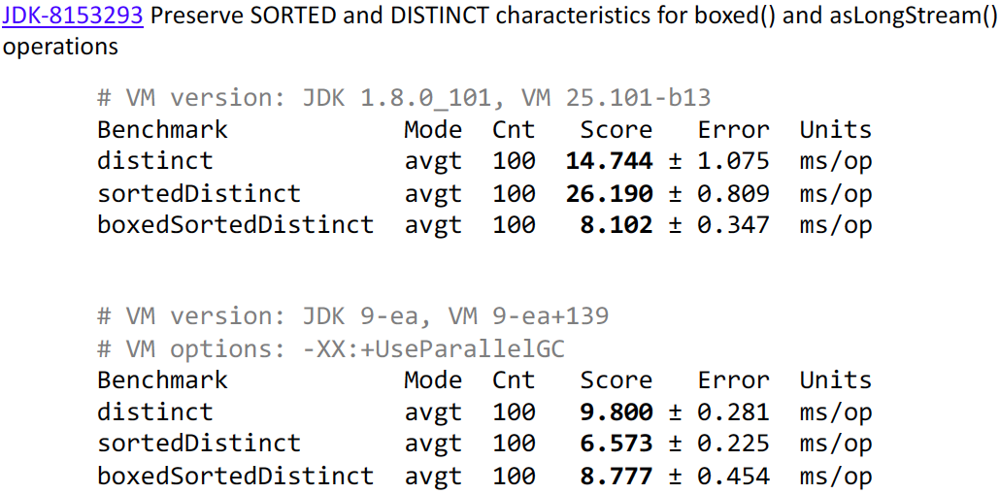  

Как мы видим, после применения патча результаты оказываются значительно
интереснее. Второй вариант теперь выигрывает, потому что он сортирует на
примитивах. Третий вариант теперь немножко проигрывает второму, потому
что мы сортируем объекты, но при этом все еще выигрывает у первого
варианта.

Кстати, хотел бы отметить, что при выполнении тестов в 9 версии, я
использовал опцию –XX:+UseParallelGC, так как в 8 версии он стоит по
умолчанию, а в 9 стоит по умолчанию G1. Если мы эту опцию уберем, то
результаты получаются существенно отличающимися:

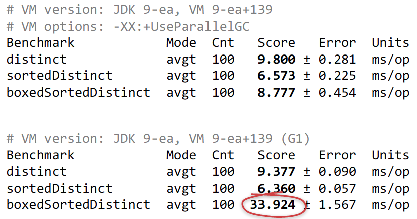  

Поэтому я хотел бы предупредить, что при переходе на 9 версию у вас
что-то может начать медленнее работать.

Перейдем к следующей причуде.


Выполним следующую задачу. Для ее выполнения будем использовать
икосаэдры. Икоса́эдр — это такой правильный выпуклый многогранник,
имеющий 20 граней.

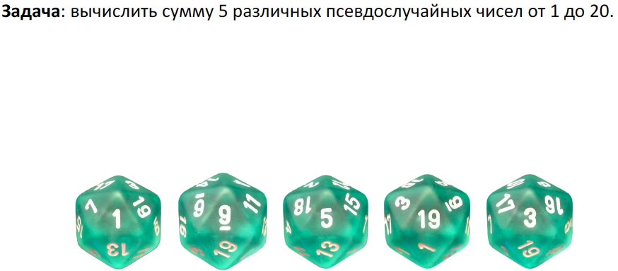

Сделаем это с помощью Stream API:

// IntStream ints(long streamSize, int origin, int bound)  
**new** Random().ints(5, 1, 20+1).sum();

Зададим параметры и суммируем полученные значения. При таком подходе
результат может получиться не совсем корректный. Нам необходима сумма
пяти*псевдослучайных*чисел. А может получиться так, что у нас
попадется повтор:

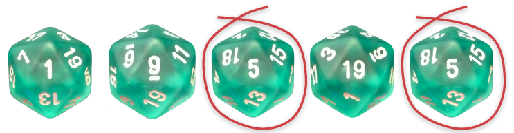

Если добавить *distinct()*, то это тоже не поможет, так как он просто
выкинет повтор, у нас уже будет сумма из 4 чисел или даже меньше:

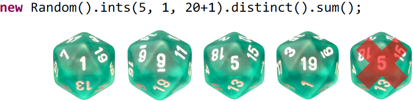

Нам остается взять версию чуть-чуть подлиннее:

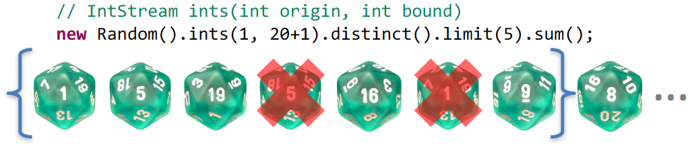

Мы возьмем *ints()* и теперь не будем задавать количество необходимых
нам чисел, а просто укажем, что нам нужны сгенерированные определенным
образом числа. У нас получится бесконечный Stream, в
котором *distinct()* будет проверять числа на повтор, а *limit()* после
получения 5 чисел остановит выполнение генерации чисел.

Теперь попробуем эту задачу распараллеливать. Сделать это не просто, а
очень просто:

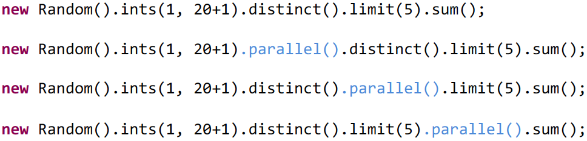

Достаточно дописать *parallel()* и у вас будет параллельный Stream. Все
вышеперечисленные примеры скомпилируются. А как вы думаете, есть ли
разница между вышеописанными примерами? Можно предположить, что разница
будет. Если вы так считаете, то это не ваша вина, потому что в
документации об этом плохо сказано, и, действительно, много людей думает
аналогично. Тем не менее на самом деле никакой разницы нет. У всего
Stream есть некоторая структура данных, в котором есть булева
переменная, которая описывает его как параллельный или обычный. И где бы
вы до выполнения Stream не написали *parallel()*, он установит эту
специальную переменную в true и после этого терминальная операция будет
его использовать в том значении, в котором и была эта переменная.

В частности, если вы напишете так:

**new** Random().ints(1, 20+1).parallel().distinct().limit(5)  
.sequential().sum();

Можно подумать, что только *distinct()* и limit() выполняются
параллельно, а sum() последовательно. На самом деле нет, так
как *sequential()* сбросит флажок и весь Stream будет выполнен
последовательно.

В девятой версии документация была улучшена, чтобы не вводить людей
заблуждение. Для этого был заведен отдельный ticket:


Посмотрим, как долго будет выполняться последовательный Stream:

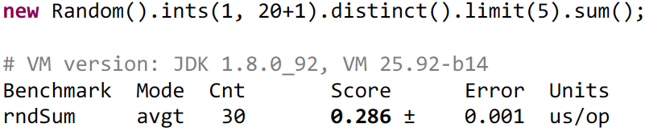

Как мы видим, выполнение происходит очень быстро – 286 наносекунд.

Если честно, то я сомневаюсь, что распараллеливание будет быстрее.
Большие издержки – создавать задачи, раскидывать их по процессорам. Это
должно быть дольше, чем 200 наносекунд, – получается слишком большой
overhead.

Как вы считаете, во сколько раз дольше будет выполняться параллельный
Stream? В 10 раз, в 20 или очень долго вплоть до бесконечности? С
практической точки зрения правы будут последние, так как тест будет
выполняться около 6 000 лет:

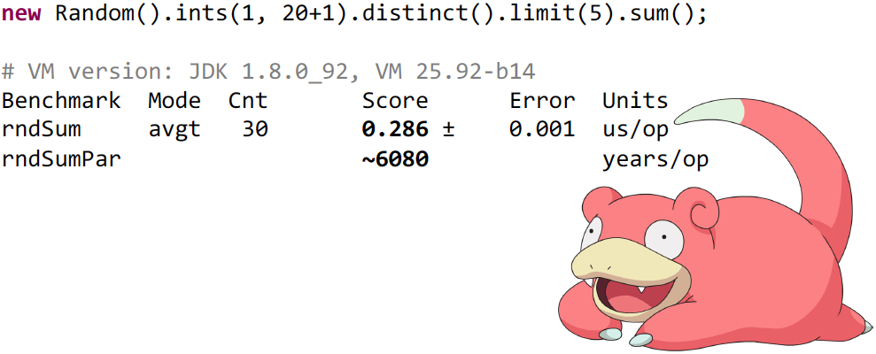

Возможно, на вашем компьютере тест будет выполняться на пару тысяч лет
больше или меньше. Чтобы понять причину такого поведения, необходимо
немного покопаться. Все дело в причудливой операции *limit()*, которая
имеет несколько реализаций. Потому что она в зависимости от
последовательности или параллельности и прочих флагов работает
по-разному. В данном случае у нас
работает *java.util.stream.StreamSpliterators.UnorderedSliceSpliterators\<T,T_SPLIT\>*. 
Код я вам не буду показывать, а постараюсь объяснить как можно проще.

Почему unordered? Потому что источник случайных чисел говорит о том, что
данный Stream не упорядочен. Поэтому если при распараллеливании мы
порядок поменяем, то никто ничего не заметит. И, казалось, несложно
реализовать unordered limit – добавить в него атомарную переменную и
инкрементить ее. Увеличили, а лимит еще не достигнут –
просим *distinct()* дать нам еще число и передаем его в сумматор. Как
только атомарная переменная станет равна 5, мы останавливаем
вычисления.

Эта реализация бы работала, если бы не разработчики JDK. Они решили, что
в такой реализации будет слишком большой contention из-за того, что все
нити используют одну и ту же атомарную переменную. Поэтому они решили
брать не по одному числу, а по 128. То есть каждый из потоков
увеличивает атомарную переменную на 128 и берет 128 чисел из
вышестоящего источника, но при этом счетчик уже не обновляет, и потом
только через 128 происходит обновление. Это умное решение, если у вас
там лимит, например, 10 000. Но оно невероятно глупое, если у вас такой
маленький лимит. Ведь заранее известно, что больше 5 и не потребуется.
Мы не сможем взять 128 чисел из этого источника. Первые 20 чисел мы
возьмем нормально, а на 21 мы попросим *distinct()* дать нам еще одно
число. Он пытается получить его у «кубика», тот его дает.
Например, *distinct()* достается число 10. «А оно уже было» — говорит
distinct() и просит дать ему еще. Получает он число 3, а оно у него уже
тоже было. И этот процесс никто не остановит, так как *distinct()* видел
уже все грани нашего кубика, и он не знает, что кубик кончился. Это
должно происходит до бесконечности, но если посмотреть на
документацию *ints*(), то Stream не бесконечный, он effectively
unlimited. В нем конкретно *Long.MAX_VALUE* элементов и в какой-то
момент он все-таки кончится:

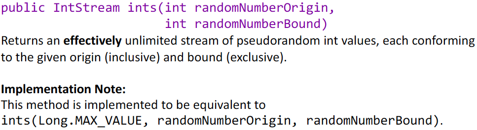

Мне это показалось странным, я эту проблему в 9 версии пофиксил:

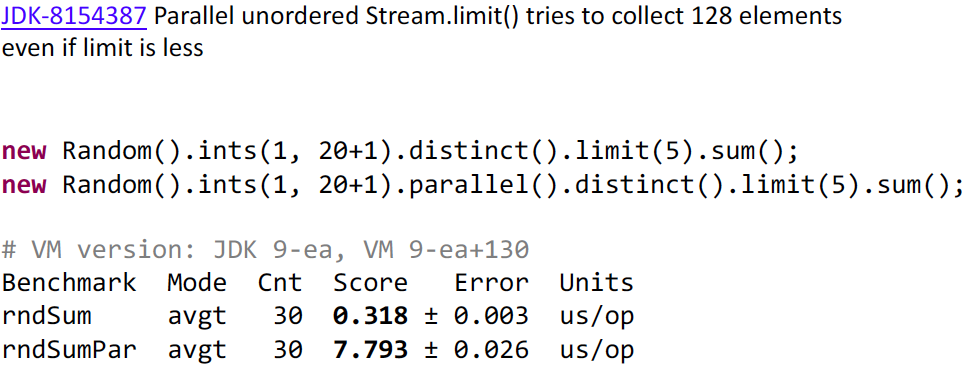

Соответственно мы получаем провал в производительности, что вполне
адекватно – 20-25 раз примерно. Но я хочу вас предостеречь, что хоть я
эту проблему и пофиксил для конкретного примера, это не значит, что она
исправлена вообще. Это была проблема performance, а не проблема
корректной реализации Stream.

В документации нигде не сказано, что если у вас указано *limit(5)*, то у
вас будет прочитано из источника ровно 5 чисел. Если у вас *findFirst*,
это не значит, что у вас будет прочитано одно число – может быть
прочитано сколько угодно. Поэтому нужно быть осторожными с бесконечными
Stream. Потому что если мы возьмем не 5, а 18 чисел как лимит, то можем
снова столкнуться с той же проблемой. Так как 18 чисел уже прочитано, а
другие 3 параллельных нити также запросят еще по одному, и мы уже
упремся в 21. Поэтому такие операции распараллеливать не стоит. С
параллельными Stream понятно – если у вас короткозамкнутая операция, она
вычитает гораздо больше, чем вы думаете.

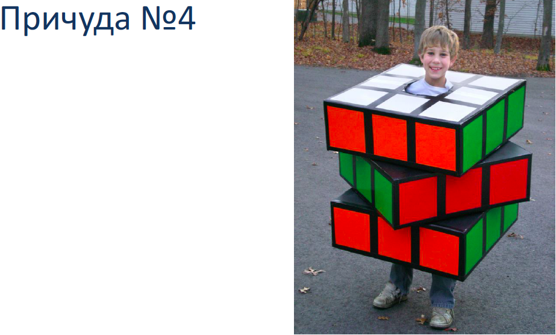

С последовательными Stream есть причуда на таком вот примере:

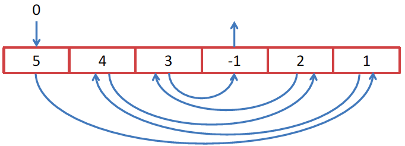

Пример может немного искусственный, но в каком-нибудь алгоритме может он
может проявиться. Мы хотим обойти массив целых чисел, но обойти его
хитрым способом. Начнем с 0 элемента, а значение в этом элементе есть
индекс следующего элемента, который мы хотим взять. Так как мы хотим
обойти его при помощи Stream API, то мы находим метод Stream.iterate(),
который, казалось бы, создан для нашей задачи:

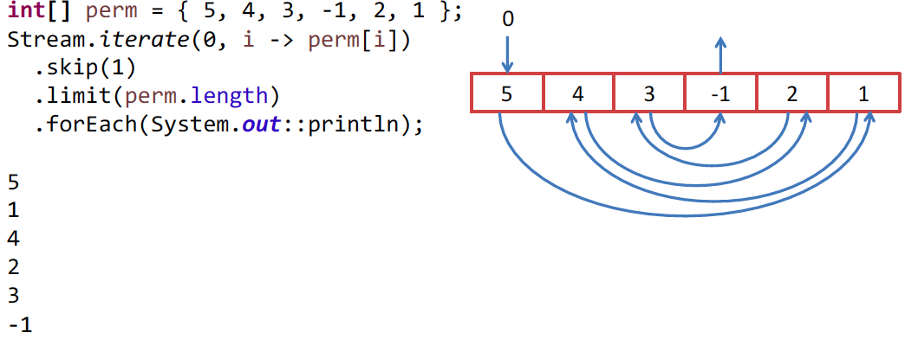

Первый элемент Stream — это индекс в нашем массиве, а вторым будет
функция прироста, т.е. функция, которая из предыдущего элемента делает
следующий. В нашем случае мы используем элемент как индекс. Но так как
нам первый элемент 0 – это индекс и он нам не нужен, мы пропускаем его
при помощи *skip(1)*. Затем мы ограничиваем Stream длиной массива и
выводим на экран или делаем что-то другое, другой алгоритм, например, у
нас идет.

Все работает корректно, и никакого подвоха нет. Но так как у нас здесь
целые числа, то почему бы не использовать *IntStream* ? В этом интерфейсе
у нас есть iterate и все остальные операции. Пишем *IntStream*,
получаем:

Exception in thread "main" alt="" java.lang.ArrayIndexOutOfBoundsException  
at test.Iterate.lambda\$0(Iterate.java:9)  
at test.Iterate\$\$Lambda\$1/424058530.applyAsInt(Unknown Source)  
at java.util.stream.IntStream\$1.nextInt(IntStream.java:754) …  
at test.Iterate.main(Iterate.java:12)

Дело все в том, что это деталь реализации *IntStream.iterate()*, а
у *Stream.iterate()* этой детали нет. Каждый раз, когда Вам выдается
число, сразу же запрашивается следующее. Оно сохраняется в переменную, а
Вам отдается предыдущее число. И поэтому, когда мы пытаемся получить -1,
происходит попытка получить у источника значение массива с индексом -1,
что приводит к возникновению ошибки. Мне это показалось странным, и я
это исправил:


Но это всего лишь странность реализации, и это нельзя назвать багом, так
как поведение соответствует спецификации.


Stream на самом деле любят вот за это:

Map\<**String**, **String**\> userPasswords =  
Files.lines(Paths.get("/etc/passwd"))  
.map(str -\> str.split(":"))  
.collect(toMap(arr -\> arr\[0\], arr -\> arr\[1\]));

Можно взять файл и использовать его как источник. Превратить его в
Stream строк, превратить в массивы, промапить и так далее. Все красиво,
все вот так вот в одну строчку – все у нас fluent:

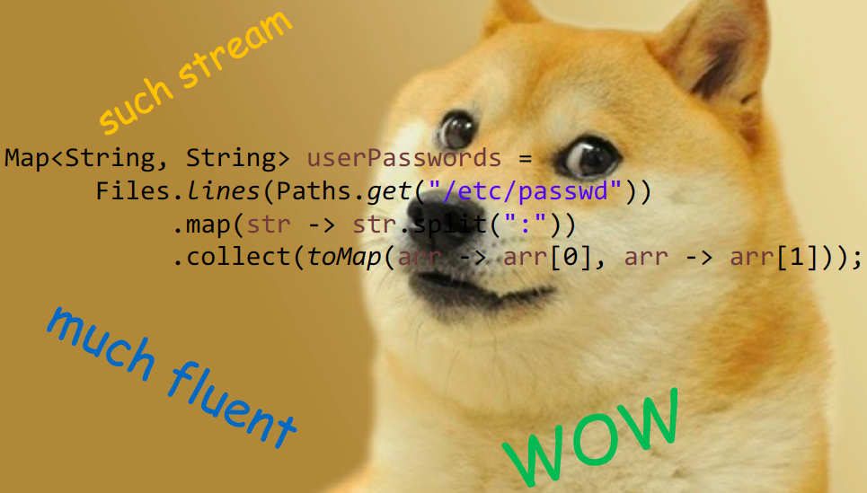

Но вам не кажется, что чего-то не хватает в этом коде?
Может*try-catch*? Почти, но не совсем. Не хватает*try-with-resources*.
Необходимо закрывать файлы, иначе у вас могут закончиться файловые
дескрипторы, а под Windows еще хуже, с этим уже потом ничего не
сделаешь.

На самом деле код уже должен выглядеть вот так:

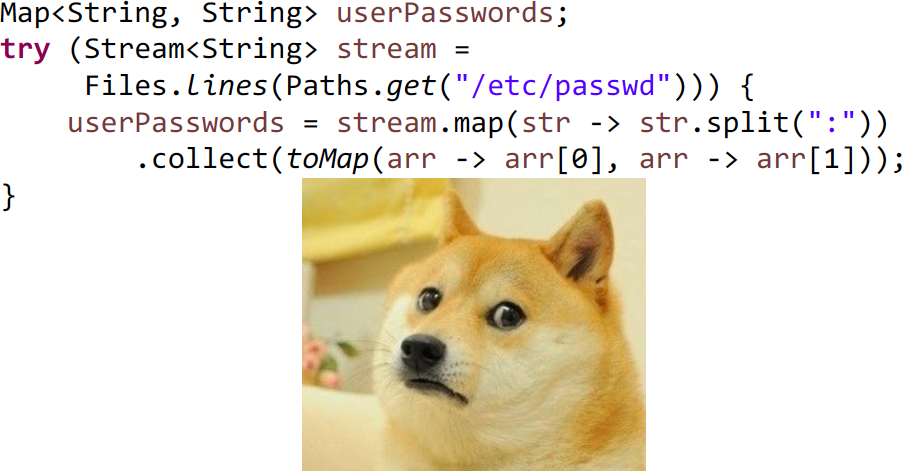

И вот все уже выглядит не так радужно. Пришлось вставить try, а для
этого завести отдельную переменную. Это рекомендуемый способ написания
кода, то есть не я это придумал. В любом документе по Stream сказано,
что делайте так.

Естественно, что некоторым людям это не нравится и они пытаются это
исправить. Вот, например, это пытался сделать Lukas Eder. Замечательный
человек и он предлагает вот такую идею. Он выложил свою мысль на
обсуждение на StackOverfow —[в виде
вопроса](http://stackoverflow.com/questions/34753078/). Это все странно,
мы же знаем, когда Stream закончит работать – у него есть терминальная
операция, и после ее вызова он уже точно не нужен. Так давайте мы его и
закроем.

Stream — это интерфейс, мы можем взять его и реализовать. Сделаем
делегата к Stream, который JDK нам выдает, и переопределим все
терминальные операции – вызовем оригинальную терминальную операцию и
закроем Stream.

Будет ли такой подход работать и корректно закрывать все файлы?
Рассмотрим список всех терминальных операций – они делятся на 2 группы:
одну я назвал «Нормальные» операции (с внутренним обходом), а другую
(раз у нас причуды) «Причудливые» (с внешним обходом):

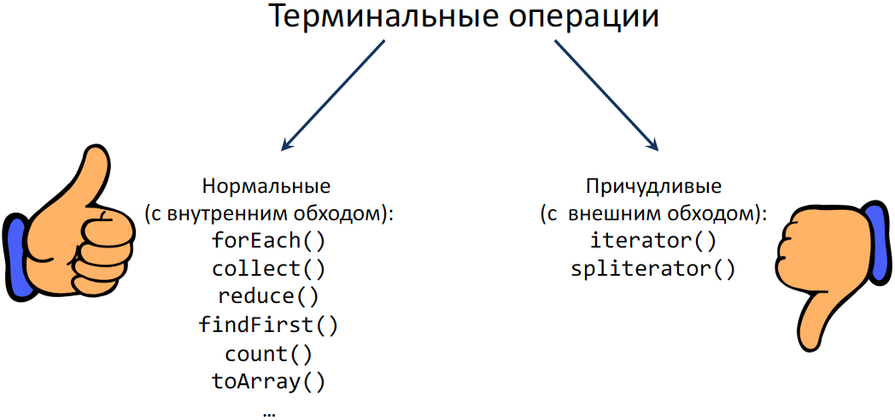

«Причудливые» операции всю картину и портят. Представьте, что вы сделали
Stream строчек файла и хотите его передать в старый API, который при
Stream ничего не знает, но знает про итераторы. Естественно, у этого
Stream'а мы берем итератор, но при этом никто не хочет, чтобы весь файл
загрузился в память. Мы хотим, чтобы это работало «лениво», Streаm'ы
ведь ленивые. То есть по факту терминальную операцию уже вызвали, но
файл открытый еще нужен. После этого контракт итератора не
подразумевает, что этот итератор нужно закрыть или сказать, что он после
этого не нужен.

Можно один раз вызвать *iterator.next()* и потом бросить его. То есть
когда итератор вернулся, то уже никогда не станет известно, что файл не
нужен. Получается, что проблема не решается. *Spliterator* — то же
самое, только вид сбоку. В нем тоже есть метод *tryAdvance()*, который
включает вместе *hasNext()* и *next()* и про него можно сказать, что он
итератор на стероидах. Но с ним абсолютно такая же проблема – можно
бросить его в неизвестном состоянии и никак не сказать, что файл на
самом деле уже пора закрыть. Если вы его не использовали у себя в коде,
то, возможно, вы вызывали его неявно. Например, вот такая вот
конструкция:

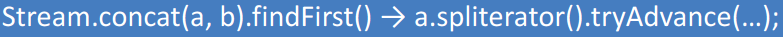

Вот, вроде бы, легальная конструкция – объединение двух Stream вместе.
Но после этого любая короткозамкнутая операция приведет к тому же самому
эффекту – у вас брошенный итератор в неизвестном состоянии.

Поэтому я стал думать, как сделать так, чтобы Stream закрывались
автоматически. На самом деле для этого есть *flatMap*:

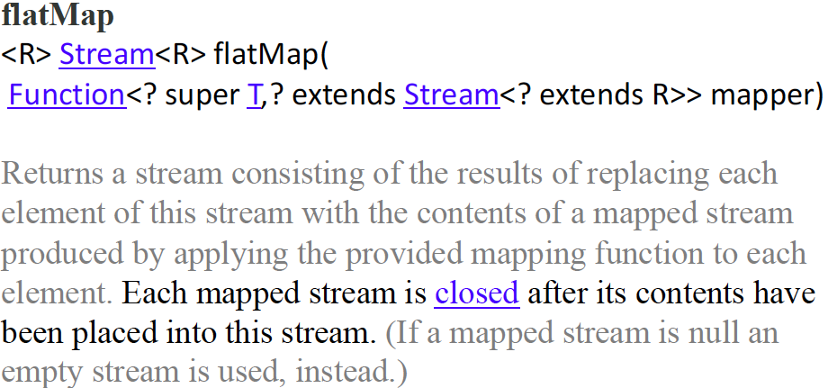

Мы берем документацию, а в ней сказано, что это метод. Он принимает
функцию, и каждый элемент у вас превращается в Stream. Также имеется
замечательная пометка, что каждый созданный Stream будет закрыт после
того, как его содержимое будет передано в текущий Stream. То
есть *flatMap()* нам обещает, что Stream будет закрыт. Значит он все
может сделать за нас, нам нет необходимости делать все
с *try-with-resources*. Давайте тогда напишем так:

Map\<**String**, **String**\> userPasswords =  
Stream.of(Files.lines(Paths.get("/etc/passwd")))  
.flatMap(s -\> s)  
.map(str -\> str.split(":"))  
.collect(toMap(arr -\> arr\[0\], arr -\> arr\[1\]));

Вызов *Stream.of(Files.lines(…))* – приводит к образованию Stream'a,
состоящего из одного Stream. Затем мы вызвали *flatMap()* и снова
получили один Stream. Но теперь *flatMap()* нам гарантирует, что Stream
будет закрыт. Дальше у нас все точно такое же и мы должны получить тот
же самый результат. При этом файл должен автоматически закрыться без
всяких *try* и дополнительных переменных.

Считаете ли вы это в целом отличным решением, в котором нет проблем с
производительностью и все будет закрыто корректно? Да, никакого подвоха
нет и все сработает. Это и по производительности хорошее решение, и файл
будет закрыт нормально. Даже если у нас в какой-то строчке не окажется
«:» и arr\[1\] вызовет *ArrayIndexOutOfBoundsException* и все это упадет
с исключением, все равно файл закроется, *flatMap()* это гарантирует. Но
посмотрим, какой ценой он это делает.

На докладе на JPoint я говорил, что если мы делаем в Stream *flatMap()*,
то результирующий Stream мы получаем немного испорченным.

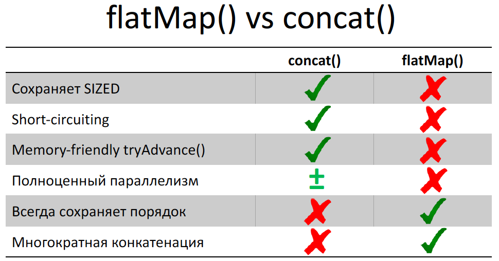

В частности, теряется короткозамкнутость внутри Stream, то есть внутри
вложенного Stream мы не сможем сделать короткое замыкание, даже если там
написать *limit()* или *findFirst()* – весь вложенный Stream будет все
равно прочитан. И это на самом деле очень важная деталь реализации
Stream, и она очень неприятная. Про нее стоит знать при любом
использовании Stream (последовательное или параллельное). То есть если у
вас после *flatMap()*и дет короткозамкнутая операция, то готовьтесь к
тому, что у вас последний и нужный вам Stream, который
выдал *flatMap()*, будет прочитан до конца. И это может привести к
проблемам с производительностью в вашем коде. А самое печальное,
что *tryAdvance()* у него ведет себя вообще плохо:

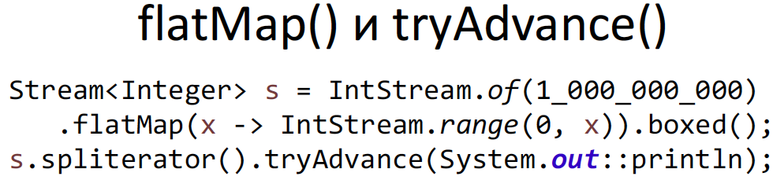

У меня был такой случай. Я сделал Stream из одного элемента и
использовал *flatMap()* на Stream из 1 000 000 000 элементов. А потом
взял у Stream'a *spliterator()* и *tryAdvance()*– хотел вывести на
экран первый элемент Stream. Это все кончилось печально
– *OutOfMemoryError*. Когда только я
сделал *tryAdvance()*, *flatMap()*— весь вложенный Stream загрузился в
буфер – в результате кончилась оперативная память. Подробнее об этом я
говорил на JPoint, вы можете посмотреть.

Это в частности нам показывает, что произойдет:

Files.lines(Paths.get\<("/etc/passwd"))  
.spliterator().tryAdvance(...);  
// вычитываем одну строку, файл не закрываем

Stream.of(Files.lines(Paths.get("/etc/passwd")))  
.flatMap(s -\> s)  
.spliterator().tryAdvance(...);  
// вычитываем весь файл в память, файл закрываем

В первом случае, если мы вызовем *spliterator().tryAdvance(),* у
простого Stream у нас будет вычитана одна строчка и файл закрыт не
будет. На самом деле может быть вычитано немного больше, у нас
там *BufferedReader*. Но размер буфера не зависит от длины файла, вот
что важно. Даже если у нас там гигабайтный файл, его можно обходить
через *tryAdvance()* и у нас память не кончится. А вот во втором
случае *flatMap()* нам обещает, что файл будет закрыт, но он не знает,
когда мы бросим *spliterator* и в каком состоянии. Поэтому он вычитывает
весь файл в память и файл закрывает. То есть он нам гарантирует закрытие
файла. У этого факта есть интересный побочный эффект – многим людям не
нравится такое поведение *flatMap()*, им не нравится, что он
потенциально может все занести в буфер. Они считают, что это можно
исправить, можно написать хороший *flatMap*. Даже
есть[реализации](http://stackoverflow.com/a/32767282/4856258)(небуферизующий *flatMap*).
Он написан не в JDK, а снаружи. Его нужно вызывать как статический
метод, но после этого он вам и короткое замыкание во вложенном Stream
сделает, и если вызвать *spliterator().tryAdvance(),* никакой
буферизации не будет. Все будет замечательно. Так почему же разработчики
JDK не внесут эту реализацию? Потому что данная реализация не
гарантирует, что у вас все вложенные Stream будут закрыты. А в
спецификации написано, что *flatMap()* гарантированно закрывает
Stream.

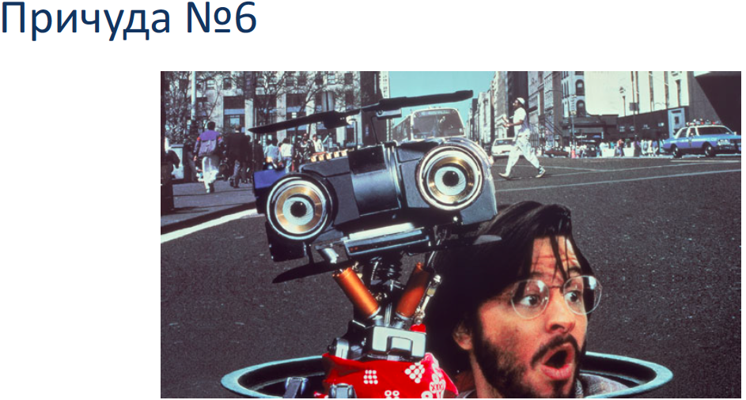

Все любят короткозамкнутые операции. За что их любят? Они могут получить
результат до того, как будут прочитаны все входные данные. В частности,
они могут получить результат на бесконечном Stream, то есть у нас
бесконечное число входных данных, но мы все равно сможем узнать
результат. Но что произойдет, если короткое замыкание не сработает или
сработает в самом конце? Давайте попробуем этот случай исследовать.


Возьмем числа от 0 до 1 000 000. В первом случае посчитаем количество
вхождений числа 1 000 000 в этот ряд, а во втором мы просто найдем это
число 1 000 000. С помощью Stream это делается довольно тривиально:

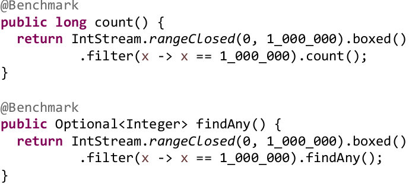

@Benchmark  
**public** **long** count() {  
**return** IntStream.rangeClosed(0, 1_000_000).boxed()  
.filter(x -\> x == 1_000_000).count();  
}

@Benchmark  
**public** Optional\<**Integer**\> findAny() {  
**return** IntStream.rangeClosed(0, 1_000_000).boxed()  
.filter(x -\> x == 1_000_000).findAny();  
}

Берем *rangeClosed()*, создаем диапазон целых чисел.*Boxed()*я добавил
специально, чтобы было похоже на следующих слайдах, на вывод он не
влияет. Просто мне потом будет удобнее сравнивать результаты. Выводы и
на примитивном Stream будут одни и те же. Дальше мы делаем фильтры,
абсолютно одинаковые, а в конце выполняем операцию — либо *count()*,
либо *findAny()*. Либо найти произвольное число, либо посчитать. Как вы
думаете, какая из операций будет быстрее?

В обоих случаях мы должны перебрать в цикле числа от 0 до 1 000 000, в
обоих случаях у нас будет какая-то проверка, проверка абсолютно
одинаковая. В обоих случаях она сработает один раз и в тот же самый
момент. Даже если мы вспомним, что в процессоре есть *branch
predictor* и т.п., он должен все равно одинаково отработать.

И только в этот самый последний момент у нас произойдет небольшая
разница. Мы либо добавим единичку к какой-то переменной (что быстро),
либо мы как-то выйдем из этого цикла (что тоже быстро). То есть у нас на
самом деле должна быть близкая производительность. Однако если мы это
замеряем, мы увидим:

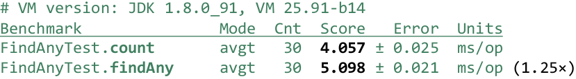

*FindAny()*проигрывает, причем ощутимо — на 25%. Эти результаты
получаются стабильно, так что это значимая разница. Хорошо, можно
подумать, что никто не использует *IntStream.rangeClosed()* и это редкий
источник. Самый частый источник — это *ArrayList*. Давайте сделаем его
из тех же самых чисел, упакуем их и выполним такие же операции:

List\<**Integer**\> list;

@Setup  
**public** **void** setup() {  
list = IntStream.rangeClosed(0, 1_000_000).boxed()  
.collect(Collectors.toCollection(ArrayList::**new**));  
}

@Benchmark  
**public** **long** count() {  
**return** list.stream().filter(x -\> x == 1_000_000).count();  
}

@Benchmark  
**public** Optional\<**Integer**\> findAny() {  
**return** list.stream().filter(x -\> x == 1_000_000).findAny();  
}

В данном случае у нас результаты получаются быстрее, в основном потому,
что нам не надо упаковывать числа (все было упаковано заранее):

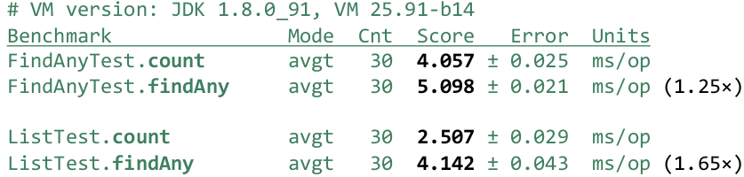

При этом разница еще ощутимее. Короткозамкнутая операция проигрывает уже
на 65%. Происходит это вот почему. Не короткозамкнутая операция, когда
заранее вам известно, что нужно обойти весь Stream, обходит его
через *forEachRemaining,* который сразу знает, что нужно перебрать весь
источник и нигде не стоит останавливаться. А короткозамкнутая операция
перебирает его по одному числу через *tryAdvance()* — то есть
вызывает *tryAdvance()*, получила одно число, вызвала
еще *tryAdvance()* получила еще одно число.

Но дело в том, что *forEachRemaining* в *spliterator* можно реализовать
более эффективно. Например, состояние можно хранить в локальных
переменных (сколько вы чисел обошли и сколько осталось), а
в *tryAdvance()* после каждого вызова нужно сохранить в поля состояния,
чтобы при следующем вызове вы знали, где вы стоите. Работа с кучей
всегда, естественно, дороже и поэтому скаляризовать spliterator
JIT-компилятор не может, поэтому происходит замедление. В случае со
списком ситуация еще хуже, так как вы должны постоянно
проверять *modCount()*, чтобы если кто-то из другого потока выполнил
изменение, вы могли кинуть *ConcurrentModificationExceptions*. В случае
с *forEachRemaining* *modCount()* проверяется в конце. А в
случае *tryAdvance()* необходимо проверять его при каждом вызове. Мы же
не знаем, сколько мы еще раз будем вызывать *tryAdvance()*. Так что это
еще накладные расходы. Поэтому обойти весь Stream намного быстрее, чем
если обходить его по одному элементу.

И еще одна проблема, о которой мы говорили, что короткозамкнутые
операции не работают во вложенном Stream:

@Benchmark  
**public** Optional\<**Integer**\> findAny1() {  
**return** IntStream.range(0, 1_000_000)  
.boxed().filter(x -\> x == 0).findAny();  
}

@Benchmark  
**public** Optional\<**Integer**\> findAny1Flat() {  
**return** IntStream.of(1_000_000).flatMap(x -\> IntStream.range(0,
x))  
.boxed().filter(x -\> x == 0).findAny();  
}

Если мы хотим найти первый элемент из 1 000 000, то получаем:

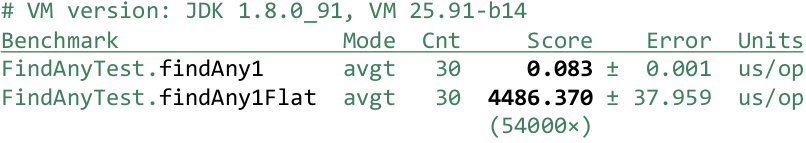

Первый тест сработает за 83 наносекунды, это очень быстро. А во втором
тесте, где все элементы были из вложенного Stream'a, весь вложенный
Stream будет обойден до конца, несмотря на то, что мы нашли нужный
элемент в самом начале. Мы проиграли в 54 000 раз и можем проиграть в
любое количество раз, в зависимости от того, сколько элементов у нас
есть.

Мы приходим к выводу:

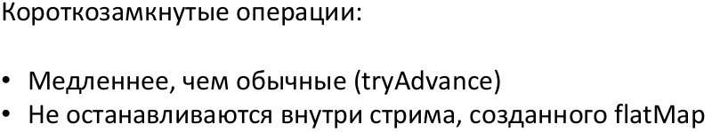

Возникает вопрос, каким образом эту штуку как-то исправить. Есть вот,
например, быстрый *forEachRemaining,* то есть как-то вызвать вот этот
«быстрый» — сперва говорим, что мы все элементы обойдем, но в какой-то
определенный момент мы понимаем, что нам дальше обходить не надо. Мы
каким-то образом *forEach* говорим, что надо выходить. Но как мы можем
сказать, мы же внутри лямбды, а лямбда — *Consumer*, она ничего не может
вернуть. Если мы выйдем, нас сразу запустят для следующего элемента. Так
есть ли какой-то способ выпрыгнуть из этого *forEachRemaining*?
Генерировать *Exception*?


Нельзя использовать*Exception*для Control Flow, это же
антипаттерн(<http://c2.com/cgi/wiki?DontUseExceptionsForFlowControl>):

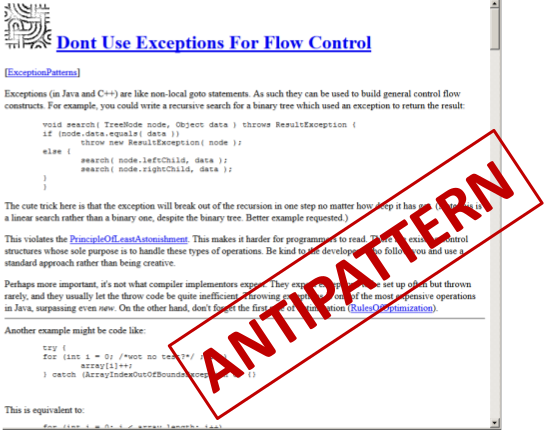

Все так говорят… или все-таки можно?


Давайте попробуем — напишем такой код:

**static** **class** FoundException **extends** RuntimeException {  
**Object** payload;

FoundException(**Object** payload) { **this**.payload = payload; }  
}

**public** **static** \<T\> Optional\<T\> fastFindAny(Stream\<T\>
stream) {  
**try** {  
stream.forEach(x -\> { **throw** **new** FoundException(x); });  
**return** Optional.empty();  
} **catch** (FoundException fe) {  
@SuppressWarnings({ "unchecked" })  
T val = (T) fe.payload;  
**return** Optional.of(val);  
}  
}

Создадим свое исключение, причем производное от *RuntimeException*,
потому что *checked* исключение мы бросать не можем. После мы напишем
быстрый поиск — *fastFindAny*(). Естественно, мы в интерфейс Stream так
быстро добавить не можем — сделаем статический метод, который принимает
Stream. А в нем мы сделаем такую вещь — обойдем его весь,
через *forEach*. Естественно, там будет использоваться
быстрый *forEachRemaining*. Но как только нас раз вызовут,
мы *Exception* выкинем. Потом его мы бережно ловим, так как он
приватный, никто другой его кинуть не может, распаковываем из него
найденный элемент и возвращаем его спокойно. Если же *Exception* не
вылетел, то значит элемент мы не нашли — просто возвращаем
пустой *Optinal*.

Классное ли это решение и способно ли оно заменить
стандартное *findAny()*? Или же это ужасное решение — у вас глаза
кровоточат при виде этого? Я считаю это ужасный код и классное
решение в обоих случаях. Этот метод корректный, он выдает результат,
если что-то находит или же ничего не выдает в противном случае.

В тестах — берем обычный *findAny()* и «быстрый» *fastFindAny()*.

@Benchmark  
**public** Optional\<**Integer**\> findAny() {  
**return** IntStream.rangeClosed(0, 1_000_000).boxed()  
.filter(x -\> x == 1_000_000).findAny();  
}

@Benchmark  
**public** Optional\<**Integer**\> fastFindAny() {  
**return** fastFindAny(IntStream.rangeClosed(0, 1_000_000)  
.boxed().filter(x -\> x == 1_000_000));  
}

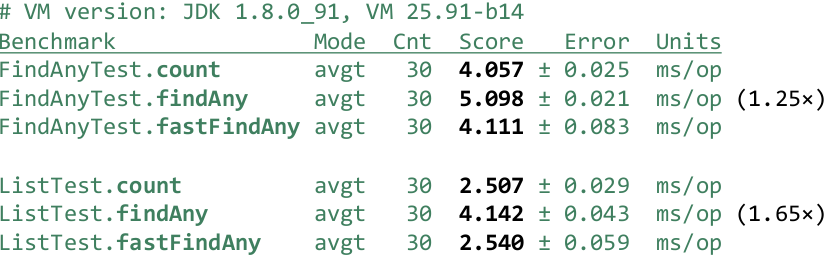

И мы замечаем, что «быстрый» начинает работать как *count()*, то есть мы
этого провала на 25-65% не наблюдаем. Проверим теперь — получилось ли у
нас во *flatMap()*– внутри вложенного Stream выйти:

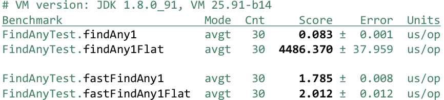

Естественно, получилось. Было 4 000 микросекунд, а стало 2 микросекунды.
Но мы наблюдаем неприятный момент – для простого Stream
(*IntStream.rangeClosed*) мы нашли первое число и вышли. Но мы проиграли
раз в 20 по производительности. А почему проиграли – потому
что *Exception* использовали. Некоторые, возможно, знают: кто-то сам
читал или ходил на доклады Андрея Паньгина – в Exception самое тяжелое
не кинуть его, а создать. И даже не создать, а заполнить Stack Trace.
Потому что при возникновении *Exception* мы можем получить *Stack
Trace* на момент его создания. При этом, когда мы его создаем, мы не
знаем – пригодится ли он в дальнейшем и JDK его заполняет. К счастью,
есть решение:

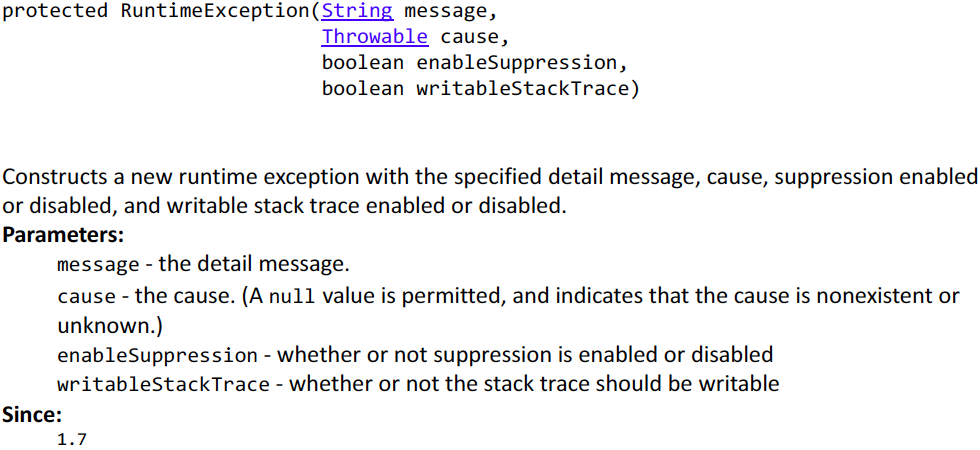

Есть специальный *protected Constructor* в некоторых исключениях, в том
числе *RuntimeException*, где последним параметром можно указать,
что *Stack Trace* нам не нужен. Поэтому мы можем немного сделать
оптимизацию:

**static** **class** FoundException **extends** RuntimeException {  
**Object** payload;

FoundException(**Object** payload) {  
**super**("", null, false, false); // \<\<\<\<  
**this**.payload = payload;  
}

Возьмем наш *FoundException* и используем этот замечательный
конструктор. Тогда мы получим еще прирост в производительности:

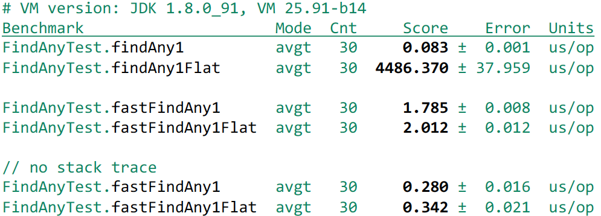

Все равно получаем небольшой проигрыш из-за генерации исключения –
200-300 наносекунд. Если для вас этот небольшой overhead не является
препятствием, и вы готовы с этим мириться, то это может быть хорошим
решением.

Но мы забыли про параллельные Stream. Хотя, казалось бы, а что с ними?

@Benchmark  
**public** Optional\<**Integer**\> findAnyPar() {  
**return** IntStream.range(0, 100_000_000).parallel().boxed()  
.filter(x -\> x == 10_000_000).findAny();  
}

@Benchmark  
**public** Optional\<**Integer**\> fastFindAnyPar() {  
**return** fastFindAny(IntStream.\<i\>range\</i\>(0, 100_000_000)  
.parallel().boxed().filter(x -\> x == 10_000_000));  
}

Используем *forEach*, он тоже в параллельном Stream работает. Кинем
исключение и все должно завершиться.

Запустим Benchmark и посмотрим на результаты. Я взял 4-х ядерную машину
без HT и получил:

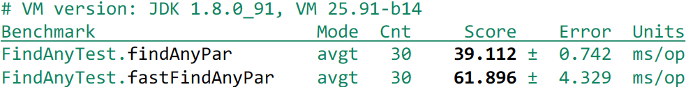

Получается очень неприятно, что наша быстрая реализация – она раза в
полтора проигрывает стандартной реализации. В чем причина? Я думаю, что
Дюк устал и он запутался в этих параллельных Stream:

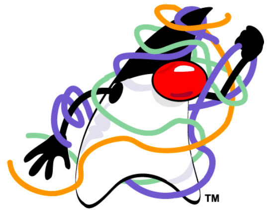

Ему нужно дать немного поспать:

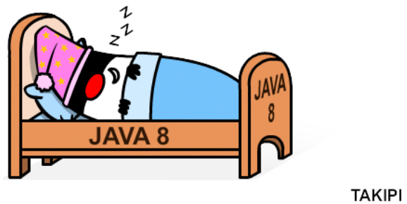

Давайте дадим ему поспать:

@Param({ "0", "20", "40" })  
**private** **int** sleep;

@Setup(Level.Invocation)  
**public** **void** setup() **throws** InterruptedException {  
Thread.sleep(sleep);  
}

Добавим такой setup метод перед каждым тестом – он будет спать или не
будет спать. И после этого мы видим, что это помогает:

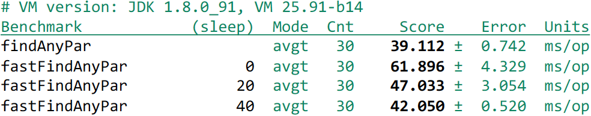

Мы видим, что, если мы поспали немножко, стало лучше, поспали еще больше
– стало еще лучше.  
Если вы не догадались, что происходит - то можно сделать такой простой
тест:

AtomicInteger i = **new** AtomicInteger();  
Optional\<**Integer**\> result = fastFindAny(  
IntStream.range(0, 100_000_000).parallel()  
.boxed().peek(e -\> i.incrementAndGet())  
.filter(x -\> x == 10_000_000));  
System.out.println(i);  
System.out.println(result);  
Thread.sleep(1000);  
System.out.println(i);

Для этого используем метод *peek()*, который в документации
рекомендуется использовать для отладки. Каждый раз, как мы перебираем
число, мы будем увеличивать переменную на 1, чтобы посмотреть, сколько
чисел мы реально перебрали. Выведем этот счетчик, потом поспим и снова
выведем. Мы получаем результат разный, но примерно вот-такой:

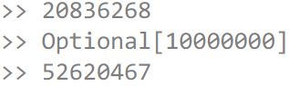

Сначала 20 000 000 чисел, а потом через секунду оказалось 50 000 000
чисел. То есть если вы кидаете исключение из параллельного Stream, то у
Вас завершается та задача, которая его кинула. Остальные задачи
продолжают работать – им никто не сказал, что надо завершиться. Я эту
проблему обсуждал в Core-Libs-Dev, с Полом Андерсом и Даг Ли – багу
завели на это дело:

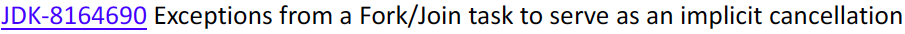

Согласились, что это не фича поведения, а баг. Но, в 9 версии это точно
не будет исправлено. Поэтому, если используете параллельные Stream и
кидаете исключения, используйте их с осторожностью.

Еще я могу сказать, что вариант с исключением можно доработать и он
будет работать также эффективно. Но реализация этих вещей достаточно
сложная и она, увы, не входит в наш доклад.  
На этом примерно все, что я хотел вам рассказать. В Stream много причуд,
но если между ними варьировать, то Stream — это классно.
