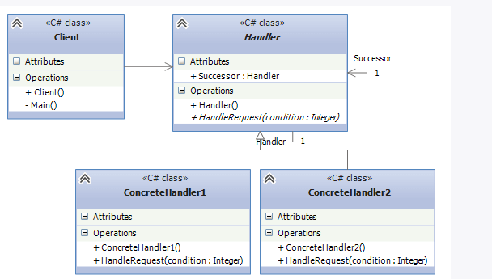

### Какой компонент микросервисной архитектуры отвечает за маршрутизацию запросов клиента к соответствующему сервису?

Service Mesh
API Gateway
Config Server
Service Registry

Компонент микросервисной архитектуры, который отвечает за маршрутизацию запросов клиента к соответствующему сервису, —
это API Gateway.

#### Объяснение:

- API Gateway действует как единая точка входа для всех клиентских запросов и распределяет их между соответствующими
  микросервисами. Он также может выполнять задачи аутентификации, авторизации, агрегирования данных и контроля нагрузки.
  Другие компоненты:

- Service Mesh — управляет взаимодействиями между микросервисами, обеспечивая безопасность, балансировку нагрузки,
  мониторинг и т.д., но не занимается маршрутизацией запросов клиентов.
- Config Server — хранит и управляет конфигурациями для микросервисов.
- Service Registry — регистрирует доступные микросервисы и их местоположение, чтобы другие сервисы могли находить их, но
  не отвечает за маршрутизацию запросов клиентов.
  Таким образом, API Gateway выполняет ключевую роль в маршрутизации запросов.

### Какой паттерн позволяет микросервисам динамически обнаруживать и взаимодействовать друг с другом?

Service Mesh
API Gateway
Service Discovery
Circuit Breaker

Паттерн, который позволяет микросервисам динамически обнаруживать и взаимодействовать друг с другом, — это Service
Discovery (Обнаружение сервисов).

#### Объяснение:

- Service Discovery автоматически определяет, где находятся микросервисы (их адреса и порты) в распределенной системе,
  чтобы другие сервисы могли с ними взаимодействовать. Это необходимо, так как в динамической среде микросервисы могут
  изменять свое местоположение из-за масштабирования, отказов или перезапусков.
  Другие компоненты:

- Service Mesh управляет коммуникацией между микросервисами, обеспечивая маршрутизацию, мониторинг и безопасность, но не
  занимается их обнаружением.
- API Gateway — это точка входа для клиентских запросов, не связанная с внутренним обнаружением сервисов.
- Circuit Breaker — это паттерн, который защищает систему от каскадных отказов, разрывая цепочку вызовов при проблемах с
  сервисами, но не занимается их обнаружением.
  Таким образом, для динамического обнаружения и взаимодействия сервисов используется паттерн Service Discovery.

### Какой паттерн проектирования GoF позволяет создавать объекты, не специфицируя точные классы объектов, которые будут созданы?

Адаптер
Строитель
Фабричный метод
Одиночка

Паттерн проектирования GoF, который позволяет создавать объекты, не специфицируя точные классы объектов, которые будут
созданы, — это Фабричный метод.

#### Объяснение:

- Фабричный метод (Factory Method) предоставляет интерфейс для создания объектов, но позволяет подклассам решать, какой
  именно класс создавать. Это позволяет делегировать процесс создания объектов подклассам, не указывая конкретные классы
  в коде.
  Другие паттерны:

- Адаптер (Adapter) — паттерн, который используется для совместимости различных интерфейсов.
- Строитель (Builder) — паттерн, который пошагово конструирует сложные объекты.
- Одиночка (Singleton) — паттерн, который гарантирует, что у класса будет только один экземпляр, и предоставляет
  глобальную точку доступа к нему.
  Таким образом, Фабричный метод — это паттерн, который используется для создания объектов без указания их точных
  классов.

### Какой паттерн проектирования GoF позволяет объекту изменять свое поведение, когда его внутреннее состояние меняется?

Стратегия
Декоратор
Состояние
Наблюдатель

- Паттерн проектирования, который позволяет объекту изменять свое поведение в зависимости от изменения его внутреннего
  состояния, называется Состояние (State).

Паттерн "Состояние" позволяет объекту изменять свое поведение, когда изменяется его внутреннее состояние, при этом
объект будет казаться, что он изменил свой класс.

#### Объяснение:

1. Стратегия (Strategy)
   Паттерн Стратегия определяет семейство алгоритмов, инкапсулирует каждый из них и делает их взаимозаменяемыми. Этот
   паттерн позволяет изменять поведение объекта во время выполнения программы, подставляя в него различные алгоритмы.
   Важно, что алгоритмы можно менять без изменения самого объекта, что дает гибкость в выборе поведения.

Пример: Если у вас есть несколько способов сортировки данных (например, сортировка по возрастанию, по убыванию), вы
можете реализовать их как отдельные стратегии и применять нужную в зависимости от ситуации.

2. Декоратор (Decorator)
   Паттерн Декоратор динамически добавляет объектам новые обязанности. Он используется для того, чтобы добавлять
   функциональность объекту без изменения его структуры (класса). Декораторы работают как оболочки (wrappers) вокруг
   объектов, расширяя их поведение.

Пример: Можно декорировать объект "Кофе", добавляя к нему различные добавки, такие как молоко, сахар и так далее, при
этом исходный объект "Кофе" остается неизменным.

3. Наблюдатель (Observer)
   Паттерн Наблюдатель определяет отношение "один ко многим" между объектами, так что при изменении состояния одного
   объекта, все зависимые объекты (наблюдатели) уведомляются и обновляются автоматически. Это позволяет объектам
   взаимодействовать без жесткой связи между ними.

Пример: В системе уведомлений пользователь подписывается на обновления. Когда событие происходит (например, выходит
новая статья), всем подписчикам рассылаются уведомления.

Краткое сравнение:

- Стратегия: Позволяет менять алгоритмы поведения объекта.
- Декоратор: Добавляет функциональность объекту динамически.
- Состояние: Меняет поведение объекта в зависимости от его состояния.
  = Наблюдатель: Реализует взаимодействие между объектами, когда один объект уведомляет других о своих изменениях.
  Все эти паттерны решают разные задачи, но служат одной цели — сделать систему более гибкой и расширяемой.

### Какие паттерны проектирования часто используются при разработке микросервисных приложений?

При разработке микросервисных приложений часто используются следующие паттерны проектирования:

* Service Discovery: Этот паттерн позволяет микросервисам находить друг друга в распределенной среде. Например, Spring
  Cloud Eureka и Consul используются для регистрации и обнаружения сервисов.

* Circuit Breaker: Этот паттерн помогает управлять отказами и предотвратить цепные сбои в системе. Он позволяет временно
  прекратить запросы к сбойному сервису и возвращать заранее определенные ответы или альтернативные решения. Примеры
  реализации включают Hystrix и Resilience4J.

* Gateway: Паттерн API Gateway представляет собой единую точку входа для всех запросов к микросервисам. Он может
  выполнять
  маршрутизацию, агрегацию ответов и обработку кросс-сервисных функций, таких как аутентификация и логирование. Примеры
  включают Spring Cloud Gateway и Netflix Zuul.

Эти паттерны решают ключевые проблемы, связанные с разработкой и эксплуатацией микросервисов, такие как обнаружение
сервисов, управление отказами и обработка запросов.

* Другие упомянутые паттерны, такие как Singleton, Observer, Factory, MVC, Front Controller, Data Access Object (DAO), и
  Builder, Prototype, Strategy, также полезны в различных контекстах, но они более общие и не специфичны для
  микросервисной архитектуры.

# Цепочка Обязанностей (Chain of responsibility)

Цепочка Обязанностей (Chain of responsibility) - поведенческий шаблон проектирования, который позволяет избежать жесткой
привязки отправителя запроса к получателю. Все возможные обработчики запроса образуют цепочку, а сам запрос перемещается
по этой цепочке. Каждый объект в этой цепочке при получении запроса выбирает, либо закончить обработку запроса, либо
передать запрос на обработку следующему по цепочке объекту.

Когда применяется цепочка обязанностей?
Когда имеется более одного объекта, который может обработать определенный запрос

Когда надо передать запрос на выполнение одному из нескольких объект, точно не определяя, какому именно объекту

Когда набор объектов задается динамически

Участники
Handler: определяет интерфейс для обработки запроса. Также может определять ссылку на следующий обработчик запроса

ConcreteHandler1 и ConcreteHandler2: конкретные обработчики, которые реализуют функционал для обработки запроса. При
невозможности обработки и наличия ссылки на следующий обработчик, передают запрос этому обработчику

В данном случае для простоты примера в качестве параметра передается некоторое число, сначала обработчик обрабатывает
запрос и, если передано соответствующее число, завершает его обработку. Иначе передает запрос на обработку следующем в
цепи обработчику при его наличии.

Client: отправляет запрос объекту Handler

То есть у нас образуется небольшая цепочка обработки запроса:

Использование цепочки обязанностей дает нам следующие преимущества:

Ослабление связанности между объектами. Отправителю и получателю запроса ничего не известно друг о друге. Клиенту
неизветна цепочка объектов, какие именно объекты составляют ее, как запрос в ней передается.

В цепочку с легкостью можно добавлять новые типы объектов, которые реализуют общий интерфейс.

В то же время у паттерна есть недостаток: никто не гарантирует, что запрос в конечном счете будет обработан. Если
необходимого обработчика в цепочки не оказалось, то запрос просто выходит из цепочки и остается необработанным.

Использование паттерна довольно часто встречается в нашей жизни. Достаточно распространена ситуация, когда чиновники
перекладывают друг на друга по цепочке выполнения какого-нибудь дела, и оно в конце концов оказывается не выполненным.
Или когда мы идем в поликлинику, но при этом точно не знаем характер заболевания. В этом случае мы идем к терапевту, а
он в зависимости от заболевания уже может либо сам лечить, либо отправить на лечение другим специализированным врачам.

Рассмотрим конкретный пример. Допустим, необходимо послать человеку определенную сумму денег. Однако мы точно не знаем,
какой способ отправки может использоваться: банковский перевод, системы перевода типа WesternUnion и Unistream или
система онлайн-платежей PayPal. Нам просто надо внести сумму, выбрать человека и нажать на кнопку. Подобная система
может использоваться на сайтах фриланса, где все отношения между исполнителями и заказчиками происходят опосредованно
через функции системы и где не надо знать точные данные получателя.
