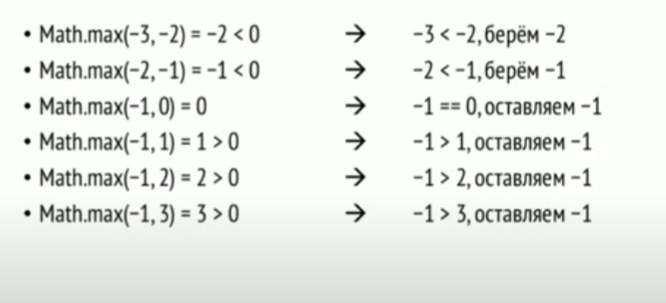
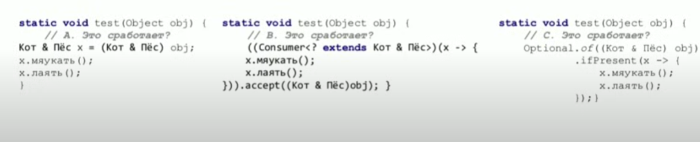
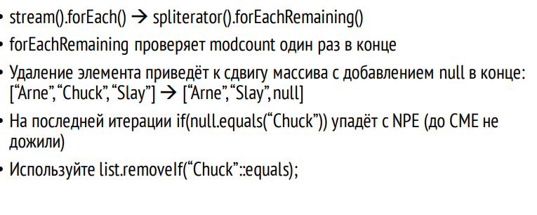

<https://www.youtube.com/watch?v=6bN1HcRhse4&t=2076s>
# Что выведет код

      A. молоко/хлеб/колбаса  
      B. молоко/хлеб/колбаса/яйца, яйца ещё! 
      C. молоко/хлеб/колбаса/ConcurrentModificationException   
      D. ConcurrentModificationException  

```java
 private static void task1() {
    List<String> list = new ArrayList<>();
    list.add("молоко");
    list.add("хлеб");
    list.add("колбаса");
    Stream<String> stream = list.stream();
    list.add("яйца, яйца ещё!");
    stream.forEach(System.out::println);
}
```

Ответ- lateBinding - все изменения в стриме проигрываются только тогда, когда происходит терминальная операция

# Что выведет код

    A. молоко/хлеб/колбаса
    B. молоко/хлеб/колбаса/яйца, яйца ещё!
    C. молоко/хлеб/колбаса/ConcurrentModificationException
    D. молоко/хлеб/яйца, яйца ещё!

```java
    private static void task2() {
    List<String> list = new ArrayList<String>();
    list.add("молоко");
    list.add("хлеб");
    list.add("колбаса");
    list = list.subList(0, 2); //не надо колбасу!
    Stream<String> stream = list.stream();
    list.add("яйца, яйца ещё!");
    stream.forEach(System.out::println);
}
```

Здесь был баг так как sublist().spliterator was is not late binding

# В чём разница между строчками 1 и 2?

    A. 1 компилируется, 2 нет
    B. 2 компилируется, 1 нет
    C. Что в лоб, что по лбу, обе нормально сработают.
    D. Без разницы, обе не компилируются.

```java
    public void killAll() {
    ExecutorService ex = Executors.newSingleThreadExecutor();
    List<String> sentence = Arrays.asList("Казнить");
    ex.submit(() -> Files.write(Paths.get("Приговор.txt"), sentence)); // 1
    ex.submit(() -> { // 2
        Files.write(Paths.get("Приговор.txt"), sentence);
    }); 
}
```

Метод write кидает check IOException и метод возвращает Path
Нужно разобраться как ExecutorService понимает что это Callable(возвращает V и кидает exception)или Runnable(не
возвращает B).
В 1 случае если мы не используем фигурных скобок - ExecutorService по return type понимает что это Callable а в нем
exception продекларирован
В 2 случае поставили фигурные скобки. Если мы хотим что-то вернуть мы должны написать возврат, но мы не
написали. Сервис определяет это как Runnable - у него Exception не продекларирован- и требует обработки try catch

# Что будет?

      A. Ошибка компиляции
      B. Вылетитс исключением
      C. 3
      D. Что−то другое

```java
private static void task3() {
    System.out.println(
            Stream.of(-3, -2, -1, 0, 1, 2, 3).max(Math::max).get()
    );
}

```


Мы передали не компоратор но метод stream.max пытается его использовать как компаратор

# Что произойдёт после выполнения?

      A. Мапы поменяются местами
      B. Обе станут олдскульными
      C. Обе стануткак надо
      D. Поучитесь программировать! Это вообще не скомпилируется!

```java
private static void task4() {
    Map<String, String> oldSchool = new HashMap<>() {{
        put("buildTool", "maven");
        put("lang", "java");
        put("IOC", "jee");
    }};

    Map<String, String> proper = new HashMap<>() {{
        put("buildTool", "gradle");
        put("lang", "groovy");
        put("IOC", "spring");
    }};

    oldSchool.replaceAll(proper::put);
    oldSchool.forEach((k, v) -> System.out.println(k + ": " + v));
}
```

Ответ - Мапы поменяются местами
Фокус в том что put возвращает старое значение.
Пускается стрим который берет элемент, засовывает в proper, из нее берется старое значение и перекладывается в oldSchool

# Одинаково ли сработают три способа?

      A. Все ответы будут одинаковые
      B. Будет два разных ответа
      C. Будет три разных ответа
      D. Будетчетыре разных ответа

```java


private static void task5() {
    List<String> list = Arrays.asList("Вронский", "Поезд", "Анна");
    Comparator<String> cmp = Comparator.nullsLast(Comparator.naturalOrder());
    System.out.println(Collections.max(list, cmp));
    System.out.println(list.stream().collect(Collectors.maxBy(cmp)).get());
    System.out.println(list.stream().max(cmp).get());
}
```

одинаково

# а теперь?

```java
private static void task6() {
    List<String> list = Arrays.asList("Вронский", null, "Анна");
    Comparator<String> cmp = Comparator.nullsLast(Comparator.naturalOrder());
    System.out.println(Collections.max(list, cmp));
    System.out.println(list.stream().collect(Collectors.maxBy(cmp)).get()); //так как возвращаеться Optional и у него нал значение
    System.out.println(list.stream().max(cmp).get()); //тоже optional но с проверкой через object
}
```

C. Будет три разных ответа

1) null
2) NoSuchElementException: No value present
   Потому что завернули в optional. Потому что maxBy у коллектора. Он видит null и создает пустой optional
3) NullPointerException потому что max у стрима видит что нужно null засунуть в Optional и кидает исключение

# Как сделать тип, не объявляя его?

```java
interface Кот {
    default void мяукать() {
        System.out.println("мяу");
    }
}

interface Пёс {
    default void лаять() {
        System.out.println("гав");
    }
}

public static void main(String[] args) {
    class Котопёс implements Кот, Пёс {
    }
    test(new Котопёс());
}

static void test(Object obj) {
    var x = (?) obj;
    x.мяукать();
    x.лаять();
}
```

Варианты решения

ОТВЕТ С- с Optional

В 8 java можно кастовать к пересечению типов, но нельзя создать переменную и объявить ее типом такого пересечения.
А в лямде не нужно указывать тип переменной. В итоге в решении- тип класс и Кот и Пес сразу

# Что выведет

      A. ПРИВЕТ/ПРИВЕТ  
      B. ПРИВЕТ/HELLO   
      C. HELLO/ПРИВЕТ   
      D. HELLO/HELLO

```java
public class SupplierExample {
    String str;

    void run() {
        str = "привет";
        Supplier<String> s1 = str::toUpperCase;
        Supplier<String> s2 = () -> str.toUpperCase();
        str = "hello";
        System.out.println(s1.get());
        System.out.println(s2.get());
    }

    public static void main(String[] args) {
        new SupplierExample().run();
    }
}

```

ответ- B. ПРИВЕТ/HELLO
В 1 случае референс на метод конкретного объекта. Строка 1.
Если мы str переприсвоили значение - создалась новая строка.
А во 2 случае лямбда захватила переменную которая есть сейчас, ее поменяли.
Суплаер обратился к новому значению переменной только когда его вызвали.

# Что произойдёт?

         A. ConcurrentModificationException
         B. ArrayIndexOutOfBoundsException
         C. NullPointerException
         D. Успешно завершится

```
List<String> list = new ArrayList<>(Arrays.asList("Arne", "Chuck", "Slay"));
        list.stream().forEach(x -> {
            if(x.equals("Chuck")) {
                list.remove(x);
            }
        });
```

NullPointerException - потому что
stream().forEach - проверяет ConcurrentModification, в данном случае для ArrayList, только в самом конце прохода по
элементов. Это сделано для скорости. Поэтому до ConcurrentModificationException мы не доходим.
Но вместо этого при удалении элемента массив не уменьшается. Элементы двигаются и вместо удаленного элемента
дописывается null в конце
